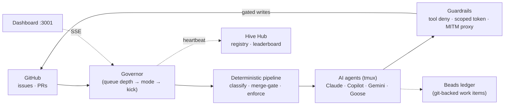

# Hive

AI agent orchestration for open source projects. A single Go binary enumerates GitHub issues and PRs, classifies them by complexity, and dispatches work to AI agents (Claude, Copilot, Gemini, Goose) on adaptive cadences governed by queue depth.

Hive separates decisions into two layers: a **deterministic pipeline** of shell scripts handles filtering, classification, merge-gating, and enforcement before any LLM sees the work. Agents only handle judgment calls — reading code, reasoning about fixes, writing PRs.

## Production quickstart: signed Hive + Visual Hive

The maintained `DavidDiaz0317/hive` integrated release is the recommended path for repository testing and repair automation. It ships Hive, an immutable Visual Hive bundle, Node 22, and the `/hive` Codex skill as one signed installation. Hive owns setup, scheduling, issues, repair PRs, guarded merges, post-merge verification, and closure; Visual Hive owns deterministic test evidence and verdicts.

Prerequisites are Git, an authenticated current GitHub CLI (`gh auth status`), and an authenticated Codex CLI (`codex login`) when model-backed repair is enabled. On Linux, paste these two command blocks:

Command 1 — verify and install the latest immutable fork release:

```bash
(
set -eu
repo=DavidDiaz0317/hive
version="$(gh api "repos/$repo/releases/latest" --jq .tag_name)"
commit="$(gh api "repos/$repo/commits/$version" --jq .sha)"
work="$(mktemp -d "${TMPDIR:-/tmp}/hive-bootstrap.XXXXXX")"
trap 'rm -rf -- "$work"' EXIT INT TERM
gh release download "$version" --repo "$repo" --pattern install-integrated.sh --dir "$work"
gh attestation verify "$work/install-integrated.sh" --repo "$repo" --signer-workflow "$repo/.github/workflows/integrated-release.yml" --source-ref "refs/tags/$version" --source-digest "$commit" --signer-digest "$commit" --deny-self-hosted-runners
[ "$(gh api "repos/$repo/commits/$version" --jq .sha)" = "$commit" ]
sh "$work/install-integrated.sh" --version "$version" --repo "$repo"
)
```

Command 2 — inspect the repository, open one reviewable setup PR, and start production automation:

```bash
"$HOME/.local/bin/hive" setup --repo OWNER/REPOSITORY --coverage comprehensive --automation auto-merge --provider codex --visual-hive --start --json
```

The installer verifies the archive checksum, exact tag commit, GitHub-hosted provenance, platform, integrated version, and every file in the internal distribution inventory before atomic activation. `hive --version` reports the packaged integrated version and exact Hive commit without consulting a source checkout. `visual-hive --version` uses the distribution's bundled Node runtime directly, so a global Node installation is not required. Setup automatically resolves and reports the bundled immutable Visual Hive repository and commit. Coverage and GitHub write authority remain separate choices; use `advisory`, `issues`, or `repair-pr` instead of `auto-merge` when less authority is appropriate.

The currently published integrated release remains fork-scoped: its release workflow, tags, assets, and installer attestations belong to `DavidDiaz0317/hive`. Source changes may follow the upstream project's normal reviewed contribution path, but that does not authorize publishing integrated tags, assets, or installer attestations from a different trust root. `advisory` writes no GitHub lifecycle state, `issues` manages issues only, `repair-pr` opens repair PRs but never merges, and `auto-merge` lets Hive merge only after all deterministic and repository-protection gates pass. Because the PR workflow is repository-owned, production auto-merge also requires protected workflow/policy paths with independent code-owner review and no unreviewed bypass. See the [integrated threat model](v2/docs/integrated-threat-model.md).

Windows users should use the equivalent signed PowerShell install block in the [integrated quickstart](v2/docs/integrated-quickstart.md), then run the same `hive setup ...` command. That guide also documents upgrades, rollback, pause/resume, and production verification.

## Legacy KubeStellar deployment (not the integrated quickstart)

The Docker, dashboard, and Kubernetes instructions below describe the older `kubestellar/hive` service deployment. They require manual configuration and token handling and do **not** install the signed Hive + Visual Hive product, bundled runtime, or Codex skill shown above. They remain here for existing legacy deployments.

### Docker Compose

**Prerequisites**

- Docker Engine 24+ with the Compose v2 plugin (`docker compose`, not the legacy `docker-compose`)
- A Linux, macOS, or Windows (WSL2) host on `amd64` or `arm64` — the pre-built images are multi-arch
- `git`, and a GitHub token (PAT or App) for the org you want the hive to work on

```bash
git clone -b v2 https://github.com/kubestellar/hive.git
cd hive/v2

cp hive.yaml.example hive.yaml
export HIVE_GITHUB_TOKEN=ghp_...
docker compose up -d
```

Dashboard at `http://localhost:3001`.

The pre-built image tag is documented in [src/docs/operator-reference.md#image-provenance-for-ghcriokubestellarhivev2-latest](src/docs/operator-reference.md#image-provenance-for-ghcriokubestellarhivev2-latest).

To build from source instead of pulling the pre-built image:

```bash
docker compose build
docker compose up -d
```

## Legacy Kubernetes deployment

### Prerequisites

- `kubectl` configured for your cluster
- Kubernetes 1.24+
- A StorageClass that supports `ReadWriteMany` (NFS recommended for zero-downtime rollouts)
- cert-manager (for TLS certificates)
- nginx-ingress (for ingress routing)

### Hosted Option

The [Hive Hub](https://hive.kubestellar.io) provides hosted hives with OAuth-protected dashboards, a public registry, and cross-hive leaderboards. No cluster required.

If you need to run your own private hub instead, see the v2
[self-hosted hub deployment guide](src/docs/hub-deployment.md).

### Self-Hosted Deployment

#### 1. Create the namespace

```bash
kubectl apply -f src/deploy/k8s/namespace.yaml
```

Or manually:

```bash
kubectl create namespace hive
```

#### 2. Create secrets

```bash
kubectl -n hive create secret generic hive-secrets \
  --from-literal=HIVE_GITHUB_TOKEN=ghp_... \
  --from-literal=HIVE_DASHBOARD_TOKEN=your-dashboard-auth-token
```

For GitHub App auth (recommended for production), add the private key:

```bash
kubectl -n hive create secret generic hive-secrets \
  --from-literal=HIVE_GITHUB_TOKEN=ghp_... \
  --from-file=gh-app-key.pem=/path/to/key.pem
```

#### 3. Create ConfigMap from hive.yaml

```bash
cp src/hive.yaml.example hive.yaml
# Edit hive.yaml: set your org, repos, agents, and governor config

kubectl create configmap hive-config -n hive --from-file=hive.yaml=hive.yaml
```

#### 4. Create PersistentVolumeClaim

Apply the provided PVC manifest:

```bash
kubectl apply -f src/deploy/k8s/pvc.yaml
```

The default PVC requests 10Gi with `ReadWriteOnce`. For zero-downtime rollouts with rolling updates, use an NFS-backed StorageClass with `ReadWriteMany`:

```yaml
apiVersion: v1
kind: PersistentVolumeClaim
metadata:
  name: hive-data
  namespace: hive
spec:
  accessModes:
    - ReadWriteMany
  storageClassName: nfs
  resources:
    requests:
      storage: 10Gi
```

#### 5. Deploy

```bash
kubectl apply -f src/deploy/k8s/deployment.yaml
kubectl apply -f src/deploy/k8s/service.yaml
```

The deployment runs a single replica with liveness and readiness probes on `/api/health`. Resource defaults: 500m CPU / 512Mi memory (requests), 2 CPU / 2Gi memory (limits).

#### 6. Set up Ingress with TLS

```yaml
apiVersion: networking.k8s.io/v1
kind: Ingress
metadata:
  name: hive
  namespace: hive
  annotations:
    cert-manager.io/cluster-issuer: letsencrypt-prod
    nginx.ingress.kubernetes.io/proxy-body-size: "50m"
    nginx.ingress.kubernetes.io/proxy-read-timeout: "3600"
    nginx.ingress.kubernetes.io/proxy-send-timeout: "3600"
spec:
  ingressClassName: nginx
  tls:
    - hosts:
        - hive.example.com
      secretName: hive-tls
  rules:
    - host: hive.example.com
      http:
        paths:
          - path: /
            pathType: Prefix
            backend:
              service:
                name: hive
                port:
                  name: dashboard
```

Long timeouts are needed for SSE streaming connections to the dashboard.

#### Quick apply (all manifests)

```bash
kubectl apply -f src/deploy/k8s/namespace.yaml
kubectl -n hive create secret generic hive-secrets \
  --from-literal=HIVE_GITHUB_TOKEN=ghp_...
kubectl create configmap hive-config -n hive --from-file=hive.yaml=hive.yaml
kubectl apply -f src/deploy/k8s/pvc.yaml
kubectl apply -f src/deploy/k8s/deployment.yaml
kubectl apply -f src/deploy/k8s/service.yaml
```

### Ports

| Port | Purpose |
|------|---------|
| 3001 | Dashboard (supports auth token) |
| 3002 | Internal API |
| 7681 | ttyd web terminal |

### Volumes

| Mount Path | Purpose |
|------------|---------|
| `/etc/hive/hive.yaml` | Configuration (read-only, from ConfigMap) |
| `/data` | Persistent state: metrics, beads, logs |
| `/secrets` | GitHub App key and other secrets (read-only) |

## Legacy service configuration

All v2 runtime config lives in a single `hive.yaml`. Environment variables are interpolated with `${VAR}` syntax. See [src/hive.yaml.example](src/hive.yaml.example) for the full reference, [src/docs/env-vars.md](src/docs/env-vars.md) for the centralized environment variable reference, [src/docs/agent-configuration.md](src/docs/agent-configuration.md) for agent configuration, [src/AGENT-DEFINITION.md](src/AGENT-DEFINITION.md) for the portable agent YAML format, [src/docs/supervisor.md](src/docs/supervisor.md) for the supervisor agent, [docs/backend-setup.md](docs/backend-setup.md) for CLI backends, [docs/inference-backends.md](docs/inference-backends.md) for model gateways, and [docs/migration-v1-v2.md](docs/migration-v1-v2.md) for v1→v2 migration.

The top-level deterministic shell pipeline uses a separate project file,
`config/hive-project.yaml.example`; see [config/README.md](config/README.md)
before running the top-level `bin/` scripts directly.

```yaml
project:
  org: your-org
  repos:
    - repo-one
    - repo-two
  primary_repo: repo-one
  ai_author: your-bot-user

agents:
  scanner:
    enabled: true
    backend: claude
    model: claude-sonnet-4-6
    beads_dir: /data/beads/scanner
    clear_on_kick: true

governor:
  eval_interval_s: 300
  modes:
    surge:
      threshold: 20
      scanner: 15m
      reviewer: pause
    busy:
      threshold: 10
      scanner: 15m
      reviewer: 1h
    quiet:
      threshold: 2
      scanner: 15m
      reviewer: 45m
    idle:
      threshold: 0
      scanner: 15m
      reviewer: 15m

hub:
  enabled: true
  url: https://hive.kubestellar.io
  contribute:
    enabled: true
```

### GitHub Auth

Use a personal access token or a GitHub App:

```yaml
github:
  token: ${HIVE_GITHUB_TOKEN}
```

```yaml
github:
  app_id: 12345
  installation_id: 67890
  key_file: /secrets/gh-app-key.pem
```

## Legacy service ACMM levels

Hive uses an **AI-native Capability Maturity Model** (ACMM) with six levels that control what agents are allowed to do:

| Level | Name | Agents | What agents can do |
|-------|------|--------|-------------------|
| L1 | Inception (Assisted) | 2 | Interactive advisor and project inception. Advisory beads only. |
| L2 | Advisory (Instructed) | 5 | Observe and report findings as dashboard beads. No GitHub interaction. |
| L3 | Quality-Gated (Measured) | 6 | Quality agent opens issues and hold-gated PRs. Others remain advisory. |
| L4 | Security-Aware (Adaptive) | 7 | All agents file issues. Quality, sec-check, and CI open hold-gated PRs. |
| L5 | Semi-Autonomous (Semi-Automated) | 9 | All agents open hold-gated PRs. Humans batch-review and approve. |
| L6 | Fully Autonomous | 10 | Agents open PRs and auto-merge on green CI. No hold label required. |

Each level defines per-agent **policy modes**: advisory (observe only), measured (file issues), holdgated (PRs with hold label), or full (auto-merge). See `src/docs/acmm-policy-matrix.md` for the full matrix. Browse the [v2 docs index](src/docs/README.md) for operations, contributor relay, snapshots, health checks, and design guides.

Operational references from the repository root include [hub disaster recovery](docs/HUB_DISASTER_RECOVERY.md), [federation design](docs/federation-design.md), [outreach antispam policy](docs/outreach-antispam.md), [macOS deployment notes](docs/macos.md), and [backend setup](docs/backend-setup.md). Worked examples live under [examples/](examples/README.md), including [KubeStellar skill and campaign configs](examples/kubestellar/README.md), [SQLite state backend notes](examples/sqlite-state.md), and [ACMM runtime fragments](examples/acmm/README.md).

## Legacy service architecture

Hive runs as a single container with three long-lived processes:

- **Go binary** (`hive`, `:3002`) — the brain. Runs the governor eval loop, the agent manager (tmux sessions), the dashboard API, an in-process MITM GitHub proxy, the hub heartbeat, and token tracking — all as goroutines.
- **Node.js proxy** (`:3001`) — the public front door. Reverse-proxies to the Go API with auth and path-rewrite, and streams SSE/WebSocket to the dashboard and web terminal.
- **ttyd** (`:7681`) — web terminal onto the agent tmux sessions.

The governor evaluates queue depth on a configurable interval and switches between four modes (`SURGE`, `BUSY`, `QUIET`, `IDLE`), each with per-agent cadences. A deterministic pipeline (Go + shell) filters, classifies, and merge-gates all GitHub work before any agent is kicked, and three independent layers — CLI tool denial, least-privilege scoped tokens, and a network-level MITM proxy — enforce what each agent may do, keyed off its ACMM-assigned mode.



**See [src/docs/architecture.md](src/docs/architecture.md) for the full reference architecture** — process model, the governor loop, the deterministic pipeline, layered guardrails, ACMM, beads, hub & spoke, and an end-to-end walkthrough, with Mermaid diagrams throughout. Operator safety references include [trajectory review](src/docs/trajectory-review.md), [dashboard health checks](src/docs/health-checks.md), [sandbox guardrails](src/docs/sandbox-isolation.md), [manual provisioning](src/docs/manual-provisioning.md), [cross-cluster migration](src/docs/cross-cluster-migration.md), and [config layering](src/docs/config-layering.md). The dashboard API reference is published as [dashboard/openapi.json](dashboard/openapi.json).

See also the [v2 docs index](src/docs/README.md), [public roadmap](src/docs/roadmap.md), and [landscape comparison](src/docs/landscape.md) for community-facing documentation and positioning.

## Legacy compute contribution

Community members can contribute compute to any hive through **ClankeR**, the
contributor relay — it hands tasks from a hive's backlog to the CLI agent
running on your own machine:

```bash
brew install just gh
git clone -b v2 https://github.com/kubestellar/hive && cd hive
just contribute-setup claude
just contribute-hive
```

Supported CLIs: Claude Code, GitHub Copilot, Pi, Goose, Bob. Contributors start as newcomer (rate-limited) and auto-promote based on completed tasks. Your credentials never leave your machine.

A relay can subscribe to multiple hives with comma-separated `HIVE_HUB` and matching `HIVE_REGISTRATION_TOKEN` values, and operators can delegate selected spoke roles through **Acting as** / `HIVE_AGENT_ROLE`. See [src/docs/contributor-relay.md](src/docs/contributor-relay.md) and [src/docs/contributor-trust-and-roles.md](src/docs/contributor-trust-and-roles.md).

See the [Hive Hub contribute page](https://hive.kubestellar.io) for details.

## Contributing

See the [Hive Hub](https://hive.kubestellar.io) to browse registered hives, view leaderboards, and find hives accepting contributions.

To contribute to Hive itself, see [CONTRIBUTING.md](CONTRIBUTING.md) and open issues or PRs on this repository.

## Security

Please see [SECURITY.md](SECURITY.md) for the vulnerability disclosure process. Do not report security vulnerabilities through public issues or pull requests.

---

Apache 2.0
