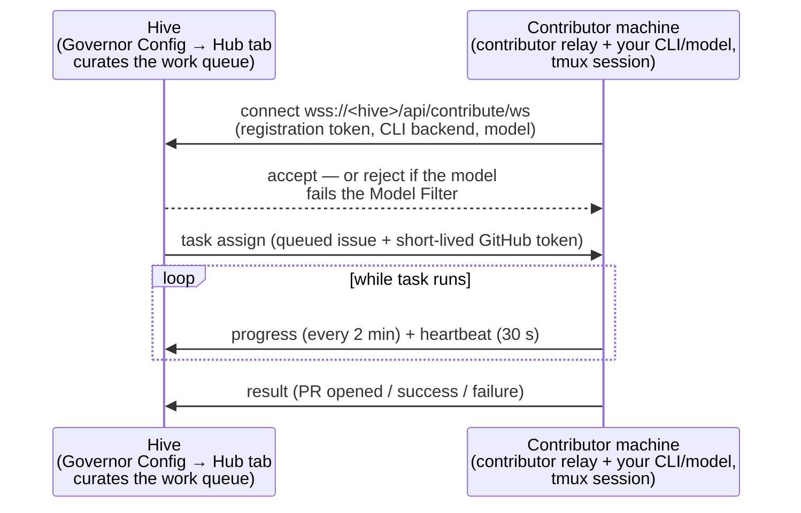

# ClankeR contributor relay

ClankeR lets a contributor lend their local AI CLI subscription to a hive. A contributor runs a small relay process on their machine; the hive assigns it real work — issues from the project's queue — and the contributor's agent executes each task locally with the CLI and model of their choice, reporting completion/PR metadata back over a WebSocket.

The relay turns a hive from a fixed set of resident agents into an elastic swarm: the admin curates *what* is offered (which repos, which labels, which models are acceptable), and contributors decide *how* it gets done (their CLI, their model, their compute, their tokens). The relay connects to `/api/contribute/ws`, receives one task at a time, runs the selected CLI in the contributor's environment, and reports the result back.

## How it fits together



- The **work queue** is built from the hive's monitored repos: open candidate issues that pass every contributor admission gate (including disabled repositories, holds, cooldowns, in-flight work, dependencies, assignments, and the admin's title/author/label filters). `GET /api/contribute/status` reports that offerable total as `actionable_items`; its additive `candidate_items` field is the raw pre-admission scanner population. `GET /api/contribute/queue` returns the bounded ordered rows plus the uncapped offerable `queue_total` and separately visible `held_total`.
- The **relay** authenticates with a registration token, receives one task at a time, drives the local CLI inside a tmux session, injects a short-lived GitHub token for the PR, and reports the result. It heartbeats every 30 s and reconnects with exponential backoff; a task is abandoned if the relay observes no forward progress for 30 minutes, or if it crosses an absolute 4-hour backstop. The GitHub token is valid for 55 minutes and is re-minted by the hub before it expires, so a task may outlive any single token ([below](#the-github-token-outlives-the-task-because-the-hub-re-mints-it)).
- Every contributor has a **trust tier** with per-tier rate limits. See [Contributor trust tiers and delegated agent roles](contributor-trust-and-roles.md).

## Basic setup

From a checkout of this repository:

```bash
export HIVE_HUB=wss://hive.example.com/contribute
just contribute-setup claude
just contribute-hive
```

`compose-contributor.yaml`, `Dockerfile.contributor`, and the `just contribute-hive` recipe are the reference container path. Native mode is available through `just contribute-hive <backend> local` when a container runtime is not desired.

`contribute-setup` is one-time per hive: it registers you (your GitHub identity plus a registration token stored in `${HOME}/.config/hive/contributor.env`), authenticates `gh`, and verifies the CLI backend you chose. Every hive also serves a landing page at **`https://<hive-dashboard>/contribute`** with live queue stats and copy-paste setup commands tailored to the CLI you pick.

`contribute-hive` starts the relay in one of two modes:

```bash
just contribute-hive               # containerized (recommended) — relay + CLI in docker or podman
just contribute-hive claude local  # host mode — relay + CLI directly on your machine, in a tmux session
```

Containerized mode auto-detects the runtime — docker first, then podman — and can be forced with `export HIVE_CONTAINER_RUNTIME=podman`.
The resolved runtime is passed into the container, so the "attach to the CLI" hints printed from inside it (the status line, and the banner shown when the CLI needs a login) name the engine that actually launched it ([#5145](https://github.com/hivecommons/hive/issues/5145)). In host mode there is no container, and those hints are a plain `tmux attach -t <session>`.

The `just contribute-hive` container defaults to the same workload ceiling as
`contribute-k8s`: 4 GiB of memory and 2 CPUs. Its combined memory-and-swap cap
is also 4 GiB, so the container cannot consume another 4 GiB from host swap
after reaching the RAM limit. Tune the local container for a larger or smaller
machine with `HIVE_CONTAINER_MEMORY` and `HIVE_CONTAINER_CPUS`:

```bash
HIVE_CONTAINER_MEMORY=6g HIVE_CONTAINER_CPUS=3 just contribute-hive claude
```

Set either override to `none` to omit that limit on a host that cannot enforce
the corresponding cgroup controller.

These overrides affect the `just contribute-hive` container only; Kubernetes
keeps the resource requests and limits rendered in its generated manifest.

Run-stage work uses per-stage git worktrees instead of sharing a dirty checkout
between concurrent stages. The hub keeps a shared source clone and creates
worktrees under the workspace root as `runs/<run-key>/<stage>-<generation>`,
starting each from the target branch. The default live-worktree cap is eight
(`runs.max_worktrees`); a ninth concurrent run-stage kick is refused and audited
rather than reusing another stage's tree. Reclaiming or completing a stage
removes its worktree.

Use `just contribute-check <backend>` before registering to catch missing CLIs or obvious auth gaps.

## Docker Compose workflow

The containerized path is `src/compose-contributor.yaml` plus `src/Dockerfile.contributor`; the `just contribute-hive` recipe wraps it. From the repository root you can also run Compose directly after `just contribute-setup` has written `${HOME}/.config/hive/contributor.env`:

```bash
export AGENT_BACKEND=claude
docker compose -f src/compose-contributor.yaml up --build
```

The compose file mounts local contributor state read-only into the container:

- `${HOME}/.config/hive` for Hive registration/config.
- `${HOME}/.claude` and `${HOME}/.config/claude-code` for Claude-family CLI auth.

`just contribute-hive claude` (the recommended path) does not mount `${HOME}/.claude`
at all. It copies only `${HOME}/.claude/.credentials.json` and
`${HOME}/.claude/settings.json` into a per-run staging directory, mounts that at
`/home/dev/.claude`, and deletes it when the recipe exits. The rest of
`${HOME}/.claude` — every Claude Code transcript on the machine, the prompt
history, paste cache, per-project memory and your private `CLAUDE.md` — never
leaves the host, because the agent in that container runs third-party
repositories' test suites for real
([#7836](https://github.com/hivecommons/hive/issues/7836)). The recipe prints a
`Staged:` line naming exactly what it copied.

Important environment variables:

| Variable | Default | Meaning |
| --- | --- | --- |
| `HIVE_HUB` | value from `contributor.env`, else public hub default | WebSocket hub(s) to subscribe to. Use comma-separated URLs for multi-hub mode. Direct Compose reads the registered value from the mounted config file. |
| `HIVE_REGISTRATION_TOKEN` | value from `contributor.env` | Registration token(s), positional with `HIVE_HUB` when multiple hubs are listed. Required; run `just contribute-setup` first. |
| `AGENT_BACKEND` | `claude` | CLI/backend to run (`claude`, `copilot`, `goose`, `bob`, `codex`, `pi`, `aider`, `litellm`, `agy`, `opencode`, `kilo`, `muse`, `omp`, depending on image support and credentials). `omp` is interactive-only: Hive starts normal `omp --model <id>` in the prepared tmux cwd and passes no fabricated permission flags. It has no verified local confinement mechanism, so local mode refuses it without `HIVE_OMP_DANGEROUSLY_RUN_UNCONFINED=1`; container mode is the supported boundary. `agy` has the same confinement limit. `opencode`, `kilo`, and `muse` only run headless (`CONTRIBUTOR_MODE=headless`) — hive has no interactive-tmux wiring for them. |
| `AGENT_MODEL` | unset (backend default) | Optional model override passed to the contributor agent (e.g. `claude-sonnet-4-6`, `gpt-4o`, `gemini-2.5-pro`). Declared to the hive when the relay connects. |
| `AGENT_REASONING_EFFORT` | unset | Reasoning effort override. Consumed by `codex` (`-c model_reasoning_effort`), by `agy` (`--effort low\|medium\|high`, required whenever a model is set, else agy ignores the model), by `muse` (`--reasoning-effort none\|minimal\|low\|medium\|high\|xhigh\|max\|ultra`, applied with or without a model; a value outside that set is dropped rather than passed, because muse exits 2 on it), and by `claude` (`--effort low\|medium\|high\|xhigh\|max`, applied with or without a model; a value outside that set is dropped the same way, and unset leaves Claude Code at its own default - [#8377](https://github.com/hivecommons/hive/issues/8377)). Ignored by other backends, including inference routes such as `litellm` that drive the claude binary. |
| `CONTRIBUTOR_MODE` | `interactive` | `interactive` keeps a tmux/TTY session. `headless` is for one-shot/no-TTY task delivery. |
| `HIVE_AGENT_SESSION` | `contributor` | tmux session name for interactive mode. |
| `HIVE_SESSION` | backend name (`AGENT_BACKEND`) | Optional session label for running multiple relays under one GitHub account (see [Running multiple backends under one account](#running-multiple-backends-under-one-account)). Relays with distinct labels get independent session-scoped identities (`ContributorID#session`) on the hub, so their task leases, assignment cooldowns, failure streaks, and ownership fences do not collide. Auth, trust tier, model admission, and rate-limit accounting stay per-account. Sanitized on the hub: only `[A-Za-z0-9._-]` survive, capped at 32 bytes; a label that sanitizes to empty counts as unset. Set it to the **empty string** to opt out — the relay then declares no session and keeps the bare per-account identity (the historical single-session behavior). |
| `HIVE_CONTRIBUTOR_QUOTA_GUARD` | `ask` | Contributor-local subscription quota guard mode. `ask` and `pause` hold new work when a normalized quota window is at or below the configured reserve; `off` is the explicit launch-time opt-out for this relay session. Headless/no-response sessions wait safely rather than spending the last quota headroom. The guard can only act when a reading source is available — either `HIVE_CONTRIBUTOR_QUOTA_READING_FILE` / `HIVE_CONTRIBUTOR_QUOTA_READING_JSON`, or, for a **supported subscription backend** (`claude`, `pi`, `codex`, `agy`, `gemini`), the reading the Go rotation probers publish — into `HIVE_CONTRIBUTOR_QUOTA_POOL_DIR` when that is set, otherwise the per-install derived pool directory, so publishing is default-on (kubestellar/hive#6967, kubestellar/hive#6987). The publisher no longer requires provider rotation to be enabled: when `governor.rotation.enabled` is false (the default), the spoke runs a publish-only prober loop that publishes readings without rotating anything, so any host running `hive` gets a publisher. A host running **only** the relay (no local `hive` process) still has no publisher and stays on this guard's no-source behaviour. With none of those it has nothing to read, logs that it is not guarding anything, and admits work. |
| `HIVE_CONTRIBUTOR_QUOTA_MIN_REMAINING_PCT` | `20` | Default remaining-percentage reserve for every quota window, **including kinds this build does not recognize** — an exhausted unfamiliar window holds work rather than being skipped, because providers add window kinds over time (`weekly_scoped` was one). A *healthy* unrecognized window still admits. Valid range is `0`–`100`; invalid values fail relay startup with a message naming the bad variable. The reserve reduces the chance of consuming paid/extra usage but cannot guarantee a task will finish within a provider window. |
| `HIVE_CONTRIBUTOR_QUOTA_SHORT_MIN_REMAINING_PCT` | unset | Optional short-window reserve override for normalized `session`/`five_hour` quota windows; inherits `HIVE_CONTRIBUTOR_QUOTA_MIN_REMAINING_PCT` when unset. |
| `HIVE_CONTRIBUTOR_QUOTA_WEEKLY_MIN_REMAINING_PCT` | unset | Optional weekly reserve override for normalized `weekly` and `weekly_scoped` quota windows; inherits `HIVE_CONTRIBUTOR_QUOTA_MIN_REMAINING_PCT` when unset. |
| `HIVE_CONTRIBUTOR_QUOTA_SIMPLE_MIN_REMAINING_PCT` / `HIVE_CONTRIBUTOR_QUOTA_MEDIUM_MIN_REMAINING_PCT` / `HIVE_CONTRIBUTOR_QUOTA_COMPLEX_MIN_REMAINING_PCT` / `HIVE_CONTRIBUTOR_QUOTA_UNKNOWN_MIN_REMAINING_PCT` | unset | Optional v5 complexity reserves. For each offered task and quota window, Hive requires the maximum of the effective window reserve and the task's configured complexity reserve; unset complexity tiers inherit the base percentage. These apply to an **offered task**, which has a complexity. Whether the relay advertises readiness at all is judged against the effective *window* reserve only — there is no task in that question, so no tier applies. |
| `HIVE_CONTRIBUTOR_QUOTA_READING_FILE` | unset | Path to a JSON quota reading the guard evaluates: `{"state": …, "limits": [{"id": …, "kind": …, "pct_remaining": …, "resets_at": …}]}`. Re-read on each decision, so a writer refreshing the file is what lifts a hold. A missing, torn or malformed file is treated as `unknown` and **holds** work rather than crashing the relay or admitting blind — so the writer should rename atomically, since a hold is still a hold. |
| `HIVE_CONTRIBUTOR_QUOTA_READING_JSON` | unset | The same reading supplied inline, taking precedence over `HIVE_CONTRIBUTOR_QUOTA_READING_FILE`. Intended for tests and for supervisors that already hold the reading in memory. Being a fixed launch-time value it never changes, so a hold against it cannot lift by itself — prefer the file for long-running relays. |
| `HIVE_CONTRIBUTOR_QUOTA_RETRY_MS` | `60000` | How often a guarded relay re-reads the quota and re-advertises `ready` once every effective reserve is clear. Must be a positive integer of milliseconds. An explicit contributor pause outranks a recovered reading. |
| `HIVE_CONTRIBUTOR_QUOTA_POOL_DIR` | derived per-install | Directory for the cross-process quota-pool store (kubestellar/hive#6953) **and** the automatically-published quota reading (kubestellar/hive#6967). When set, relays that resolve to the same pool key share one guard state through atomically-written files: a peer relay holding an in-flight task reserves the pool so a second relay on the same account cannot independently oversubscribe the reserve, and this is the directory the out-of-band `just contribute-quota …` controls write overrides into. It is also where the Go rotation probers publish a normalized reading (`<poolKey>.reading.json`, written temp-file-plus-rename so a reader never sees a torn file): a **supported** subscription backend then reads its guard reading from here without any hand-configuration. **Publishing is default-on (kubestellar/hive#6987):** when this is unset, the publisher and relay derive the same per-install directory (`$XDG_CONFIG_HOME` or the platform user-config dir, joined with `hive/contributor-quota`), so a default install of a supported backend gets a reading with no env var — setting this only overrides the location, or points a shared pool at a common path. With an **explicit** dir, a not-yet-landed or torn reading **holds** (the operator declared a publisher for the pool); with the **derived default** dir, a *present* reading is evaluated (a torn/`unknown` one still holds — fail-closed), a *missing* one holds when a fresh `<poolKey>.publisher.json` presence marker declares a live publisher for the pool (kubestellar/hive#6987 condition (b)), and only a missing reading with no fresh marker falls through to `unprovisioned`/admit, so a host with genuinely no publisher is never stranded holding forever. The cross-process store proper stays opt-in on an explicit dir. |
| `HIVE_CONTRIBUTOR_QUOTA_POOL_ACCOUNT` | unset | Account component of the pool key. It is **hashed** into an opaque 16-hex key and never logged raw (privacy). Two relays with the same value share one pool; unset keys the pool off the backend name alone (same-backend relays on one host share, which can only under-subscribe the true account pool, never over-subscribe). |
| `HIVE_CONTRIBUTOR_QUOTA_SESSION_ID` | `HIVE_SESSION` then `pid-<pid>` | Stable id for this relay session. A `disable-session` override targets it, and a session opt-out expires when the process exits (a new process gets a new id, so a stale opt-out never authorizes a later run). Never an account identifier. |
| `HIVE_CODEX_SANDBOX_MODE` | probed (see note) | Codex `--sandbox` value. Left unset, hive resolves it at launch instead of hard-coding one: `workspace-write` everywhere it can work, and `danger-full-access` **only** inside the contributor container when that container blocks the unprivileged user namespace `workspace-write`'s bubblewrap needs (#6653). Setting this pins one value and skips the probe. |
| `HIVE_CODEX_APPROVALS_REVIEWER` | `auto_review` | Codex reviewer for boundary requests. The default prevents Hive-delivered work from waiting on an interactive operator while retaining `workspace-write`; set `user` only for an intentionally attended contributor. Set it to the **empty string** to omit the `-c approvals_reviewer=` key entirely — the escape hatch if a Codex release rejects that config key at startup. Doing so keeps the sandbox posture; it is not the same as the dangerous bypass. |
| `HIVE_CLAUDE_DANGEROUSLY_ALLOW_HOST_STATE` | unset | Drops the defense-in-depth Claude command denylist. In local mode the native filesystem sandbox still applies, so this does not grant host writes. |
| `HIVE_CLAUDE_DANGEROUSLY_BYPASS_APPROVALS_AND_SANDBOX` | unset | Restores the pre-#4918 unconfined Claude/LiteLLM local posture. Use only on a disposable or externally sandboxed host. |
| `HIVE_COPILOT_DANGEROUSLY_BYPASS_SANDBOX` | unset | Restores the unconfined Copilot local posture. Also the automatic fallback (with a warning) when the installed `copilot` CLI predates `--sandbox` (copilot-cli < 1.0.60). |
| `HIVE_OPENCODE_DANGEROUSLY_ALLOW_HOST_STATE` | unset | Drops opencode's host-state command deny-list (`permission.bash`). opencode has no filesystem sandbox to fall back to either way — this only removes the command-name floor. |
| `HIVE_GOOSE_DANGEROUSLY_RUN_UNCONFINED` | unset | **Required** for `just contribute-hive goose local` to launch at all. goose has no sandbox, filesystem allowlist, or command deny-list hive can wire; local mode refuses to launch without this. |
| `HIVE_AGY_DANGEROUSLY_RUN_UNCONFINED` | unset | **Required** for `just contribute-hive agy local` to launch at all. Same reasoning as goose above — agy's execution modes govern approval only, not filesystem confinement. Container mode (the default) needs no such flag: it now ships the `agy` binary and runs it inside the container boundary. |
| `HIVE_BOB_DANGEROUSLY_RUN_UNCONFINED` | unset | **Required** for `just contribute-hive bob local` to launch at all. Bob Shell documents no sandbox or path-restriction mechanism of any kind. |
| `HIVE_PI_DANGEROUSLY_RUN_UNCONFINED` | unset | **Required** for `just contribute-hive pi local` to launch at all. pi ships with no sandbox by default; directory confinement exists only via a third-party extension hive does not depend on. |
| `HIVE_AIDER_DANGEROUSLY_RUN_UNCONFINED` | unset | **Required** for `just contribute-hive aider local` to launch at all. aider has no sandbox or OS isolation option of any kind. |
| `HIVE_KILO_DANGEROUSLY_RUN_UNCONFINED` | unset | **Required** for `just contribute-hive kilo local` to launch at all. kilo's `--auto` is an unattended auto-approve flag, not a boundary; kilo has no verified sandbox, filesystem allowlist, or command deny-list hive can wire. |
| `HIVE_OMP_DANGEROUSLY_RUN_UNCONFINED` | unset | **Required** for `just contribute-hive omp local` to launch at all. OMP has no sandbox, filesystem allowlist, or command deny-list Hive can wire; local mode refuses to launch without this. |

### Where each backend reads its instructions

The relay downloads the hive's knowledge export to a single `agent.md` and then
symlinks it under whatever filename the chosen CLI actually looks for
(`bin/contributor-agent.sh`). Getting this wrong is silent: the export is
fetched and refreshed on schedule, but the model never sees it — the failure
mode fixed for Goose in [#2393](https://github.com/hivecommons/hive/issues/2393).

| Backend | Filenames linked in `$HOME` |
| --- | --- |
| `claude`, `litellm` | `CLAUDE.md` |
| `copilot` | `copilot-instructions.md`, `COPILOT.md`, `CLAUDE.md` |
| `goose` | `AGENTS.md`, `.goosehints`, `.goose-instructions.md`, `CLAUDE.md` |
| `codex` | `AGENTS.md`, `CLAUDE.md` |
| `pi` | `AGENTS.md`, `CLAUDE.md` |
| `bob` | `.bob/AGENTS.md`, `CLAUDE.md` (compatibility) |
| `agy` | `CLAUDE.md` |
| `opencode` | `AGENTS.md`, `CLAUDE.md` |
| `kilo` | `AGENTS.md`, `CLAUDE.md` |
| `muse` | `AGENTS.md`, `CLAUDE.md` |
| `omp` | `AGENTS.md`, `CLAUDE.md` |
| anything else | `CLAUDE.md` only — the `*` fallback |

A backend that reads neither `CLAUDE.md` nor one of the names above falls into
the `*` branch and runs with no hive knowledge at all. When adding a backend,
confirm the filename its CLI reads and give it an explicit case.

For Codex, Hive also passes `--add-dir "$HIVE_WORKSPACE_DIR"`. The CLI itself
starts in the stable, credential-free `HIVE_AGENT_CWD`, while assigned checkouts
live below the separately bounded writable workspace. Automatic-review denial
or timeout remains a failure; headless mode reports the redacted terminal
diagnostic to Hive and returns the contributor to the ready pool.

`HIVE_WORKSPACE_DIR` must not contain whitespace. `backend_perm_flag` returns a
whitespace-separated flag string that the launcher word-splits, so a path with a
space cannot be expressed as a single argument — `--add-dir /work space` would
reach Codex as three separate words and grant the wrong directory. Hive detects
this, omits `--add-dir`, and warns on stderr rather than corrupting the argv;
the sandbox posture still applies, but the workspace is not granted. Move the
workspace to a path without spaces.

Claude-family local confinement: `claude` and `litellm` use Claude Code's
native OS sandbox in host mode. Hive enables it through command-line settings,
requires startup to fail when the sandbox is unavailable, disables unsandboxed
command retry, and runs in `dontAsk` mode so a request outside the declared
roots is denied instead of hanging an unattended pane. Bash subprocesses and
file edits may write only to `HIVE_AGENT_CWD` and `HIVE_WORKSPACE_DIR`.
Network domains are unrestricted because assigned third-party repositories
must be able to fetch arbitrary test/build dependencies; this is write
confinement, not a claim that the process can read or exfiltrate nothing.
The local launcher exports the resolved `AGENT_LAUNCH_CMD`, and the relay reuses
that exact command for post-task, revoke, and recovery relaunches so the
stricter host-mode sandbox flags cannot drift back to container defaults.

On Linux/WSL2 the native sandbox requires `bubblewrap` and `socat`; macOS uses
Seatbelt. Missing dependencies are a hard launch failure, never a silent
fallback. The existing privilege-escalation and boot/deployment command
denials remain as defense in depth. `HIVE_CLAUDE_DANGEROUSLY_ALLOW_HOST_STATE=1`
drops only that command list; it does not cross the OS boundary. The distinct,
loudly named `HIVE_CLAUDE_DANGEROUSLY_BYPASS_APPROVALS_AND_SANDBOX=1` restores
the old unconfined local posture for an externally isolated/disposable host.

`just contribute-hive` still defaults to **container** mode, the stronger
backend-independent boundary. In local mode: Claude/LiteLLM and Codex use
their own OS-enforced sandboxes; Copilot now uses its own `--sandbox` (also
OS-enforced — Seatbelt/bubblewrap/ProcessContainer depending on platform),
gated on the installed CLI actually supporting the flag; opencode gets a
command-name deny-list via its own `permission.bash` config (a floor, not a
filesystem boundary — opencode has no OS sandbox); goose, agy, bob, pi, aider,
kilo, and omp have no confinement mechanism this repo can wire at all, and local
mode for them **refuses to launch** unless the operator sets that backend's own
`HIVE_<BACKEND>_DANGEROUSLY_RUN_UNCONFINED=1`. See
[sandbox-isolation.md](sandbox-isolation.md)'s per-backend confinement matrix
for the authoritative, up-to-date state. The `agent_sandbox` Podman path
documented there remains **hub-side only** — nothing on the contributor path
reads it.

Codex sandbox mode is probed, not fixed (#6653). `--sandbox workspace-write` is
implemented with bubblewrap, and bubblewrap's first act is to create an
unprivileged user namespace. The contributor container denies that syscall under
the runtime's default seccomp profile, so asking for it there made **every**
model-generated command fail — including both of Codex's patch-application
paths, leaving the agent to rediscover a working edit mechanism by trial and
error on each task — with a `bwrap:` error that misleadingly names a *host*
sysctl. Hive therefore checks two things at launch: whether an outer boundary
exists (the root-owned `/etc/hive/contributor-mode` marker baked into the
contributor image) and whether user namespaces actually work. Only when both say
"container, and no namespaces" does it fall back to `danger-full-access`, and it
prints a one-line note saying so. Local mode is never downgraded — there is no
outer boundary there, so `workspace-write` stands regardless of the probe.
Relaxing the runtime instead (`--security-opt seccomp=unconfined`) restores
`workspace-write` automatically, with no variable to set; the contributor image
also ships a real `bubblewrap` so that path uses a distro-maintained binary
rather than Codex's bundled fallback.

Codex config-key compatibility: `approvals_reviewer` is passed with `-c`, so it
depends on the installed Codex release accepting that key. If a version rejects
it at startup, set `HIVE_CODEX_APPROVALS_REVIEWER=` (empty) to drop the key
while keeping `--ask-for-approval`/`--sandbox` — prefer that over
`HIVE_CODEX_DANGEROUSLY_BYPASS_APPROVALS_AND_SANDBOX=1`, which removes the
sandbox altogether.

To change hubs for direct Compose, run `hivectl hives use <name>` (see [Named profiles](#named-profiles-instead-of-hand-edited-lists-hivectl-hives)), re-run the registration/setup flow for the target hub, or edit `${HOME}/.config/hive/contributor.env` so `HIVE_HUB` and `HIVE_REGISTRATION_TOKEN` stay matched.

Backend credentials stay local to the contributor container. For example, `AGENT_BACKEND=bob` needs `BOBSHELL_API_KEY` in the container environment, while LiteLLM-style backends need their endpoint/key variables (`HIVE_LITELLM_ENDPOINT`, `HIVE_LITELLM_API_KEY` — exported locally, never sent to the hive).

## Choosing a CLI backend

The relay speaks to whatever backend you set up — pass it to `contribute-setup` and (in host mode) to `contribute-hive`:

| Backend | Notes |
| --- | --- |
| `claude` | Claude Code (`npm i -g @anthropic-ai/claude-code`) |
| `copilot` | GitHub Copilot CLI |
| `goose` | Goose, defaulting to a local model via Ollama — fully local inference (`export GOOSE_PROVIDER=ollama GOOSE_MODEL=phi4`) |
| `codex` | Codex CLI |
| `pi` | Pi |
| `aider` | Aider |
| `bob` | Bob shell (needs `BOBSHELL_API_KEY`) |
| `litellm` | Claude Code pointed at **your own LiteLLM proxy**: `export HIVE_LITELLM_ENDPOINT=… HIVE_LITELLM_API_KEY=…` (exported locally, never sent to the hive) |
| `agy` | Antigravity — no OS-level sandbox of its own, so container mode (default) is its only mode with any host boundary; local mode refuses without `HIVE_AGY_DANGEROUSLY_RUN_UNCONFINED=1`. Signs in through an interactive Google OAuth flow with no API-key mode: sign in once inside the container, or on the host first (`just contribute-hive agy` stages a signed-in `~/.gemini` into the container — unverified whether that alone re-authenticates an unattended run) |
| `opencode` | Provider-agnostic (75+ providers); `opencode auth login` writes a credential to `~/.local/share/opencode/auth.json`. Headless-only: `opencode run "<prompt>"` is its one-shot entry point, wired via `CONTRIBUTOR_MODE=headless`; there is no interactive-tmux launch path for it |
| `kilo` | Headless-only: `kilo run "<prompt>" --auto`; set `KILO_AUTH_CONTENT` / `KILO_CONFIG_CONTENT` or `KILO_API_KEY` (optional `KILO_ORG_ID`). Hive forwards only those values and never mounts a Kilo home/config directory. `--auto` is approval, not a sandbox. |
| `muse` | Muse Code (`curl -fsSL https://dev.meta.ai/install.sh | bash`). Headless-only: `muse exec "<prompt>"` is its documented non-interactive sub-command. Auth is `META_API_KEY` (which muse says always takes priority) or `~/.config/muse/auth.json` written by `muse login` / `muse auth set --api-key-stdin`. Set `AGENT_MODEL` to a catalog id from `GET https://api.meta.ai/v1/models`, queried **from the machine that will run muse** — the catalog is caller-dependent (a workstation and an AWS container saw different model sets for the same key on 2026-09-08), and an id the caller cannot see fails at task time. **muse brings its own OS sandbox** (bubblewrap/seccomp on Linux, seatbelt on macOS), on by default — hive narrows it rather than refusing local launch. Installed in both images, pinned by version and per-arch SHA-256 from muse's release manifest. |
| `omp` | Oh My Pi — **interactive-only**: Hive starts ordinary `omp --model <id>` in the prepared tmux cwd, with no fabricated permission flags; there is no headless wiring for it. Sign in once on the host (run `omp`, complete its provider setup, quit): container mode stages an allowlist of `~/.omp/agent` — only the selected provider's credential rows — into the container ([#7678](https://github.com/hivecommons/hive/issues/7678)), and the contributor image ships a pinned, checksummed `omp` ([#7661](https://github.com/hivecommons/hive/issues/7661)) so `just contribute-hive omp` runs without an `omp` on the host. No verified local confinement mechanism, so local mode refuses without `HIVE_OMP_DANGEROUSLY_RUN_UNCONFINED=1`; container mode is the supported boundary. Full setup notes: [docs/backend-setup.md](../../docs/backend-setup.md) |

## Running multiple backends under one account

One GitHub account maps to one contributor profile per hub — one `ContributorID`, one auth token, one trust tier. The hub keys assignment cooldowns, failure streaks, and ownership fences on that identity, so without a distinguisher two relays under the same account collide on a single active-task slot. (Task leases are the exception: since [#7774](https://github.com/hivecommons/hive/issues/7774) the hub keeps one lease per task an identity holds, so an identity whose tier allows `max_concurrent > 1` can hold several tasks across its connections and a reconnect on any one of them resumes that task rather than being answered `task_revoke` because a later task had replaced its lease.)

The optional `HIVE_SESSION` session label removes that limit. When a relay declares a session, the hub keys the per-identity state above on `ContributorID#session` instead, so each labeled relay holds its own task independently. Because `HIVE_SESSION` **defaults to the backend name**, the common case needs no configuration at all — this runs three concurrent relays under one account, with sessions `claude`, `agy`, and `pi`:

```bash
just contribute-hive claude   # terminal 1 — session "claude"
just contribute-hive agy      # terminal 2 — session "agy"
just contribute-hive pi       # terminal 3 — session "pi"
```

Set `HIVE_SESSION` explicitly when you want two relays of the *same* backend:

```bash
HIVE_SESSION=claude-a just contribute-hive claude   # terminal 1
HIVE_SESSION=claude-b just contribute-hive claude   # terminal 2
```

The labels must be distinct: two same-backend relays with identical labels (including the identical *default* label) share one session identity and collide on a single active-task slot, exactly as if no label were set.

With named profiles, use `hivectl hives session <name> --label <label>` to make the second session explicit in `profiles.yml` instead of exporting `HIVE_SESSION` by hand. The command copies the selected hive profile under a new name (default `<name>-<label>`) and stores the session label there; `hivectl hives use <session-profile>` projects that label as `HIVE_SESSION` for the active relay.

What the session label does **not** scope: auth, trust tier, model admission, and rate-limit accounting all stay per-account. Extra sessions share your account's rate limits — this is a way to run several backends concurrently, not a way to get more throughput headroom.

Notes:

- Both launch modes honor `HIVE_SESSION` from your shell environment: local mode inherits it directly, and `just contribute-hive` / `src/compose-contributor.yaml` forward it into the container.
- The hub sanitizes the label before use: only `[A-Za-z0-9._-]` survive, capped at 32 bytes. `HIVE_SESSION="my session!"` becomes `mysession` — you will not get the label you typed. A label that sanitizes to empty counts as unset.
- `HIVE_SESSION=""` (explicit empty string) opts out entirely: the relay declares no session and the hub uses the bare per-account identity — byte-for-byte the pre-session single-relay behavior.
- The feature is additive and backward-compatible: an older hub ignores the unknown field and treats the relay as a single session, and an existing single relay that never sets `HIVE_SESSION` still defaults to its backend name, which only matters once a second relay connects.

### Sharing one quota reserve across those relays

Extra sessions share your provider account's quota, so two relays under one account can each hold their own reserve against the *same* pool and, between them, spend past it. The cross-process quota-pool store closes that gap. Set `HIVE_CONTRIBUTOR_QUOTA_POOL_DIR` (and, when two relays authenticate to the same account, an identical `HIVE_CONTRIBUTOR_QUOTA_POOL_ACCOUNT`) on every relay that shares a provider account:

```bash
HIVE_CONTRIBUTOR_QUOTA_POOL_DIR=~/.config/hive/quota-pool \
HIVE_CONTRIBUTOR_QUOTA_POOL_ACCOUNT=my-anthropic-account \
  just contribute-hive claude
```

Relays that resolve to the same opaque pool key then share one guard state through atomically-written files. While one relay runs a task it reserves the pool; a second relay on the same pool holds rather than admitting alongside it, so the two cannot independently oversubscribe the reserve. The reservation is a lease refreshed while the task runs and swept if a relay dies, so a crash cannot wedge the pool. The account value is hashed into the key and never logged raw. The store is opt-in — with `HIVE_CONTRIBUTOR_QUOTA_POOL_DIR` unset the guard is purely in-process, exactly as before.

> Note (safe subset, kubestellar/hive#6953): nothing derives the provider account identity automatically yet — that prober is a separate issue — so the pool is opt-in and keyed by what you configure. A default install with no reading source still admits (it has nothing to guard), unchanged.

### How the reading reaches the guard (kubestellar/hive#6967)

The guard evaluates a reading; something has to produce it. The Go rotation probers already normalize each provider's usage into windows (`kind`, `pct_remaining`, `resets_at`). The hive process publishes that normalized reading into the pool directory as `<poolKey>.reading.json`, written atomically (temp file + rename). A **supported** subscription backend (`claude`, `pi`, `codex`, `agy`, `gemini`) with no explicit `HIVE_CONTRIBUTOR_QUOTA_READING_FILE` / `_JSON` then reads its guard reading from that pool-keyed path automatically — the same pool key on both sides, so a relay always finds the file written for its own pool.

**Publishing is default-on for supported backends (kubestellar/hive#6987, satisfying #6967 criterion 1).** The pool directory no longer has to be hand-configured. When `HIVE_CONTRIBUTOR_QUOTA_POOL_DIR` is unset, both the Go publisher (`rotation.DefaultContributorPoolDir`) and the JS relay (`defaultContributorPoolDir`) derive the same per-install directory: `$XDG_CONFIG_HOME` (honoured explicitly first, exactly as the hivectl session cache does, because Go's `os.UserConfigDir` ignores it on darwin) or the platform user-config dir, joined with `hive/contributor-quota`. The two derivations must stay byte-for-byte identical or the publisher writes where the relay never reads — the same parity the shared pool-key vectors pin (`TestDefaultContributorPoolDir_XDGParity` on the Go side, `#6987 defaultContributorPoolDir matches Go under XDG_CONFIG_HOME` on the JS side). An explicit `HIVE_CONTRIBUTOR_QUOTA_POOL_DIR` still overrides the location.

Two safety properties are deliberate:

- **A failed probe never publishes a healthy reading.** A probe error is published as `state: unknown`, which the guard *holds* on — it is never turned into "plenty of headroom". Publishing an admit off a measurement that failed would be exactly the fail-open this guard exists to prevent. One deliberate exception in the publish-only manager (below): a probe that failed because the CLI is **not installed** publishes *nothing* — nothing is written, so the relay evaluates exactly what it would with no publisher, the unprovisioned admit. That is not a fail-open: an absent CLI cannot spend quota on that host, while a published `unknown` would hold a pool the host can never provision. Under operator-configured rotation, `not_installed` keeps publishing as `unknown` — there the provider was named explicitly, so it is real signal.
- **The `unprovisioned` admit flips to a hold only on POSITIVE evidence of a publisher (kubestellar/hive#6987, condition (b)), and the remaining divergence is recorded on purpose.** #6987's title paired "make publishing default-on" with "flip `unprovisioned` to a hold". The flip is gated on the guard being able to distinguish "a publisher is expected here but has not written yet" from "nothing will ever write here" — flipping blind would strand every host with no route, the exact fleet-wide stop #6951's ruling avoided. Both previously-recorded conditions are now implemented. **Condition (a)**: the publisher no longer depends on `governor.rotation.enabled` — when rotation is disabled, `src/cmd/hive/main.go` starts a publish-only manager (`rotation.NewContributorReadingPublisher`) that probes the guard-supported providers and publishes readings without enabling failover. **Condition (b)**: the publisher writes a per-pool **presence marker** (`<poolKey>.publisher.json`, `rotation.ContributorPublisherMarkerPath`) when its probe loop starts and refreshes it atomically with every published reading; the relay judges it purely by mtime (a torn or unparsable marker can never strand a host) against the same TTL as reading staleness. A probe that fails because the CLI is **not installed** publishes nothing and *removes* the marker — an absent CLI cannot spend quota, and either a published `unknown` or a leftover marker would strand that pool on a hold. Under operator-configured rotation, `not_installed` keeps publishing `unknown` and keeps its marker — there the provider was named explicitly, so it is real signal. So the two dirs now behave like this:
  - With an **explicit** `HIVE_CONTRIBUTOR_QUOTA_POOL_DIR`, the operator has declared a publisher feeds this pool, so "no reading yet" (or a torn file) is `unknown` and **holds** while the publisher catches up — the opt-in flip #6967 already shipped for the configured case.
  - With the **derived default** dir (no env var), a *present* reading is evaluated normally (a torn or `state: unknown` file still **holds** — fail-closed). A **missing** reading with a **fresh marker** is "publisher expected, not written yet" and **holds** — this is the #6987 flip, taken exactly where it is safe. A missing reading with **no fresh marker** — a relay-only host running no `hive` process, a dead publisher whose marker went stale, or an uninstalled CLI — falls through to `unprovisioned`/admit, so a host with genuinely no route is never stranded holding forever.
- **An unsupported backend — one with no adapter — keeps reporting the guard unavailable and admits as before**, so making publishing default-on never strands a backend that can never obtain a reading (#6833 criterion 8).


### Scoped controls when the guard holds (`ask` mode)

In the default `ask` mode, when the guard holds it prints the four scoped controls #6833 specifies. Because the relay usually runs detached, these reach it through the pool directory rather than its stdin, so they work against a container or a background process. Run them from the repo (they honour the same `HIVE_CONTRIBUTOR_QUOTA_POOL_DIR` / account as the relay):

```bash
just contribute-quota continue-once          # admit one task, then re-evaluate the guard
just contribute-quota continue-until-reset   # admit until the guarded window's reset epoch changes
just contribute-quota disable-session        # turn the guard off for the running relay session
just contribute-quota pause-until-reset      # stay paused even if quota recovers, until the window resets
just contribute-quota resume                 # clear any active override
just contribute-quota status                 # show the relay's current hold and any override
```

Every override is narrowly scoped and expires mechanically, so none silently becomes a standing authorization to spend: `continue-once` is consumed after exactly one admitted assignment; `continue-until-reset` and `pause-until-reset` expire the moment that exact window reports a new reset epoch; `disable-session` expires when the session process exits. An override only ever authorizes spending below *your own* configured reserve — it never bypasses an unknown/unreadable quota (that still holds), and it never enables paid credits or changes any provider billing setting. `pause` mode holds the same way but offers no override path; `off` disables the guard for the session.

## Choosing a model

Set the model before starting the relay:

```bash
export AGENT_MODEL=claude-sonnet-4-6   # or gpt-4o, gemini-2.5-pro, …
just contribute-hive
```

(`GOOSE_MODEL` is honored for goose.) The model is declared to the hive when the relay connects. If the hive's Model Filter rejects it, the relay prints the hive's accepted patterns and exits — switch models and reconnect:

```text
This hive accepts the following models:
  - claude-opus*
  - claude-sonnet*
Set your model: export AGENT_MODEL=<model>
```

When `AGENT_MODEL` is unset, the relay reports the model the CLI is actually running where the CLI records one locally — claude, copilot and bob from their session transcripts ([#4117](https://github.com/hivecommons/hive/issues/4117)), and omp from its own config and session records ([#7760](https://github.com/hivecommons/hive/issues/7760)). omp chooses its models in `~/.omp/agent/config.yml` rather than from a flag, so an omp contributor rarely sets `AGENT_MODEL` at all; the relay reads `modelRoles.default` (and the newest session's `model_change` record, so a mid-task `/model` switch is reflected on the next progress tick), splits the `:level` suffix off into the reasoning effort, and reports the primary as `provider/model`. When omp's `--advisor` is on — `advisor.enabled: true`, or an `__advisor.jsonl` sidecar beside the session — the advisor's `modelRoles.advisor` selection is reported too, as `advisor_model` / `advisor_reasoning_effort`, so a contributor whose work is done by one model and reviewed by another shows both: `openai-codex/gpt-5.6-terra (medium) + advisor anthropic/claude-opus-5 (high)` in the fleet view, the activity rail, the run rows, and the `— hive:` trailer on the PRs it opens (`… model=openai-codex/gpt-5.6-terra effort=medium advisor=anthropic/claude-opus-5 advisor_effort=high`). `AGENT_MODEL` / `AGENT_REASONING_EFFORT` still win for the primary when set; the advisor has no env var and is always what omp records. A bare omp with no advisor, or any other single-model backend, reports exactly what it did before — the advisor fields are omitted, not empty. One caveat ([#7922](https://github.com/hivecommons/hive/issues/7922)): omp writes no session until its first turn, so until then `modelRoles.default` is the only source, and it says what omp is *set* to run, not what it resolved — an omp whose stored credential for that provider has been disabled (a revoked OAuth refresh token) quietly resolves some other provider's model instead. The relay therefore checks the credential store omp runs against: when the configured provider's credential is disabled, no model is reported and the relay withholds `ready` (logging the cause omp recorded and the fix — sign in again on the host and restart) rather than advertise `claude-sonnet-5` for a container that would work tasks on a local fallback model. A mid-task `Error: No API key found for <provider>. Use /login …` in the pane is classified as blocked on a human, the same as claude's `Please run /login`.

## What happens on a task

1. The hive assigns an issue that fits your trust tier's rate limits and passes the admin's filters.
2. The relay writes the task context, injects a short-lived GitHub token, and drives your CLI in a tmux session (attach to it to watch — or intervene).
3. Progress is reported back every 2 minutes; the result (PR opened, success/failure) is reported when the CLI finishes.
4. Completed tasks that open a PR count toward automatic tier promotion — and toward the hive's public `/leaderboard`.

Contributors never hold long-lived repo credentials: the relay receives short-lived GitHub tokens per task, and API keys for the contributor's own model provider never leave their machine.

### The checkout path reaches the agent as a literal, not as `$HIVE_WORKSPACE_DIR`

The hub writes the checkout as `$HIVE_WORKSPACE_DIR/<owner>/<repo>` because it cannot know the path — it differs per contributor (`contributor-agent.sh` defaults it to `~/workspace`; local mode differs again). That is fine inside the shell commands the prompt quotes, but the agent reads it as *the path of the repo* and hands the same string to its CLI's non-shell file tools, which do not expand shell variables: omp opened 3 of 5 sessions in one night with `Path not found: $HIVE_WORKSPACE_DIR/...`, and the advisor spent a `⟦concern⟧` explaining it — per task, since every task is a fresh CLI session ([#7908](https://github.com/hivecommons/hive/issues/7908)). The relay is the process that types the prompt and the one that knows the answer, so `resolveTaskPrompt()` substitutes the literal `TASK_WORKSPACE_DIR` for every `$HIVE_WORKSPACE_DIR` / `${HIVE_WORKSPACE_DIR}` before the prompt is typed into the pane or passed on the headless command line. The quoted shell commands work identically with a literal path; the hub's wording is unchanged.

### The base branch comes from the assignment, not from the checkout

Your relay works one issue at a time out of a single **persistent** checkout under `$HIVE_WORKSPACE_DIR`, and nothing resets it between tasks. The branch you find on disk therefore answers the *previous* task, not the current one.

So the assignment prompt names the branch each task's work belongs on, and asks the agent to start its work branch from that base (`git checkout -b <your-branch> upstream/<base>`) and open the PR against it (`gh pr create --base <base>`). The base is the branch this hive is built from — the same branch the onboarding page's `git clone -b` command names ([#3990](https://github.com/hivecommons/hive/issues/3990)) — unless the issue's title carries a release-line tag such as `[v5]`, which wins.

Before this, the prompt mentioned a branch exactly once ("push your branch to your fork") and never said which one to target, so one branch-specific issue redirected every later PR of a session: on 2026-09-02 five consecutive PRs landed on `v5`, only the first correctly, and three of the rest were fixes for defects live on the deployed `v4` ([#5729](https://github.com/hivecommons/hive/issues/5729)). Nobody in the loop could see it — the agent had nothing to check against, the contributor saw PRs opening and merging normally, and a maintainer saw correctly-formed PRs on a plausible branch.

Watching the pane, the base is the thing worth a glance: it is stated in the prompt, and the agent is asked to confirm it on the opened PR before reporting done.

### The assigning hive's writing guide travels with the task

If the hive that handed you the task sets [`project.writing_guide`](agent-configuration.md#writing-guide-how-issues-and-prs-should-read-projectwriting_guide), the assignment prompt carries it, immediately before the instruction to open the PR ([#8124](https://github.com/hivecommons/hive/issues/8124)). It is the repo owner's instruction for how the PR body should *read* — length, structure, register — and it never overrides what the repository's own `AGENTS.md` and `CONTRIBUTING` require, or what the prompt asks the body to contain.

The guide belongs to the hive that owns the task, not to your relay, because `task_assign` is built by that hub. A relay subscribed to two hives therefore gets each hive's guide on that hive's tasks, which is the right shape: the owner of the repository the PR lands in is who decides how PRs there read. A hive that sets no guide ships the prompt it always has.

### An interrupted task's uncommitted edits are stashed, not inherited

The same persistent checkout has a second thing to inherit besides its branch: its **working tree**. A task that is revoked or aborted mid-edit — the hub restarted, an operator yanked it, the CLI crashed — is stopped by the relay with an interrupt, and until [#7790](https://github.com/hivecommons/hive/issues/7790) nothing then touched the tree. Its half-done edits stayed on its branch, and because every later task on that repo is told to reuse the checkout, each of them started from another task's uncommitted changes. Observed on projectbluefin/utah: one task revoked in a hub-restart cascade left three modified files behind, and the next four tasks on that repo all began from them. `git checkout -b` carries a dirty tree onto the new branch silently, so a literal `git add -A` would have shipped someone else's half-finished change under this contributor's name; the PRs that followed leaked nothing only because that agent happened to choose `git worktree add` each time.

Two things now hold, from either side of the pane:

- **The relay sweeps the checkout on every task exit** — completion, failure, revoke, shutdown, headless or interactive — *after* the agent is stopped. If `$HIVE_WORKSPACE_DIR/<owner>/<repo>` is a repository with uncommitted changes (untracked files included), they are set aside with `git stash push --include-untracked -m "hive leftover <task_id> (<repo>#<n>, <exit>)"`, never reset or cleaned: the leftovers are somebody's work, and `git -C <checkout> stash list` shows which task they came from. The sweep is best-effort and never fatal — a git still holding the index lock makes it log and move on — and it runs only against a directory the relay can prove is the task's checkout: `HIVE_WORKSPACE_DIR` must be set explicitly (the relay's own cwd in local mode is *your* hive checkout, and is never swept), and the per-repo directory must itself be a repository.
- **The assignment prompt tells the agent to look before branching**: run `git status`, stash anything it did not write with `git stash push -u -m "hive leftover"` rather than discard or commit it, confirm the tree is clean, and prefer `git worktree add` for its task branch so the shared checkout is never its working tree. This half covers a contributor whose relay never sees the checkout.

## Multi-hub subscription

A single relay can subscribe to multiple hives. Register with each hive first, then provide matching comma-separated lists:

```bash
export HIVE_HUB='wss://hive-a.example.com/contribute,wss://hive-b.example.com/contribute'
export HIVE_REGISTRATION_TOKEN='token-from-hive-a,token-from-hive-b'
just contribute-hive
```

The lists are positional: the first token belongs to the first hub, the second token belongs to the second hub, and so on. If the counts differ, the relay refuses to start rather than sending a token to the wrong hub.

The relay keeps a WebSocket and heartbeat for each subscribed hub, but shares one CLI/tmux session and works on only one task at a time. It rotates to another hub when the active hub has no assignable work. A task that is blocked on human action stays with its owning hub; the relay does not mix task state across hubs.

### Named profiles instead of hand-edited lists (`hivectl hives`)

Positional lists have no names, and one hand-edit that drops a field transposes every hub/token pair after it. `hivectl hives` ([#8097](https://github.com/hivecommons/hive/issues/8097)) saves the same set as named profiles in `~/.config/hive/profiles.yml` (mode 0600) and **generates** `contributor.env` from them, so the lists are aligned by construction and the relay keeps reading exactly the variables documented above:

```bash
hivectl hives list                                        # which hives, and which one is active
hivectl hives add hive-b --hub wss://hive-b.example.com/contribute
hivectl hives use hive-b                                  # make it the hub the relay starts on
hivectl hives rename hive-b staging
hivectl hives remove staging                              # asks you to type the name
```

The active profile is written first in each list, which is the hub the relay solicits from when it starts. When a relay is **already running**, `hivectl hives use <name>` writes the projection and signals that relay to reload it, so the next solicitation goes to the new active hive without a restart. Work already in flight stays with the hub that assigned it and completes there.

The relay writes two non-secret control files beside the profiles: `contributor-relay.pid`, so `hivectl hives use` can signal the native process or recorded docker/podman container, and `hubs-seen.json`, so `hivectl hives list` can show when each hub last authenticated or heartbeated successfully without probing every hub.

The first `hivectl hives` command on a machine that still has a positional `contributor.env` migrates it in place — entries named after their hub host, the first hub still active — and leaves `contributor.env` untouched until a later command actually changes your hives. A legacy file whose three lists disagree in length is refused rather than guessed at.

The same list is available in the terminal UI: `just contribute-tui` (or `hivectl tui --hives` directly) opens the [Hives overlay](hivectl.md#hives-switching-the-hive-you-contribute-to) — the same rows in the same order, with `enter` to switch and `a`/`d`/`r` to add, remove and rename. It calls the same functions the commands above do, so either surface leaves `profiles.yml` and the generated `contributor.env` in the same state.

From a fresh checkout, `just contribute-tui` and `just contribute-hives` share `bin/hivectl-bootstrap.sh`: they first honor `HIVECTL`, then `./bin/hivectl`, user/system installs, and `PATH`; when none is present, they extract `hivectl` from the Hive image into `./bin/hivectl`. The checkout records the image digest beside the binary and refreshes when the digest changes, refusing to run an unverifiable stale copy if Podman cannot inspect or pull the image.

See [hivectl.md](hivectl.md#hives--named-profiles-for-the-hives-you-contribute-to) for the full command reference, including adding a hive whose token you already hold (`--token-stdin`).

## Moving the relay to another machine

Nothing binds a contributor identity to a machine. Authentication is a plain token-hash lookup — no device binding, no IP pinning, no session affinity — so the same `contributor.env` authenticates from anywhere. Only one relay should run at a time per identity, but *which* machine it runs on is yours to choose: a desktop today, a VM or a sandbox tomorrow, and back again.

What you cannot do is re-run `contribute-setup` on the new machine. `POST /api/contribute/register` is unauthenticated and identifies you by a self-asserted GitHub username, so it will never hand back an existing contributor's token — otherwise POSTing someone else's username would be an account takeover. It answers "already registered" and stops. That is correct; the two supported ways round it are below.

### Option 1 — export/import one named profile (keeps the old machine working)

Export the named hive profile on the old machine and import it on the new one:

```bash
hivectl hives export acme --out acme.hive-profile
# copy acme.hive-profile by your normal file-transfer path
hivectl hives import acme.hive-profile --name acme-laptop
```

The bundle is passphrase-encrypted and contains one profile: hub URL, contributor id, optional session label and the registration token. The token is never printed in any `hivectl` output. You still need the backend and GitHub credentials on the new machine (`gh auth login`, backend CLI login, or your usual dotfile/bootstrap path); the profile bundle replaces hand-copying `contributor.env`.

**Export/import is the only way to *reuse* a registration token without copying raw files.** The hive stores only a SHA-256 hash of the token and clears the plaintext after the first read, so no endpoint can print it again — not the dashboard, not the API, not the hive administrator.

Use this when you want to switch back and forth, or to try the VM before committing to it. The cost is that the credential now exists in two places: remove the imported profile or the old profile once you no longer want both machines able to connect as the same contributor id.

### Option 2 — reissue the credential (`just contribute-move`)

```bash
export HIVE_HUB=wss://hive.example.com/contribute
just contribute-move claude
```

`contribute-move` does everything `contribute-setup` does — backend preflight, `gh auth`, `gh-auth.env`, CLI config staging — except that instead of registering it calls `POST /api/contribute/reissue-token`, which authenticates with your GitHub token and therefore *can* prove you own the identity. It then writes `contributor.env` for you.

**This rotates the credential.** Reissuing overwrites the stored hash, so a relay still running on the old machine stops authenticating the moment this succeeds. That is the point when you are moving off a machine you no longer want holding the token — but it means this is not the way to switch back and forth.

Three things it does that a hand-rolled rotation makes easy to get wrong:

- **It preserves every hub, in order.** For more than one hive, list them comma-separated and it reissues against each, writing the positional `HIVE_HUB` / `HIVE_REGISTRATION_TOKEN` / `CONTRIBUTOR_ID` lists aligned in the same order. Doing this by hand means rotating per hub and rebuilding three lists without transposing them; the relay refuses to start when the lengths disagree, and sends the wrong token to the wrong hive when the order is wrong.

  ```bash
  export HIVE_HUB='wss://hive-a.example.com/contribute,wss://hive-b.example.com/contribute'
  just contribute-move claude
  ```

  Re-run it later with `HIVE_HUB` unset and it reuses the hub list already in `contributor.env`.

- **A partial failure keeps what it got.** If the second hive is unreachable, the first one's rotation has already happened on that hive and its new token can never be reprinted — so every token it did receive is written, the failures are named, and the exit status is non-zero. Re-run to retry the rest.

- **It asks before sending your GitHub token.** It prints every host that will receive it and requires confirmation, and it refuses any non-loopback `http://` hub outright. (`contribute-setup` deliberately never sends your GitHub token, because it derives the hub URL from a public registry entry that a poisoned registry would control. `contribute-move` takes the URL from *you* and reissue-token authenticates by GitHub token by design — hence the prompt.) Set `HIVE_MOVE_ASSUME_YES=1` for scripted runs.

Keys `contribute-move` does not manage — `HIVE_LITELLM_ENDPOINT`, for instance — are carried across from the previous file rather than dropped, and the previous file is kept at `contributor.env.bak`.

### Adding another hive to an existing setup

That is not a move: run `contribute-setup` against the new hive with `HIVE_HUB` pointing at it. It appends to the hub, token, and id lists already in `contributor.env` rather than replacing them, so a working multi-hive setup survives. The previous file is kept at `contributor.env.bak`.

`hivectl hives add <name> --hub <url>` does the same append with a name attached, once the machine is already set up — it performs only the registration POST, not the `gh` login or the backend CLI preflight. See [Named profiles](#named-profiles-instead-of-hand-edited-lists-hivectl-hives).

## Acting as a spoke agent role

Set `HIVE_AGENT_ROLE` to request a delegated role, or use the **Acting as** control in `/contribute` where available:

```bash
export HIVE_AGENT_ROLE=quality
just contribute-hive
```

The hive may override the request with an owner-assigned role. See [Contributor trust tiers and delegated agent roles](contributor-trust-and-roles.md) for tier, grant, and allow-list requirements.

## Admin: configuring the queue (Governor Config → Hub)

Everything an admin controls lives on one tab: **Governor Config → Hub**, below the hub registration settings. A queue-count badge shows how many issues currently qualify. These settings persist on the hub configuration (`PUT /api/config/governor/hub`).

### Kill switch

| Control | Config key | Effect |
|---|---|---|
| **Suspend Contributions** | `contribute_suspended` | Stops assigning tasks immediately. Connected contributors stay online but idle. Use this instead of revoking people when you need a pause (release freeze, incident). |

### What gets queued

Only issues that pass **all** of these filters are offered to contributors:

| Control | Config key | Behavior |
|---|---|---|
| **Repos for Contribute** | `disabled_repos` | Per-repo toggle. A monitored repo serves work unless it is listed in `disabled_repos`; newly added repos default to **on**. |
| **Label filter** | `contribute_labels_mode` + `contribute_deny_labels` | Set `contribute_labels_mode` to `deny` (default) so listed labels exclude an issue (e.g. `hold`, `wontfix`, `duplicate`), or to `allow` so an issue must carry one of the listed labels to queue (e.g. `good-first-issue`, `help-wanted`). |
| **Contribute skip labels** | `contribute_skip_labels` / `HIVE_CONTRIBUTE_SKIP_LABELS` | Hive-wide “not contributor work” labels that are never offered even before normal filters run. Default: `blocked,tracking,epic,discussion,question,needs-decision,needs-triage`; `blocked` is always added as a floor. Comma-separated entries are case-insensitive and use `path.Match`-style `*` globs, so projectbluefin can set `wayfinder:map,wayfinder:grilling,wayfinder:research` (or `wayfinder:*`) to keep decision briefs out of the relay. |
| **Title filter** | `contribute_titles_mode` + `contribute_deny_titles` | Title patterns. With `contribute_titles_mode` set to `deny` (default) a matching title excludes the issue; set it to `allow` so only issues whose title matches one of the patterns queue. Supports `*`-wildcards (`*dashboard*`, `epic:*`) and slash-delimited regex (`/renovate/`, always case-insensitive). |
| **Author filter** | `contribute_authors_mode` + `contribute_deny_authors` | Author patterns (e.g. `dependabot*`, `renovate[bot]`). Same `deny` (default) / `allow` mode semantics as the title filter, and the same wildcard/regex syntax. |
| **Skip Assigned to Others** | `contribute_skip_assigned_to_others` | When on, an issue already assigned to someone other than the requesting contributor is skipped. Unassigned issues, and issues assigned to the contributor themselves, stay eligible. Default off, so issues are offered regardless of assignment. |

The legacy `contribute_allow_labels` field is retained only for one-time migration into `contribute_deny_labels` + `contribute_labels_mode`; configure the label filter through those two keys.

The list keys keep their `deny_*` names in every mode for backward compatibility with existing on-disk config; the `*_mode` key decides whether the list is a denylist or an allowlist. An empty list in `allow` mode is treated as "filter off" rather than "nothing passes", so a half-configured filter never silently empties the queue.

### Cooldown

After a contributor completes an issue, the hub keeps that issue out of the queue for a while so the same work is not handed straight back out:

| Control | Config key | Behavior |
|---|---|---|
| **Cooldown** | `contribute_cooldown_enabled` | Toggles the post-completion cooldown. Absent (older config) or `true` means enabled; an explicit `false` disables it, so no completed issue is ever excluded for cooldown. Failure quarantine is separate and stays on either way. |
| **Cooldown Hours** | `contribute_cooldown_hours` | Length of the with-PR completion cooldown in hours. `0` or unset means the default of `168` (one week); any positive value is clamped to `1`-`8760`. The short no-PR cooldown is fixed and not tuned here. |

### Queue hold and priority

The **Operations** tab lets an operator reorder and park individual issues in the ready-work queue. Both controls persist on the hub configuration alongside the filters above, but they are edited only through two authenticated endpoints (owner or read-write role; a read-only or anonymous caller gets `403`):

| Endpoint | Config key | Behavior |
|---|---|---|
| `PUT /api/contribute/queue/order` | `contribute_queue_order` | Body `{"order":["owner/repo#number", ...]}`. Listed issues are offered first, in exactly this order; everything else follows in the default order. This only reorders offer priority: a listed issue that fails admission, cooldown, disabled-repo, or in-flight checks is still excluded, and a stale key is skipped. |
| `POST /api/contribute/queue/hold` | `contribute_queue_hold` + `contribute_queue_hold_reasons` | Body `{"key":"owner/repo#number","held":true,"reason":"optional note"}`. A held issue is never offered until it is resumed (`"held":false`), unlike cooldown, which clears itself. Held rows stay visible on the Operations tab, greyed with an "on hold" badge; the optional reason is shown in the badge tooltip and pruned automatically when the hold is lifted. |
| `POST /api/contribute/queue/hold/clear` | `contribute_queue_hold` | Resumes every held issue in one call. Same role gate and persistence as the single-issue endpoint. |

### Why an issue is not queued (Withheld)

The Contributor Queue is not every open issue, and the reason a candidate is missing used to be invisible: each exclusion was a bare skip inside the admission pass, so the only symptom was an absent row. Since [#6902](https://github.com/hivecommons/hive/issues/6902) the Operations tab groups the queue into three, and the third one explains itself:

| Group | What it is |
|---|---|
| **Ready** | The offerable queue, in offer order. Unchanged. |
| **On hold** | Issues an operator parked (see above), greyed with the "on hold" badge and a Resume control. A manual hold is the operator's own decision and is never merged into Withheld. |
| **Withheld** | Candidates Hive knows about — they are in the actionable set — but is not currently willing to offer, each with the reason the admission pass recorded when it refused. Collapsed by default. |

Withheld rows carry a stable reason code and, where the refusing gate had one, the evidence behind it:

| Reason | Meaning | Evidence |
|---|---|---|
| `open_pr_claim` | An open pull request already claims the issue. | Claiming PR URL and author |
| `issue_claim` | Someone has claimed the issue on the issue itself - a `hive-claim` marker comment or an assignee - and the claim has not expired ([#8380](https://github.com/hivecommons/hive/issues/8380)). Only while `governor.claims.enabled` is on. | `claimed_by` and `claim_expires_at` |
| `merged_claim_stale` | A merged pull request (or a verified `no_work_needed` verdict) has claimed to fix the issue for 7+ days and the issue is still open; the next step is a maintainer's — close it, or say what remains ([#8003](https://github.com/hivecommons/hive/issues/8003)). | Fixing PR URL and author; the age in days |
| `issue_churn` | The issue has already absorbed several merged or abandoned pull requests without settling, so what is left is a maintainer's call ([#7995](https://github.com/hivecommons/hive/issues/7995)). | Merged / closed-unmerged counts and the PR numbers |
| `workflow_blocked` | The issue carries the `blocked` workflow label. | Matched label |
| `label_skipped` | The issue carries a label from `contribute_skip_labels` / `HIVE_CONTRIBUTE_SKIP_LABELS` (for example `wayfinder:grilling`). | Matched label |
| `dependency_blocked` | A declared dependency is established as unsatisfied. | Blocker keys, observed record/generation |
| `dependency_unknown` | A declared dependency could not be resolved, so satisfaction cannot be asserted. | Blocker keys, observed record/generation |
| `disabled_repo` | The repository is switched off for contribution (`disabled_repos`). | — |
| `tracker` | A tracker/umbrella issue; its children carry the work and queue independently. Recognised by an `epic`/`tracker`/`tracking`/`meta-tracker` label (including prefixed spellings such as `kind/epic`), an `[Epic]`/`[Tracker]` title prefix, or a body listing three or more child issues. | — |
| `cooldown` | The issue completed recently and is inside its post-completion cooldown. | Expiry timestamp |
| `failure_cooldown` | The issue failed recently and is inside its failure cooldown or quarantine window. | Expiry timestamp |
| `no_work_needed` | A live `no_work_needed` verdict is suppressing the issue until it changes again. | — |
| `in_flight` | A contributor is working the issue right now. | — |
| `contributor_filter` | A title, author, or label filter above rejected the candidate. | Which filter matched |
| `assigned_to_other` | The issue is assigned to someone else and **Skip Assigned to Others** is on. | Assignee logins |

Two properties are worth relying on:

- **The reason is the real one.** It is retained from the same admission pass that produces the Ready queue, not recomputed by a second rule set — so a Withheld row cannot tell you something the assignment path disagrees with.
- **Showing a row changes nothing.** Withheld is an explanation, never a control: the rows are not in the offer order, they carry no reorder or drag affordance, and nothing becomes assignable because it is displayed.

Per-contributor exclusions are deliberately absent from this list. Agent-role matching, tier concurrency and rate limits, and restored-lease exclusion depend on *who* is asking rather than on the issue, so they are not properties a shared queue view can report.

Candidates dropped *before* they reach the actionable set — the governor `hold` label (which has its own list on the status payload), governor exempt labels, `project.issue_filter` require-labels, and standing meta issues — are out of scope here and are not explained by this section.

**API.** `GET /api/contribute/queue?withheld=1` returns the same queue plus `withheld` (the rows) and `withheld_total`. The parameter is an explicit opt-in: without it the response is byte-identical to what it has always been, so existing clients are unaffected. The list is bounded by the same limit as the queue, computed per request, and never cached or persisted. It carries only public issue metadata, reason codes, and public evidence — no credentials, prompts, or contributor execution data.

### Explicit acceptance

| Control | Config key | Behavior |
|---|---|---|
| **Require Explicit Accept** | `contribute_require_explicit_accept` | Chooses who accepts a task before the scoped GitHub credential is delivered (kubestellar/hive#2537). Absent or `false` (default) auto-accepts any task that already passed admission, so an unattended fleet keeps running. `true` withholds the credential until the relay sends `task_accepted`; a task that is declined, times out, or is lost to a reconnect never receives one. |

Delegated agent roles (`contribute_delegatable_roles`) are covered in [Contributor trust tiers and delegated agent roles](contributor-trust-and-roles.md).

### Which models are acceptable

Contributors declare their CLI backend and model when the relay connects. The **Model Filter** decides whether that connection is accepted:

| Control | Config key | Behavior |
|---|---|---|
| **Allowed Models** | `contribute_allow_models` | Patterns for acceptable models — presets (`claude-opus*`, `claude-sonnet*`, `gpt-4o*`, `gemini*`, `deepseek*`, …) or custom wildcards/regex. **Empty list = all models accepted.** |
| **Reject Unknown Models** | `contribute_reject_unknown_models` | When on (and the allowlist is non-empty), a contributor whose model matches nothing on the list is rejected **at connect time**. The rejection message echoes the accepted patterns, so the contributor knows what to switch to. |

This is the admin's quality floor: a hive doing subtle refactors can require `claude-opus*`/`claude-sonnet*`, while a hive full of `good-first-issue` label work can accept anything, including local Ollama models.

### Trust tiers and individual controls

Each trust tier can be toggled on/off and given its own rate limits (`0` = unlimited); tiers promote automatically as contributors complete tasks that open PRs. Admins can also promote, demote, or revoke individual contributors from the dashboard's contributor list (`GET /api/contributors`, with `PUT /api/contributors/{id}/trust` and `POST /api/contributors/{id}/revoke`); revoked contributors cannot reconnect. Completed-task counts and standings are public on the hive's `/leaderboard`. Tier names, promotion thresholds, and delegated roles are documented in [Contributor trust tiers and delegated agent roles](contributor-trust-and-roles.md).

### Filter timing

- **Queue-time vs. connect-time.** Repo, label, title, author, and assignment filters, cooldown, and the hold/priority sets apply when the queue is next built, so tightening them affects the *next* queue build. The Model Filter applies at connect time, so tightening it affects the *next* connection, not agents already mid-task.
- **Suspending vs. revoking.** Suspension idles everyone and is instant to undo; revocation is per-contributor and blocks reconnection.

## Kubernetes contributor workload

`just contribute-k8s` emits a complete Kubernetes workload for a long-lived contributor relay: Namespace, ConfigMap, Secret, and Deployment. It prints YAML to stdout by default, or writes a file when an output path is supplied:

```bash
just contribute-setup claude
just contribute-k8s                          # default namespace hive-contributor
just contribute-k8s my-namespace relay.yaml  # write a manifest
just contribute-k8s my-namespace relay.yaml v4  # pin image tag
kubectl apply -f relay.yaml
kubectl -n my-namespace rollout status deploy/hive-contributor
```

The generated pod sets `CONTRIBUTOR_MODE=headless` because Kubernetes pods have no TTY; interactive tmux mode would stall. Headless mode is currently verified for `claude`, `litellm`, `copilot`, `codex`, `goose`, and `agy` (`agy -p`, verified on 1.1.13) — but **`agy` stays out of `just contribute-k8s`'s `HEADLESS_BACKENDS` allowlist regardless**: it signs in through an interactive Google OAuth flow with no API-key mode, and a pod has no way to complete that sign-in even once (unlike the container path, where an operator can attach and run `agy` interactively, or the relay can stage an already-signed-in `~/.gemini`). Headless `agy` is verified only on a host that has already signed in. `opencode` has a verified one-shot invocation (`opencode run "<prompt>"`, [#4970](https://github.com/hivecommons/hive/issues/4970)) but is **not yet** in `just contribute-k8s`'s `HEADLESS_BACKENDS` allowlist: whether `opencode auth login`'s credential file supports non-interactive, unattended use in a fresh pod is unverified, so it currently runs headless on a host that has already signed in, the same posture as `agy`. The Deployment has one replica per registered contributor identity and uses readiness/liveness probes that read the relay's headless status file (`waiting`, `working`, `done` pass; missing/failed state fails).

**If you need `agy`, `opencode`, or `kilo` on the K8s path**, the allowlist is
`HEADLESS_BACKENDS="claude litellm copilot codex goose"` (defined in the
`contribute-k8s` recipe in `Justfile`) and
`just contribute-k8s` refuses anything outside it. Two workarounds: pick a
supported headless backend, or run the backend attended on the container/local
path (`just contribute-hive <backend>`), where an operator can complete an
interactive sign-in. Tracking issue:
[#5406](https://github.com/hivecommons/hive/issues/5406). Whether these backends
can run unattended at all is still an open question — some may require an
interactive login that a pod cannot satisfy — so treat the allowlist as a
deliberate gate, not an oversight.

The generated Secret contains the registration token and `GH_TOKEN` as Kubernetes Secret data. Treat it as sensitive cluster-readable material and prefer a pinned image tag/digest for repeatable operation.

## How the hub picks work for contributors

Two admission behaviors are worth knowing when your relay seems idle:

- **Issues already claimed by an open PR — or settled by a recently-merged one — are skipped.** The hub's claim ledger records every open PR that references an issue with a closing keyword (`fixes #N`, `closes owner/repo#N`, …) — including PRs from external authors, not just hive agents ([#3792](https://github.com/hivecommons/hive/pull/3792)). Since [#6867](https://github.com/hivecommons/hive/issues/6867) the same scan also covers **recently-merged** PRs: a fix that merged *without* a closing keyword leaves its issue open, and its claim used to vanish the moment the PR left the open set, so the settled issue went straight back to contributors (and agent dispatch) whose only possible verdict was "already resolved on `main`" — measured downstream at ~34% of contributor sessions. Merged claims are graded by the same evidence tiers as open ones and suppress identically; across tiers, evidence wins, so a merged `Fixes #N` outranks an open `Refs #N`. A claimed issue is silently dropped from the contribute candidate set; if nothing else is admissible the relay receives `task_unavailable` with reason `no_matching_work` (there is no per-issue "claimed by PR #N" message). External claims — like the weaker non-closing `Refs #N` references — now DEFER the hive's own agents for a bounded 72h window, then release the issue even while the PR stays open ([#4929](https://github.com/hivecommons/hive/issues/4929)). They previously never suppressed agent work at all, which let an agent that cannot check for existing PRs re-implement an issue a live PR already covered. Nothing is frozen: the window is a bound — anchored at first observation for an open claim, and at the **merge** for a merged one, so a merged `Refs #N` still releases an epic's remainder — and a red+stale claiming PR defers nothing.
- **A `no_work_needed` verdict's citation becomes a verified claim.** The merged-PR scan above only sees PRs that *reference* the issue; a fix that landed without mentioning it is invisible, and on one hosted spoke 5 of 7 tasks on a contributor ended `no_work_needed` re-discovering settlements the previous agent had already found ([#7871](https://github.com/hivecommons/hive/issues/7871)). The agent does name what settled the issue in its `verdict_reason` ("already merged via #532", "covered by merged PR #867", "already in upstream/main (e6d3de3)"), so the hub now parses that reason for `#N`, `owner/repo#N`, pull URLs and 7–40 hex SHAs (the task's own issue number excluded, at most six candidates), checks each against GitHub, and records the **first that holds up** in the same claim ledger, exactly as the scan would have: a PR merged into the task repo *before the task was dispatched* — or a commit reachable from the default branch — is a strong merged claim; an open PR in the task repo by someone else is a weak external claim — *someone else* is enforced: the hub compares the PR's author to the reporting contributor's GitHub login (case-insensitively) and drops a self-authored open PR, so the least-trusted write path cannot defer an issue by citing its own unrelated PR ([#7890](https://github.com/hivecommons/hive/issues/7890)); a merged PR is a fact whoever authored it. The text alone is never trusted: a reference the API cannot confirm (wrong repo, closed-unmerged, not on `main`, merged after dispatch, or simply fabricated) records nothing and today's cooldown applies. What the API check does *not* establish is relevance — a real but unrelated ref passes, since a settling PR by definition never referenced the issue; that residual is bounded by the claim TTL and voided by newer activity on the issue. Verdict-recovered claims carry `source: "verdict"` and survive the authoritative scan that cannot see their PR, until the ordinary 72h TTL retires them or stronger live evidence for the issue replaces them. The check runs off the contributor's read loop and requires a wired claim ledger and GitHub client; a hive without either behaves as before.
- **A closing keyword written as prose counts.** The claim parser used to require GitHub's own trailer shape, `keyword #N` (optionally with a colon), so a merged PR whose body read *"Resolves architect issue #1232 (first incremental step)"* produced **no claim at all** ([#7995](https://github.com/hivecommons/hive/issues/7995)). Since that issue the closing tier accepts the same bounded run of prose the non-closing reference tier already did — at most 40 characters, no `.`, newline or `#` — so `Resolves architect issue #1232` and `Fixes the bug in #12` are closing claims. GitHub will still not auto-close on those, and hive does not pretend it will: a claim here is about whether the **work landed**, and a merged PR that says it resolves an issue is the strongest evidence the hub gets, so it suppresses rather than being released for re-verification after every merge. The prose gap must begin with a space or tab, which is what keeps a Conventional Commits type prefix (`fix:`, `fix(scope):`) from claiming the first issue number in a title. The closing tier remains single-issue, matching GitHub's one-keyword-per-number rule; only the reference tier reads lists.
- **A merged fix does not expire on a clock.** A strong claim from a merged PR — or a verified `no_work_needed` verdict — used to leave the ledger 72 hours after the merge, because the settle scan looks back 72h and the ledger TTL matched it. The PR was still merged; only the clock had moved. So the issue went straight back into the offer pool, an agent re-verified "already fixed on main", and the verdict claim it left sat on the same 72h clock — one wasted task cycle every three days for as long as nobody closed the issue ([#8003](https://github.com/hivecommons/hive/issues/8003): projectbluefin/chairlift#55, fixed by #133, re-offered three times with two "please close" agent comments on it). Settled claims are now carried forward across scans for 30 days from the merge; a merged *weak* claim (a `Refs #N`, or an external author's PR) is not — it never asserted it finished the issue, and is still released with context as before. And because the hold has by then outlasted every automatic bound, after **7 days** the contribute queue stops describing it as "an open pull request already claims this issue" and withholds it under `merged_claim_stale`, whose prose is the question a maintainer has to answer: *Fixed by merged PR #133 4 days ago; the issue is still open — close it or say what remains.*
- **An issue that keeps consuming pull requests is withheld for a maintainer.** The claim ledger answers "is somebody on this right now?"; it could not answer "has this issue already cost seven pull requests?" ([#7995](https://github.com/hivecommons/hive/issues/7995)). projectbluefin/documentation#1232 — an incremental architecture issue — went three merged and four closed PRs deep and was still NEXT UP: every cycle an agent found remaining work, shipped the next slice, and the issue came back after the merge, because only a human can decide that an incremental issue is *done*. So the same two PR listings the claim scan already pages through now also feed a cumulative **churn history**: which pull requests have been observed against each issue, and how each one ended. A closed-without-merge PR still claims nothing — the issue stays released for work — it only counts. Once an issue reaches **2 merged** or **2 closed-unmerged** pull requests, the contribute queue stops offering it and withholds it with reason `issue_churn`, on the same operator-visible Withheld surface as an open-PR claim, carrying the counts and the PR numbers a maintainer needs in order to answer the question. Nothing is closed, commented on, or relabelled by the guard. It lapses on its own: records age out 14 days after a pull request was last seen (deliberately longer than the 72h settle scan, because the pattern plays out over a week or more), and a maintainer who has triaged the issue can clear the guard immediately by adding the label `hive: churn-triaged`.
- **An issue someone has claimed on the issue itself is withheld until the claim expires** ([#8380](https://github.com/hivecommons/hive/issues/8380), default OFF: `governor.claims.enabled: true`, or the "Issue claims" toggle on the Features panel). The PR claim ledger above protects the *end* of the pipeline; nothing marked the window between "I started on this" and "I opened a PR", so two workers that do not share hub state - a contributor reading the issue list, a second operator session, an agent on another hive - could both build the same issue (#8336 grew two identical PRs minutes apart). A claim makes the issue itself the source of truth. It is recognised in two forms, both read at enumeration time so every listing (the contribute queue, kick prompts including the scanner's, the runs API) sees the same fields:
  - a **claim comment** carrying the marker `<!-- hive-claim: <identity> <started RFC3339> <expires RFC3339> -->` followed by a human line (`Claimed by <identity> until <expires>.`); the most recently started marker on the issue is the one that counts, so posting a new one renews or takes over;
  - an **assignee**, when no marker comment exists; that claim runs for the TTL from the issue's last activity, so an assignee who keeps the issue moving keeps it and one who went quiet loses it.

  Claims **expire**: the marker names its own expiry, and `governor.claims.ttl_s` (default 4h) is the TTL written on hub-posted claims and applied to assignee-inferred ones. An expired claim releases the issue on the next enumeration with no comment edit and no poller - liveness is judged every time the fields are read. A withheld issue shows on the Withheld surface under `issue_claim` with `claimed_by` and `claim_expires_at`. An open PR referencing the issue is the stronger, later signal and is checked first; a live claim is checked before churn. The hub itself asserts a claim when it leases a task to a relay contributor: at a trust tier whose mode may write issue comments (`newcomer` and above - the ISSUES_ONLY rung) it posts the claim comment on the issue through the forge seam, at `advisor` and `reviewer` it records the claim on the lease only; either way the runs API (`GET /api/runs`) shows `claimed_by`, `claim_expires_at` and `claim_posted`, and the lease registry carries them across a restart. A failed comment post never refuses the assignment. Reading claims costs one comment fetch per actionable issue on first sight and none until the issue's `updated_at` moves; with the feature off nothing is fetched, no field is emitted and every payload is byte-for-byte what it was.
- **Claims expire.** Ledger entries live 72 hours — refreshed while the PR stays open, or anchored at the merge for a merged claim, so a settled issue is suppressed for 72h after its fix lands and nothing is stranded forever. An **open** claiming PR that goes red on a required check and stale releases the issue back to the queue; merged claims never take that valve — a fix already on `main` cannot go red.
- **A repository the App cannot mint a token for is excluded, not fatal.** Since C4 the `task_assign` token is scoped to the chosen item's repository, so GitHub's `422 There is at least one repository that does not exist or is not accessible to the parent installation` means *that repo* — renamed, deleted, or removed from the installation — and nothing about the tier or the App key. It used to fail the whole selection with `token_mint_failed`, and because selection is deterministic the same doomed item was chosen on every 30 s retry: one stale entry in the project repo list (a renamed repo) wedged a hive for every contributor while `actionable_items` sat at 19 ([#7869](https://github.com/hivecommons/hive/issues/7869)). Now the claim is rolled back, the repo is excluded from selection for `mintFailureRepoCooldown` (10 min, so the fleet is not re-discovering it every retry, but the operator's fix takes effect without a restart), and the *same* call selects again from the remaining candidates (bounded at three such skips). If nothing else is admissible the reason is `repo_unmintable` rather than `no_matching_work` or `token_mint_failed`, and the hub log names the repo with a pointer at the repo list. Non-repo mint failures (5xx, bad key, an unaccepted permission) keep the `token_mint_failed` contract and exclude nothing — they would recur for any candidate.

## Capability declaration (DECLARE)

Since protocol 1.2 the relay self-reports coarse client facts on connect — container runtime (docker/podman/none), OS/arch, agent CLI version, relay protocol version, and credential *type* (app/pat/oauth; never the credential itself). The hub records these and shows them on the Operations tab as a `declares: …` sub-line.

This is **display-only and untrusted**: the hub never routes, gates, or trusts work based on a declared capability — server-side policy still governs everything a contributor may do. Empty declarations render nothing, and older relays that don't declare behave exactly as before.

**How each fact is obtained.** All of it is probed once at relay startup, before the first hub connection, and cached for the life of the process — nothing here runs during the handshake. The container runtime is a `command -v docker || command -v podman` presence check. The agent CLI version comes from running the resolved backend binary with `--version` (the same binary `backends.conf` maps your `AGENT_BACKEND` to, so `litellm` reports the `claude` CLI's version), with stdin closed and a short timeout. Every probe is best-effort: if the binary is missing, the flag is unsupported, or the call times out, that one field is simply **omitted**, which reads as unknown. Declaring nothing is always a valid answer and never costs you work.

**Both sides bound it.** The relay reduces a CLI's output to one short printable line — CLIs append update nudges and colour escapes — and the hub independently truncates every declared field to 64 characters and strips control characters when it stores them. A declaration is unverified client text, so the hub does not rely on the client having limited it. Sanitizing never rejects: an over-long or messy declaration still authenticates and still receives work, it just cannot spill past its field on the Operations row.

### Failure attribution

The same DECLARE rule applies to failures. A `task_failed` may carry an optional `failure_kind`:

| `failure_kind` | Meaning |
|---|---|
| `environment` | This client's own runtime could not run the work — the agent CLI never started or crashed, the backend has no headless mode. The work item itself is unjudged. |
| `task` | The work was attempted and failed on its merits. |
| *(absent)* | Normalized to `unspecified`. This is what every relay written before protocol 1.2 sends, and it is treated exactly as it is today. |

The hub records the reason and kind on the connection and shows the most recent one on the Operations tab, so an operator can tell "this client cannot run the work" from "the agent got the work wrong" instead of inferring it from a tmux tail.

The shipped relay declares `environment` only where the cause is unambiguous (CLI never became ready, CLI process died, backend has no headless mode) and omits the field everywhere else — an honest `unspecified` is better than a guess, because operators read this to attribute failures.

**It changes nothing about dispatch.** The kind is self-reported, so acting on it would be routing on a value the client controls: a relay could keep an issue permanently hot by tagging every failure `environment`. The work item's failure cooldown and quarantine weight (#2435) are computed exactly as before, from the repo, number and `permanent` flag alone — never from the declared kind. That separation is pinned by tests (`TestSelectionPathsDoNotReadFailureKind`, `TestRecordTaskFailure_IgnoresFailureKind`).

Whether the hub should ever *act* on client declarations — the ROUTE half of [#2547](https://github.com/hivecommons/hive/issues/2547) — remains an open maintainer decision, and needs task-side requirements metadata that does not exist yet.

### A PR the agent researched is not a PR it opened

`pr_url` on `task_complete` tells the hub whether work shipped, which picks the issue's cooldown. It comes from a regex over the agent's recent pane output — and a regex cannot tell a PR the agent **opened** from one it merely **read about**. `gh pr list` and `gh issue view --comments` both render full URLs, so an agent researching prior art prints plenty of the latter.

When that happened, two things went wrong at once ([#6662](https://github.com/hivecommons/hive/issues/6662)): the contributor was credited with somebody else's PR, and — the serious half — the `prURL ? null : verdict` precedence **discarded a correct `no_work_needed` verdict**.

That precedence was justified as "a visible PR contradicts 'nothing shippable'". True of a PR this task opened; exactly inverted for a PR a maintainer merged a month ago, where the PR is the evidence that makes the verdict *correct*. And that is [#3987](https://github.com/hivecommons/hive/issues/3987)'s target population by construction — its own step 1 is "an issue's shippable parts land across several PRs referencing it; those PRs merge" — so the very evidence that makes `no_work_needed` right was what discarded it. The issue was then booked as shipped and re-entered the offer pool when no merge materialised: the [#2547](https://github.com/hivecommons/hive/issues/2547) loop #3987 exists to close.

Measured over one 45-minute container session: **3 of 10 completions** attributed a third party's already-merged PR to the contributor and lost a correct verdict. Which tasks landed in that 3 came down to whether the agent happened to print a bare `#1103` — which the regex does not match, so the verdict survived — or a full URL.

A scraped URL is now a **candidate**, not a conclusion. It is checked against GitHub (`gh pr view --json author,createdAt,mergedAt`) and the answer is three-way:

- **Refuted** — merged or created before the task started, or authored by somebody else. Not our work: dropped from `pr_url`, and the verdict stands. The merged-before-start check alone catches all three observed cases, and it needs no identity, so a relay whose `HIVE_CONTRIBUTOR_USERNAME` is unset is still protected. Timestamp comparisons carry a few minutes of slack, because `taskAssignedAt` is the contributor's clock and GitHub's timestamps are GitHub's; the misattributions are off by weeks.
- **Confirmed** — opened by this contributor during this task. Reported, and it suppresses a `no_work_needed` claim exactly as before.
- **Unverified** — `gh` missing, offline or rate-limited. Still reported as a best-effort audit trail, because dropping it would start losing real PRs ([#6667](https://github.com/hivecommons/hive/issues/6667) is that failure read in the opposite direction) — but it no longer silently outranks the agent's own sentinel. A regex hit on scrollback prose is much weaker evidence than a line the agent deliberately printed.

The cross-repo fallback is also gone. It returned the first PR URL in *any* repo when nothing matched the task's repo, reasoning that an approximate audit trail beats none. For a value the hub books cooldowns on, an approximate one is a wrong one, and a PR in a different repository cannot be the PR for this task's issue.

**A refutation is a verdict on one URL, not on the pane** ([#7789](https://github.com/hivecommons/hive/issues/7789)). The check above originally ran on the *first* PR URL found top-down and stopped at a refutation — so an agent that read an older PR before opening its own (the task prompt tells it to look for prior PRs first) had the researched PR examined, refuted, and the walk ended there; the PR it actually shipped, lower on the pane, was never looked at, and the task was booked `verdict=idle` with no `pr_url`. Observed live when utah#131 shipped utah#205 with utah#133 cited above it — and [#7759](https://github.com/hivecommons/hive/issues/7759) makes the shape routine, since a `no_work_needed` verdict cites prior PRs by construction and the advisor can turn it into a shipped PR in the same pane. The relay now collects every distinct PR URL for the task's repo (`detectPRURLs()`), ranked by how likely each is to be the agent's own — a URL on a `HIVE_VERDICT` line first, newest verdict first, then everything else newest-printed first — and verifies them in that order until one is not refuted. Each refuted candidate is still logged as before. An *unverified* answer ends the walk (if `gh` could not answer for one it cannot answer for the next, and each attempt is a blocking call), so an offline `gh` still costs one lookup and reports the top-ranked candidate. At most `PR_ATTRIBUTION_MAX_LOOKUPS` (8) candidates are queried per completion; the ranking puts the agent's own PR at the front, so the cap is a backstop against a pane that rendered `gh pr view` for a dozen prior PRs, and it warns when it leaves candidates unchecked.

### The completion contract: a verdict is a claim; the ledger books what the evidence supports

The sections that follow each closed one hole in the same place — a `HIVE_VERDICT` line is free-text prose from the agent, and the hub used to book ledger outcomes from it as if it were fact. [#7864](https://github.com/hivecommons/hive/issues/7864) names the cross-cutting rule those fixes share, so the next weak-model failure mode (a fabricated PR URL, a hallucinated `no_work_needed`) is judged against a stated contract rather than patched in isolation:

**A `complete` verdict is a claim. The ledger books what the evidence supports — never the sentence.**

Evidence, strongest first, and what each buys:

| Evidence | Where it is checked | What the ledger books |
|---|---|---|
| A PR URL for the task's repo that GitHub confirms exists and is not refuted (`resolveTaskPR()` → hub `verifyReportedPRDetail`) | relay + hub | Full completion: `TasksCompleted++`, `TasksWithPR++`, with-PR cooldown. The only evidence that is not self-reported. |
| A `no_work_needed` verdict whose reason cites a settling PR or commit that GitHub confirms ([#7871](https://github.com/hivecommons/hive/issues/7871)) | hub, async after booking | `no_work_needed` completion plus a **verified** claim-ledger entry on the issue — the citation becomes a real claim, not prose. |
| A `no_work_needed` verdict with no verifiable citation ([#3987](https://github.com/hivecommons/hive/issues/3987)) | hub | `no_work_needed` completion; offer-pool suppression until newer activity or the window ends. Nothing is closed or labelled. |
| A `blocked` verdict — nothing in the repo can move until something outside it lands ([#7924](https://github.com/hivecommons/hive/issues/7924)) | hub + relay | `blocked` completion: the **full with-PR cooldown** at once (not the 4h ladder), a marked ledger row carrying the reason, no settle attempt from it. The relay, with the task credential, applies the repo's `blocked` label so the admission gate holds the issue until a human clears it. |
| A PR-less `complete` from a relay that said how it decided (`completion_signal` = `verdict` or `chrome_idle`; [#6723](https://github.com/hivecommons/hive/issues/6723), [#7862](https://github.com/hivecommons/hive/issues/7862)) | hub `isEvidenceLessCompletion` | **Evidence-less**: the flat `completedNoPRCooldownHours` cooldown only, no escalation, no `TasksCompleted++`. |
| A PR-less `complete` with `completion_signal` = `unknown` (a relay predating [#5376](https://github.com/hivecommons/hive/issues/5376), or the headless path) | hub | Booked as a completion — the deliberate compatibility exception: the hub changes behaviour only for a relay that has told it how the task ended. Upgrading the relay closes it. |

The relay's side of the contract is to make the claim *checkable* before it is sent, which is what the fixes below do: it holds a `complete` that claims a PR none can be attributed to and asks for the PR or a `no_work_needed` ([#7862](https://github.com/hivecommons/hive/issues/7862)); it treats `no_work_needed` as authoritative when both sentinels appear ([#7861](https://github.com/hivecommons/hive/issues/7861)); the prompt fixes the sentinel's *timing* — opening the PR is finishing, do not wait on CI ([#7858](https://github.com/hivecommons/hive/issues/7858)); and review notes the advisor leaves under the final verdict are recorded on the PR and in the summary rather than lost ([#7759](https://github.com/hivecommons/hive/issues/7759), [#7879](https://github.com/hivecommons/hive/issues/7879)). Whether verdict handling joins the `src/formal/contribute-lease/` model's scope is an open architect/maintainer decision tracked on #7864; the table above is the informal spec such a model would have to agree with.

### A `complete` with no PR behind it is a sentence, not a result

The prompt defines `HIVE_VERDICT: complete` as "the PR is open". Observed live ([#7862](https://github.com/hivecommons/hive/issues/7862)): one model printed `complete — PR opened` after thirty read-only tool calls — no branch, no commit, no push, no PR — and did it three times in nine tasks. `resolveTaskPR()` correctly found nothing, but the verdict text and the PR scan were never compared, and the hub treated a `complete` that arrived *with* a verdict as a normal completion: `TasksCompleted++` and the escalating no-PR cooldown on the issue.

Two changes, one on each side:

- **Relay.** When an issue task's `complete` verdict *claims* a PR (`PR`, `pull request`, `opened`) and `resolveTaskPR()` attributes none to the task, the relay types one follow-up — *open it now, or print `HIVE_VERDICT: no_work_needed — <reason>`* — and holds the finalization until a second `HIVE_VERDICT` appears (or the pane goes idle), exactly as the #7759 review follow-up does. One per task; the second verdict is final whatever it says. A PR cited only by number on the verdict line (`complete — PR #198 delivers …`) is synthesized as `https://github.com/<task repo>/pull/198` and verified like a pasted URL, so a real PR referenced that way never triggers the follow-up. Review tasks (`complete — no PR comments to address`) are exempt: their `complete` never implies a new PR.
- **Hub.** `isEvidenceLessCompletion` now returns true for any PR-less completion that is not `no_work_needed` and whose `completion_signal` is `verdict` **or** `chrome_idle` — i.e. from any relay that has said how it decided the task was over. Such a completion books only the flat short cooldown, never escalates, and no longer increments the contributor's `TasksCompleted`. The `unknown` signal (relays predating #5376, the headless path) keeps its pre-#7862 behaviour.

### A `blocked` verdict is held for the full cooldown and marked on the issue

`no_work_needed` covers two different situations, and the hub used to treat them the same. "Already covered by merged work" or "waiting on a maintainer's answer" is settled by activity *on the issue* — the merged PR is a claim, the maintainer's reply bumps `updated_at` and voids the verdict. But an issue can also be correct and unmovable because of something *outside its repository*: projectbluefin/utah#100 ("nautilus missing from image") reached, after ten minutes of research, "the packages now have recipes on utah-packages `main`, but no factory build has published an image with them since" ([#7924](https://github.com/hivecommons/hive/issues/7924)). Nothing on the issue will change until another repo's build lands; when it does, the fix is a one-line pin bump. Booked as an ordinary `no_work_needed`, that finding bought the issue the 4h no-PR rung, and every retry re-ran the same ten minutes to re-discover "still no factory build" — the hub learned nothing from the reason string it was handed. The hub already had the right primitive — an issue carrying the `blocked` label is withheld as "not contributor work until its dependency is cleared" (`workflow_blocked` above) — but nothing connected the agent's finding to the label.

The agent can now say it explicitly, the same way it says `no_work_needed`:

- **Sentinel.** `HIVE_VERDICT: blocked — <what it is waiting on>`, parsed by the same anchored, echo-guarded scanner as the other two (`HIVE_VERDICT_TOKENS` in `bin/contributor-relay.js`). The older spelling `HIVE_VERDICT: no_work_needed — blocked: <reason>` is read as the same verdict with the marker stripped; a reason that merely *mentions* being blocked mid-sentence is still `no_work_needed`, verbatim. The #7861 preference applies: a `blocked` followed by a narrated PR-less `complete` keeps `blocked`, and a PR this task opened still overrides it.
- **Wire.** The relay sends `verdict: "no_work_needed"` plus `verdict_blocked: true` — the marker, not a new token — so a hub older than #7924 sees exactly the `no_work_needed` it already books (long offer-suppression) instead of an unknown verdict it would normalize to a bare `idle` and re-offer on the short cooldown. A hub that knows the marker (it advertises `blocked_verdict` in `server_capabilities`) normalizes the pair to `blocked`; `verdict: "blocked"` outright is accepted too.
- **Hub.** A `blocked` completion books the **full with-PR cooldown** from the first completion — one wasted cycle per cooldown period at worst — rather than the 4h→8h→… ladder, and records the ledger row with `blocked: true` and the reason, so an operator can see what the issue is waiting on. It is affirmative evidence like `no_work_needed` (never evidence-less; `TasksCompleted++`, no PR credit), and its reason is deliberately **not** fed to the #7871 settle path: it names what the issue is waiting on, not what settled it, and a merged PR in *another* repo must not be recorded as a claim on this one.
- **Relay: the label.** When the hub's `auth_ok` `permissions` include `issues:write` (every tier from `newcomer` up) and the task is a GitHub issue, the relay runs `gh issue edit <issue> --add-label blocked` with the task credential *before* dropping it at task exit — the same ordering as the #7879 PR comment. If the repository does not define the label, the relay creates it once and retries once; any further failure costs a log line, never the completion. Without `issues:write` (an `advisor`-tier credential, an older hub that sends no `permissions`), the cooldown above is the whole hold. **Lifting the label stays human**: the relay never removes it, so the admission gate holds the issue past the cooldown until someone who knows the dependency has cleared says so.
- **Prompt: the comment.** The assignment prompt now asks the agent, before printing either `no_work_needed` or `blocked`, to leave one comment on the issue naming exactly what covers or blocks it — the open or merged PR, the commit, or the external dependency — signed with the same `— hive: …` attribution line as a PR body. That comment is what puts the finding on GitHub rather than only in this hub's ledger: it creates the PR→issue cross-reference nobody had made (fsdk-containers#299 was correctly `no_work_needed` for open PR #289 with no text ref, no sidebar link and an empty cross-reference timeline, so the merge could not close it and the next cycle had to re-verify), and it tells a human why the `blocked` label appeared. The prompt also fixes a boundary: the agent must never edit someone else's PR body to add `Fixes #N` — if that PR's merge should close the issue, it says so in a comment on the PR, noting that only a maintainer editing the body makes the merge close it.

### A prompt that was typed is not a prompt that was submitted

The relay delivers a task prompt by typing it into the pane with `tmux send-keys -l` and then sending Enter. A task prompt is around 2 KB, so it arrives as one burst — and a TUI that implements bracketed-paste handling classifies a burst that fast as **pasted content**. codex collapses it to `[Pasted Content 1024 chars]` in its input widget and takes the Enters that follow as newlines *inside* the paste rather than as submit. The prompt sits in the widget, and the agent is never told anything.

Observed live ([#6717](https://github.com/hivecommons/hive/issues/6717), codex-cli 0.154.0): the pane showed the launch banner, the collapsed prompt on the input line, no spinner, no tool rows and no assistant output at all, byte-identical across two consecutive five-minute checks. The relay logged `Task prompt sent to CLI` and, eight minutes later, `completed — signal=chrome_idle`. The hub booked the issue **done** with no commit, no branch and no PR, and it left `/api/contribute/queue`.

`ENTER_COUNT = 3` is not the lever: the problem is not a dropped keystroke but a widget consuming newlines as content, and three are consumed exactly as one is. Three things changed instead.

1. **Settle before submitting.** The send path now waits for the widget to finish ingesting the burst before the Enter goes out, so the Enter is a keypress and not pasted text.
2. **Verify the submit.** It then re-reads the pane and re-sends Enter while the prompt is still visibly collapsed in the input widget, up to a small budget. The send loop already retried when *tmux* errored; it had never checked whether the keystrokes achieved anything.
3. **`chrome_idle` may not complete a task that never started.** The fallback infers "the agent finished" from a pane that stopped changing, and that inference had one premise it never checked: that the agent *started*. When the prompt is **still** visibly unsubmitted **and** the pane has not changed by a single byte since delivery, the task is reported `task_failed` with `failure_kind: environment` — so the hub re-offers the issue — instead of `task_complete`, which parks it as finished.

Both signals in (3) are required together, in both directions. Some CLIs echo a submitted paste back into their transcript with the same placeholder, so the placeholder alone would fail every task on such a backend; and a pane byte-identical to its pre-work state cannot belong to an agent that did anything. An agent that genuinely finished without printing `HIVE_VERDICT` still completes on the fallback exactly as it did before, which is the whole reason the fallback exists ([#5376](https://github.com/hivecommons/hive/issues/5376)).

The placeholder rendering is recorded **per backend, and only where a real capture has shown it** — codex today, in `bin/lib/pane-classifier.js` and the shared golden fixture `bin/testdata/pane-fixtures/codex_unsubmitted_paste.pane.txt`. A backend whose widget nobody has captured makes no claim either way, and gets neither the extra Enters nor the veto. This detector can fail a task, so a pattern guessed from another CLI's documentation would be a claim about a pane nobody has looked at, in the direction that costs the most.

Finally, a `chrome_idle` completion carrying **neither** a verdict **nor** a PR is now logged as a warning. It is not always wrong — an agent that found nothing to do but never printed the sentinel lands there too — but it is the shape this bug takes, and nothing in the pane shows what such a task produced.

### Review notes that land after the verdict get one more turn

omp's `--advisor` runtime reviews every turn passively and injects its notes after the turn ends, so its review of the agent's *final* turn is drawn on the pane **under** `HIVE_VERDICT`. The sentinel being final — which [#5376](https://github.com/hivecommons/hive/issues/5376), [#7662](https://github.com/hivecommons/hive/issues/7662) and [#7733](https://github.com/hivecommons/hive/issues/7733) established, and which is what makes omp bookable at all — meant the relay finalized on the line and killed the CLI with every note on the closing turn unread. Two live tasks on 2026-09-19 each ended under a stack of `⟦concern⟧`/`⟦nit⟧` notes; one was a real, cheap fix the agent would have made if it had seen it ([#7759](https://github.com/hivecommons/hive/issues/7759)).

The relay now gives the agent **one** more turn, and only when a backend declares that its CLI posts review output after the agent's last line (`POST_VERDICT_REVIEW_MARKERS` in `bin/contributor-relay.js`; omp today, keyed by backend so the next CLI with a reviewer feature is a table entry rather than a tick-loop special case). When a verdict that would otherwise complete the task is read with `⟦concern⟧` notes below it that were not on the pane at the previous tick, the relay types one follow-up — *"Advisor notes were posted after your verdict — these ones, not any note you already handled earlier in this turn: (1) "…" | (2) "…". Address the ones that apply to your change, skip nits and anything already handled, then print the HIVE_VERDICT line again on its own line."* — reports `working` to the hub with the concern count, and resumes the normal verdict wait. The task prompt tells the agent this may happen, so the second `HIVE_VERDICT` is expected behaviour rather than a breach of "print it exactly once".

**The follow-up quotes the notes, not just the event** ([#7935](https://github.com/hivecommons/hive/issues/7935)). It originally named only the event — *"Advisor notes were posted after your verdict."* — which is unambiguous only when the pane holds exactly the notes the relay means. It usually does not: an advisor that reviews every turn has already posted one to three mid-turn notes the agent read and acted on, so the sentence reads just as well as *"the ones you already handled"*. On projectbluefin/utah#24 the agent made exactly that reading — it matched the nudge to two mid-turn `⟦blocker⟧`s it had resolved, searched the hub and the PR for anything newer, found nothing, and re-printed the verdict — and the wrong file citation the advisor had actually flagged shipped in utah#225, with the one turn #7759 grants spent searching the wrong places. The relay has the note text in hand when it types the nudge (`postVerdictQuotableNotes()` intersects the `postVerdictConcerns()` lines that earned the turn with the `⟦▎⟧`-joined blocks `postVerdictNoteBlockEntries()` parses), so it quotes them. Three constraints shape the rendering:

- **One line, joined with ` | `.** The nudge path (`tmuxSendNudge`) types a literal keystroke burst with none of the bracketed-paste settle the task-prompt path has, so an embedded newline risks submitting the first line alone and typing the rest into a working agent.
- **`POST_VERDICT_REVIEW_ANCHOR` stays a verbatim prefix**, so `postVerdictReviewAnswered()`'s echo matching and `paneHoldsUnsubmittedPrompt()` are unchanged. With nothing quotable the message degrades to the original event-only wording rather than to a truncated sentence.
- **Quoted text is sanitized.** A long echo wraps, so any fragment of the nudge can land at the start of a pane row, and `hiveVerdictLineRe()` anchors there — a note quoting the agent's own `HIVE_VERDICT: complete` line would be read back as the second verdict the follow-up is waiting for. The colon is dropped from any sentinel in quoted text, control characters collapse to spaces, each note is capped at 400 characters and at most four are quoted (the rest are counted, not silently dropped). The second, blocker-only round quotes its blockers the same way.

The bound is explicit, because an advisor that reviews every turn will always have something new to say:

- **One follow-up per task, ever.** The second verdict is final whatever appears under it. The budget is spent before the message is typed, so a send that fails is not retried — the task finalizes on the verdict as it would have.
- **Only `⟦concern⟧` triggers it, never `⟦nit⟧`.** Nits are emitted freely and are cheap to ignore.
- **Only notes below the verdict, and only new ones.** Transcript order is the evidence — a note above the sentinel was posted about an earlier turn — and a note already on the pane at the previous tick is not news. Nothing new under the verdict means the task finalizes on that very tick, exactly as before.
- **The progress lease and the absolute deadline are untouched.** The follow-up neither extends nor resets either; if the agent burns the remaining budget on the concern, the stall and lease paths book it exactly as today, and lease expiry — which reads the pane itself — completes on whichever verdict it finds.

Two verdict lines can be byte-identical (an agent that re-prints its conclusion verbatim), so the relay does not tell them apart by text. It looks for the CLI's echo of the follow-up message: a verdict *below* that echo is the second one; the first, still sitting above it while the agent works, is treated as no verdict yet. While that is so, idle chrome accrues toward the ordinary chrome-idle completion, so an agent that addresses the notes but never re-prints the sentinel still ends the same way as one that never printed it — with the verdict it did print (a `no_work_needed`, say) still carried to the hub.

**Notes left under the final verdict are recorded, not dropped** ([#7879](https://github.com/hivecommons/hive/issues/7879)). The bound above meant a `⟦concern⟧` the advisor posted under the *second* verdict vanished with the CLI — nobody but the relay ever saw it. The relay now, on the tick that finalizes a verdict, collects every `⟦concern⟧`/`⟦blocker⟧` note block below it (`postVerdictNoteBlocks()`; a note's indented `▎` continuation lines are joined into one entry, nits are skipped) and appends them under an **"Advisor notes not addressed before completion"** heading in the task summary the hub books. When the task has an attributed PR, the same list is posted as a PR comment (`gh pr comment`, with the task's credential, best-effort) *before* the CLI is stopped, so a human reviewer sees the unaddressed review where the work lives. This buys no turn: a concern under the second verdict still finalizes on that tick.

The one exception is a **new `⟦blocker⟧`**. A blocker under the second verdict — one not on the pane at the previous tick — earns exactly one more follow-up (`POST_VERDICT_REVIEW_MAX_FOLLOWUPS`, 2), with a distinct progress note ("second and final time"). A concern never earns the second turn, and a blocker under the third verdict is recorded like any other note; nothing under any verdict earns a third.

### Acting on the verdict within seconds, not at the next tick

The tick loop that credits `HIVE_VERDICT` runs every `PROGRESS_REPORT_INTERVAL_MS` (120 s). A verdict printed just after a tick therefore sat on the pane, seen by nobody, for up to two minutes — and the agent did not necessarily stop. Claude Code re-enters the agent when a background shell it started exits (the output is delivered as a task notification and the model takes another turn), so an agent that printed its verdict with `3 shells still running` was mid-turn again twenty seconds later, pushing to and commenting on a task the relay was about to credit ([#7841](https://github.com/hivecommons/hive/issues/7841)). omp's todo reminder ([#7733](https://github.com/hivecommons/hive/issues/7733)) is the same shape from a different runtime feature.

Two changes close the window from both ends:

- **The task prompt forbids it.** Right after "print it exactly once": *stop or wait for every background shell or job you started — nothing you launched may still be running when the verdict line appears*. That makes the CLI's own "N shells still running" chrome on the verdict line a prompt violation rather than a race.
- **The relay glances for the verdict every `VERDICT_WATCH_INTERVAL_MS` (5 s).** `verdictWatchTick()` is a pure pane read — the same `detectCompletionVerdict()` and the same [#5650](https://github.com/hivecommons/hive/issues/5650) dispatch-baseline exclusion the tick loop applies — and when it sees a verdict it has not acted on, it runs the *same* `progressTick()` early and re-phases the regular interval. It duplicates none of the tick's judgement: a pending [#7759](https://github.com/hivecommons/hive/issues/7759) review follow-up, an API-error pane or the task grace period refuse the completion exactly as they would on a scheduled tick. The verdict *line* is remembered rather than a flag, so the second verdict after a review follow-up gets the fast path too; the watch arms with the tick loop and disarms itself when it finds the tick loop gone.

**The judging capture is not the discovering one** ([#7907](https://github.com/hivecommons/hive/issues/7907)). The glance made the fast path fast enough to see the verdict *while the agent's final message was still streaming*. omp queues the advisor notes it generates mid-turn and appends them at the end of the turn — in the session log, the same millisecond as the final message — and renders them under the verdict about a second later. A finalizing tick captured inside that second saw the verdict alone, so the [#7879](https://github.com/hivecommons/hive/issues/7879) recording and the [#7759](https://github.com/hivecommons/hive/issues/7759) follow-up both read a pane with no notes on it; whether a task's late notes survived depended on the phase of the 5 s timer (utah#218 lost four `⟦concern⟧`s that chairlift#187 kept, on the same relay, twelve minutes apart). The first tick to see a given verdict *line* now records the sighting and defers — reporting progress, judging nothing, and leaving the concern snapshot where it was so the notes still read as new — and the line is judged by a later capture taken at least `VERDICT_SETTLE_MS` (2 s) after it. The glance re-fires once the settle has elapsed and consumes the fast path only on the run that judges, so the cost is one extra glance interval and no new turns. A second verdict after a follow-up is a different line and settles on its own. What this does not cover is the advisor's review of the *final* turn itself, which is generated after the verdict and can take 30–100 s; a note from that review has nowhere to go, and bounding a wait on it is a separate decision.

The prompt also says, in the same breath, that **opening the PR *is* finishing**: do not wait for CI, checks, or review bots before the verdict ([#7858](https://github.com/hivecommons/hive/issues/7858)). A careful agent's instinct — or a contributor's standing instructions — is to verify before declaring done, so it parked on gate results and review bots for minutes with a PR URL on the pane and no verdict; the relay cannot tell that from a stall, and hive's periodic PR review cycle already owns post-PR follow-up, so the wait was pure cost (6 of 12 tasks in one run).

### When the agent prints both verdict lines

The prompt forbids printing `no_work_needed` *and* `complete` for one task, but a model that narrates a closing "complete" after its real verdict keeps doing it. The scanner reads newest-first, so the narrated `complete` won; with no PR behind it the hub's ledger degraded that to a bare `idle`, while the informative verdict — blocked on a maintainer decision, with the reason — sat one line above ([#7861](https://github.com/hivecommons/hive/issues/7861)). `detectCompletionVerdict()` now keeps the `no_work_needed` when a `complete` follows it *within the same task* (both newer than the [#5650](https://github.com/hivecommons/hive/issues/5650) delivery baseline; a `no_work_needed` at or above the baseline is a previous task's and is never preferred). A `complete` that revises a `no_work_needed` *upward* — the other order — still wins as the newest line, and a PR this task opened still overrides `no_work_needed` where the verdict is acted on (`resolveTaskPR`'s confirmed-PR suppression), so the preference can never demote a real shipment. The delivery baseline itself is still the newest sentinel of any kind, or a previous task's trailing `complete` would complete the next task on its first tick.

## Reconnecting without losing in-flight work

The relay heartbeats every 30 s and reconnects with exponential backoff (1 s to 60 s). A drop inside that window is meant to be invisible to the agent: the relay keeps its task locally, re-asserts it on the new socket, and carries on typing into the same tmux pane.

Three things have to line up for that to work.

**The hub keeps the lease across a disconnect.** Every release path — `task_complete`, `task_failed`, a `ready` that abandons, an operator requeue or yank, the wedged-task backstop — revokes the server-issued lease, and a revoked lease is terminal. A plain socket drop deliberately does not, which is what leaves something for the returning relay to re-adopt.

**The relay proves it owns the task.** On reconnect it sends `task_accepted` followed by a `task_progress` carrying the `task_gen` the hub issued in `task_assign`. The hub honours the resume only when that claim matches the lease it recorded, exactly, on identity, task id, repo, number and generation, and only while the lease is unexpired. Ownership is never rebuilt from the relay's own fields, so a client cannot assert a task it was never given. A relay too old to echo a generation sends `0` and is asked to `ready` for fresh work instead.

**The lease has to still be alive.** The window is `leaseTTL` (30 minutes, the same as the wedged-task timeout) measured from the last accepted `task_progress` — not from assignment. This is the part [#4260](https://github.com/hivecommons/hive/issues/4260) fixed: the expiry used to be stamped once at assignment and never moved, so a task that had been reporting progress for more than 30 minutes was correctly never reclaimed as wedged, yet its lease had quietly expired. The next drop, however brief, produced this:

```
Reconnected while working on kubestellar/hive#4203 — resuming
Task revoked: ct-hivecommons/hive-4203-… — no active lease for this task
Task assigned: issue kubestellar/hive#4203 — …
Task prompt sent to CLI
```

That last line types a fresh prompt into a pane whose CLI is still mid-turn, interrupting it. Renewing the lease on every progress report keeps the two clocks together: a task the hub still considers alive is a task the relay can still resume.

**A blip is not an abandonment until the grace window says so.** The re-adoption check above is zero-width for a `1006`: the hub processes the dead socket the instant its read fails, while the relay does not even start redialing for `BASE_RECONNECT_DELAY_MS` (1 s). So on a real network blip the release always won the race, and every blip wrote an `abandoned_disconnect` run row plus a "released: connection lost" activity row for a task that resumed one second later — 11 phantom rows across 17 completed tasks in one 3.5-hour run ([#7838](https://github.com/hivecommons/hive/issues/7838)). The visible booking now waits `HIVE_CONTRIBUTE_DISCONNECT_GRACE` (default 5 s); at the deadline the hub re-runs the re-adoption check and also asks whether a completion/failure row has since been written for the task id, and writes nothing if either is true. The short release cooldown — the double-assign hedge — is still booked immediately and still withdrawn by the resume, so the window is covered either way.

**The lease has to outlive the hub process.** Leases used to live only in the hub's memory, so a restart — which self-upgrade rolls ([#5391](https://github.com/hivecommons/hive/issues/5391)) make routine rather than rare — emptied the registry while every relay carried on working. After the roll *no* in-flight resume could match, and each one produced the same four lines above, this time for a reason the relay could do nothing about ([#5681](https://github.com/hivecommons/hive/issues/5681)). Observed 2026-09-02: revoked at 14:24:40, the same issue reassigned to the same relay at 14:24:44, discarding two and a half minutes of a turn that was progressing normally. The registry is now written to `/data/contributors/task-leases.json` (owner-only) on every assignment, renewal and release, and read back at startup, so a restart is just a longer-than-usual disconnect.

This does not loosen who may claim what. The restored record is one the *hub itself* wrote, and a resume is matched against it exactly as before; a lease whose window has already passed is dropped at startup rather than restored.

**An owner can move a run back a stage without revoking it** ([#8350](https://github.com/hivecommons/hive/issues/8350)). A staged lease normally only moves forward, one stage at a time; when the work has to step back, for example a plan the owner rejected after the run had already moved on to implement, `POST /api/runs/{key}/reset` with `{"to": "plan", "reason": "..."}` moves the lease to the earlier stage instead of deleting it. The move is owner-only, refuses the same or a later stage, mints a new generation so the relay still working under the old one is fenced exactly as it would be by an advance, persists before answering, and records the reason on the agent audit sink, the lifecycle timeline, and the `stage_completed` hook payload, so `/api/runs/{key}` shows the earlier stage, the new generation, and why.

**A lease that can be resumed is a hold** ([#7773](https://github.com/hivecommons/hive/issues/7773)). While a relay is disconnected, the hub excludes the issue its unexpired lease names from every other contributor's `ready`, for exactly as long as that lease is re-adoptable — until the task is released or the lease expires. Before this, the only things keeping a disconnected relay's issue out of `selectTask` were the live-connection scan (which no longer saw it) and the ten-minute release cooldown the disconnect books, while the lease stayed re-adoptable for thirty minutes from the last progress report. Between the two, an outage of ten to thirty minutes — a laptop sleeping, a VPN dropping — left the issue offerable *and* resumable: a second contributor was handed it, the first relay came back and resumed it with a fresh credential, and both opened PRs. #5681 had applied the hold to restored leases during a two-minute post-restart grace; it is now the rule for every lease. The cost is real for a relay that never returns — its issue stays parked for the length of the lease rather than the ten-minute hedge — and it is the price of the invariant that the same issue is never offerable to one contributor while resumable by another.

A resume that is genuinely refused — an operator yanked the task, or the relay stopped reporting for longer than the lease window — still ends in `task_revoke`, and that is correct. The relay clears its task and asks for new work.

**Not every task has a lease, and one of them is the relay's own.** After every fifth completion the relay runs a *PR review cycle*: it stops taking new issues and asks its agent to look over the open PRs it has filed, so review comments get answered. That task is built locally — a `pr-review-…` id, `number: 0`, no `task_assign`, no lease — and for a long time the reconnect path above did not know the difference. It re-asserted the review to a hub that had never heard of it, the hub refused under exactly the server-issued-lease rule described above, and the relay treated the resulting revoke as terminal: stop the agent, relaunch the CLI, ask for fresh work ([#5715](https://github.com/hivecommons/hive/issues/5715)). The tell was in the log line itself — `Reconnected while working on kubestellar/hive#0 — resuming`, naming an issue number that does not exist. On a hive where 1006 closes are routine (29 in under four hours in the report) a review that takes a couple of minutes almost never survived to finish, so PR review coverage silently did not happen.

Locally-created tasks are now marked as such, and two things follow. The relay never sends a hub *ownership* frame — `task_accepted` or `task_progress` — for one, because there is no lease for the hub to confirm and the request can only ever be answered with a revoke. And a revoke that names one is ignored rather than acted on: a revoke is terminal because the work now belongs to someone else, and for a task no hub ever owned there is nobody for it to belong to, so the agent's turn is still valid. The two are independent — the first stops the relay provoking a revoke, the second makes the review survive one arriving for any other reason. Everything else is unchanged: the review still runs, still ticks locally, and still reports `task_complete` followed by `ready` when it ends, which is what puts the contributor back in the rotation. Nothing about a hub-assigned task's resume changes.

**What the review cycle reviews, and when it runs.** It used to review the repo of the single task that had just finished, and it fired on completions rather than on PRs shipped. Both are wrong, and together they meant it routinely reviewed nothing ([#6664](https://github.com/hivecommons/hive/issues/6664)): a contributor working across eleven repos had PRs in ten of them permanently unreachable, because the cadence is per-five-completions rather than per-repo and so coverage never catches up; and a task that correctly concludes `no_work_needed` still advanced the counter while guaranteeing that repo had no new PR. Observed: a cycle whose five triggering completions were *all* `no_work_needed` ran `gh pr list --repo projectbluefin/utah --author @me --state open` against a repo with zero PRs, while twenty open PRs across eleven repos went unreviewed.

The cycle is now scoped to **every repository a hub in this session has assigned work for** — one `gh pr list --repo <repo> --author <you> --state open` per authorized repo. The repos work landed in since the last cycle are named first as an ordering hint, but every authorized repo is listed; narrowing to one of them is the [#6664](https://github.com/hivecommons/hive/issues/6664) bug.

That scope replaced an account-wide `gh search prs --author @me --state open` ([#6908](https://github.com/hivecommons/hive/issues/6908)). Spanning the account fixed the coverage half but skipped the correct scope in between, and the next sentence of the prompt is *address the feedback, push fixes, and respond* — so an account-wide sweep ends with an agent pushing commits to whatever the token's owner happens to have open, including PRs they wrote by hand in repositories no hub manages. Observed: a session configured against two hubs enumerated 26 open PRs across five unrelated repositories before the operator stopped it. Two mechanics made that more than a scoping preference: `gh search prs` was not covered by the wrapper's `--author` identity check (which gated on `list`), and `--author @me` resolves server-side to the **token's user** — the human operator — because contributor mode deliberately keeps that resolution while [#4044](https://github.com/hivecommons/hive/issues/4044) rewrites to a bot identity only for staff agents. The prompt now names `HIVE_CONTRIBUTOR_USERNAME` instead of `@me`, the per-repo listings sit back on the wrapper's author-checked path, and `gh search prs|issues --author` is identity-checked there too. If no hub has assigned work yet, the cycle does not run at all: an empty scope means review nothing, never fall back to the account.

Authorization accrues from `task_assign` and is never reset, so a PR filed on the second task is still reviewable on the fortieth — the per-cycle shipped list is cleared each run and is an ordering hint only. And the cycle runs only when **at least one PR has shipped** since the last review, which is what the relay already records per completion. That also answers "skip the cycle when there is nothing to review" without a second API call: a cycle starts only when the relay's own records show a PR exists to follow up on. The precondition is a count rather than a latch on the last completion, so a PR shipped on completion 3 is still reviewed when completion 5 crosses the cadence, and a skipped cycle defers rather than starves — the accumulated count is picked up at the next multiple. A review cycle's own completion never counts as shipping, or each one would re-arm the next off the PRs it was merely reading.

The prompt also asks for `HIVE_VERDICT: complete` now. The review cycle was the one task type that never got [#5376](https://github.com/hivecommons/hive/issues/5376)'s completion sentinel — purely because its prompt is assembled in the relay rather than by the hub — so it could only ever finish through the terminal-chrome inference that [#5353](https://github.com/hivecommons/hive/issues/5353) documents as having produced thirteen separate issues.

**A dropped socket is not a failed issue.** The disconnect books a short cooldown on the issue so a second session cannot pick it up during the reconnect window and file a duplicate PR ([#2356](https://github.com/hivecommons/hive/issues/2356)). That cooldown no longer counts toward the consecutive-failure quarantine: three drops on a flaky connection used to park a perfectly workable issue for six hours with nothing having actually failed. Real failures — `task_failed`, the relay's own progress watchdog giving up, the wedged-task backstop — still count, and still quarantine.

### The relay's max-duration ceiling is a progress lease

[#5321](https://github.com/hivecommons/hive/issues/5321). `MAX_TASK_DURATION_MS` (30 minutes) bounds how long a task may go **without observed forward progress**, not how long it may take. Every progress tick that sees new pane output re-arms it from now, so an agent that is working keeps its lease indefinitely. `ABSOLUTE_TASK_DEADLINE_MS` (4 hours, `HIVE_ABSOLUTE_TASK_DEADLINE_MS`) is the backstop that nothing re-arms, for the pathological case of a process that prints forever without finishing.

It was previously a flat wall-clock kill, armed once at task start and never re-armed. That made any task whose honest duration exceeded 30 minutes impossible rather than merely slow. Observed live on 2026-08-31 it killed an agent that had already committed and pushed and was blocked on a full `go test` run; the hub booked the task `failed` 57 seconds before that task's own PR was opened, and returned the issue to the failure cooldown. The work survived only because the agent chose, unprompted, to finish and file the PR anyway.

This aligns the relay with the hub, which has been progress-driven since [#4260](https://github.com/hivecommons/hive/issues/4260): `leaseTTL` is re-stamped on every accepted `task_progress`, and `reclaimExpiredLeases` never reclaims a task that keeps reporting. The relay's blind timer was the only remaining wall-clock kill.

Crossing either ceiling is reported with `failure_kind: environment`. It is a statement about this runtime — the relay could not see the work finish — not a judgement that the agent failed its task. The old path passed no options at all, so an infrastructure ceiling was recorded as a plain task failure.

**The lease looks before it fails** ([#7662](https://github.com/hivecommons/hive/issues/7662)). A pane that has not changed for the whole window is silent either because the agent hung or because it *finished* and nothing credited it. Observed live on OMP: the agent printed `HIVE_VERDICT: complete` and opened a PR, but OMP draws its Advisor notes, a clipboard toast and the input box under the agent's last line, so the sentinel was 17 rows up — outside the 15-row window the tick loop then scanned — and the chrome-idle counter never accrued because that chrome repaints every check. The lease expired and a finished task was handed back as an environment failure. Three things changed: the verdict is now scanned over the same deep window as the PR URL (`PR_SCAN_LINES`, 400 rows; the [#5650](https://github.com/hivecommons/hive/issues/5650) dispatch baseline reads the same window, so a previous task's line deeper in scrollback is still recognised as stale); an idle-grace restart logs the rows that differed between the two frames, so a repainting meter is one look to diagnose; and lease expiry itself checks the pane first — a fresh verdict completes the task as `verdict`, a PR `resolveTaskPR()` confirms as this task's own completes it as `chrome_idle` with `pr_url` set for the hub to verify and link, and only then is the silence reported as an environment failure (naming any PR URL it saw but could not attribute).

The hang case these ceilings nominally guard is covered better and sooner by the pane-stall detector above: 20 minutes of byte-identical output, confirmed over `PANE_STALL_CONFIRM_TICKS` ticks. The headless path has no pane to scrape and therefore no progress signal, so its one-shot child is bounded by the absolute backstop directly (`HIVE_HEADLESS_TASK_TIMEOUT_MS`). Its captured output is bounded too ([#7739](https://github.com/hivecommons/hive/issues/7739)): the relay keeps only the last `HIVE_RELAY_MAX_OUTPUT_BYTES` (16 MiB by default) of the child's combined stdout/stderr, prefixing a truncation notice when the cap trips, so a CLI that prints forever cannot grow the relay's memory without bound while it waits for that backstop.

One pane state deliberately counts as busy even though the CLI looks idle:
Claude Code's silent API retry
([#5654](https://github.com/hivecommons/hive/issues/5654)). When the API
connection drops mid-turn, Claude Code does not print its `● API Error:`
chrome — it retries internally and renders a spinner countdown (`✻ Waiting for
API response · will retry in 1m 57s · check your network`) while the persistent
`⏵⏵` footer and the *previous* turn's `✻ Worked for …` summary are still on
screen. The retry countdown is a busy marker: the pane classifies as working,
the relay never types over a retry the CLI is recovering from on its own, and
the task is not booked idle-complete mid-turn. A retry loop that never resolves
is still bounded by the pane-stall detector and the absolute duration ceiling
above; genuine idle completion — the same chrome with no retry line — is
detected exactly as before.

### A frame the hub cannot read is a task that gets done twice

[#7932](https://github.com/hivecommons/hive/issues/7932). The hub reads contributor frames under a hard 64 KiB limit — `wsMaxMessageSize`, installed with `conn.SetReadLimit` (`pkg/dashboard/contribute_ws.go`). gorilla/websocket does not truncate an oversized message: it closes the connection with `1009 message too big` and the frame is **lost**. For a `task_complete` that is not a dropped log line, it is a reconnect loop — the completion never lands, the hub's lease outlives the close, the same task is handed back, and the agent redoes work it already shipped. Observed live on the Bluefin spoke: four `(exit 0)` completions against the same two issues, one of which had already opened a real PR, each followed by `closed (code=1009 message too big). Reconnecting in 1000ms…`.

It is a headless-mode failure in practice. The interactive path sends `TMUX_TAIL_LINES` of *terminal rows*, which cannot be large. A JSON-streaming backend such as pi (`--mode json`) puts a whole `tool_execution_end` event — embedded diff and all — on one **line**, so the same fifteen lines is routinely hundreds of KiB. The bound therefore belongs on bytes, not on a line count:

- **The relay trims at the choke point.** `sendTo()` — the one function every frame passes through — clamps each frame before it is written. `tmux_output` is held to `OUTPUT_TAIL_MAX_BYTES` (8 KiB) on every frame, because it is an audit *tail* for a human to read, not a transcript; the whole serialized frame is then held to the hub's budget, shrinking only the payload fields (`tmux_output`, `prompt`, `summary`, `title`, `reason`, `verdict_reason`) and never the protocol ones. `task_id`, `task_gen`, `result`, `pr_url` and `verdict` survive a clamp intact: a trimmed frame says less, never something different. A trim is logged, and a truncated tail carries a visible marker line rather than being silently shortened.
- **A single line can be larger than the whole budget**, which is exactly the pi case, so the trim keeps that line's tail rather than dropping the only line there is.
- **The hub states its limit instead of enforcing it silently.** `auth_ok` now carries `max_message_bytes`, and the relay clamps to whatever the hub advertises (less a small headroom), falling back to 64 KiB for any hub that says nothing — which is every hub released before this. Raise the two together: a hub that raises its ceiling now carries its relays up with it, and the number cannot drift between the halves.
- **Tripping the limit is logged on the hub too.** `ErrReadLimit` is not a `*CloseError`, so `IsUnexpectedCloseError` never matched it and the hub used to drop the connection with nothing in its log while the relay logged the 1009 at the other end of the same socket. It now names the bound that was exceeded.

### Provider quota parks the relay instead of burning a task per window

An exhausted provider quota and an authorization refusal are both unretryable — repeating the request changes nothing either way — and the relay treated them identically: fail the task, advertise `ready`, take the next one. For a 403 that is right. For quota it is a loop, because quota is a property of the provider **account**, not of the task: it applies to every task this contributor could be given, and it **expires**.

[#6541](https://github.com/hivecommons/hive/issues/6541) is what that cost. An agy contributor hit its quota and the relay kept asking for work; each assignment was refused seconds later with its own provider error ID — two rejections 45 seconds apart, confirmed as genuinely separate calls — so every cycle spent a provider round-trip, a hub assignment slot, and a hive issue marked failed, for a window agy itself stated as `Resets in 4h42m28s`. The relay had the reset time on screen and did not use it.

A quota refusal now parks the loop:

- **`ready` is withheld** for the duration, at the single point every frame passes through rather than at each of the eight call sites that send one. Frames about work already in flight — progress, completion, failure — still go out; only the request for *more* work stops.
- **A pushed assignment is declined**, immediately and with the reason, so the hub can offer it to a contributor who can actually run it. Withholding `ready` stops the relay asking; it does not stop a hub offering.
- **The window comes from the provider.** `Resets in 4h42m28s` is parsed off the banner, plus a small grace so the first re-ask is not one second early. A banner with no stated expiry — most backends print none — gets a bounded fallback instead, and the hold re-arms if the quota is genuinely still out. A parsed window is capped, because the duration is provider text the relay cannot validate and a malformed `Resets in 999h` must not wedge a contributor out of the fleet.
- **The operator is told once, clearly.** The banner previously lived only inside the agy pane while the relay log said `[environment]`; nobody reading the log could learn their quota was gone for four hours, or that switching model or backend was the remedy.
- **The failure says what happened.** `[environment] … the agent CLI is not visibly working` reads as a broken contributor host. The CLI was working perfectly and the provider said no, so the reason now says so.

Only quota takes this path. An authorization refusal is not time-bounded, an operator has to change something, and parking the relay would hide it — a 403 still fails fast and stays available.

The `failure_kind` on the wire is still `environment`: the hub's kinds are `environment` / `task` / `unspecified`, and the field is advisory — the hub records and displays it and does not route or change a work item's failure cooldown on it. A dedicated quota kind, and the cooldown exemption [#6541](https://github.com/hivecommons/hive/issues/6541) asks for, are a hub-side protocol change and are not part of this.

### The contributor quota guard holds *before* the provider refuses

The section above is the reaction to a provider that has already said no. The
contributor quota guard ([#6833](https://github.com/hivecommons/hive/issues/6833))
is the reserve meant to make that refusal unnecessary: it reads a normalized
quota reading and declines new work while any window sits at or below the
configured reserve, so a contributor can leave a session running without it
spending the last of a subscription allowance.

The guard lives in one place — `evaluateContributorQuota` in
`bin/contributor-relay.js`, reached from the `task_assign` handler and from
`sendTo`. It was briefly implemented twice, and the copy that did **not** run is
where a fail-open fix landed while the defect stayed live in the copy that
gates work ([#6951](https://github.com/hivecommons/hive/issues/6951)). A test
now fails if a second unwired implementation reappears.

Six behaviours are worth knowing:

- **An unfamiliar window kind is still a limit.** The guard knows `session`,
  `short`, `five_hour`, `weekly` and `weekly_scoped`. A window of any *other*
  kind used to be skipped outright, so an exhausted window this build had not
  been taught admitted work — the exact fail-open the guard exists to prevent,
  and `weekly_scoped` is proof that providers add kinds. Every window is now
  measured, and an unrecognized one against the base reserve, since the
  short/weekly overrides key off the kind.

- **The hold says which of those two it is.** A hold on a known kind reports
  `guarded`; on an unrecognized kind, `guarded_unknown_window`, and the banner
  names the kind. The refusal is identical — the distinction is so an operator
  can read "your weekly quota is low" apart from "your provider reported
  something new", the second being also the signal that any short/weekly
  override did not apply to that window.

- **Copilot's `monthly` window is deliberately such a kind.** GitHub Copilot
  meters premium requests per calendar month
  ([#6980](https://github.com/hivecommons/hive/issues/6980)) — there is no
  rolling five-hour or weekly window to map it onto. Rather than growing the
  documented kind set (and its reserve-override surface) for one provider, the
  recorded decision is that the `monthly` window the Copilot adapter emits is
  governed by the **base reserve** (`HIVE_CONTRIBUTOR_QUOTA_MIN_REMAINING_PCT`)
  through the unrecognized-kind path above: enforced, held as
  `guarded_unknown_window`, with the kind named in the banner. The
  short/weekly overrides do not apply to it. Note also what the adapter can
  and cannot read: the documented usage endpoint reports **consumption only**,
  so the window (and its percentage) exists only when the operator states the
  plan's included allowance in `rotation.providers.<name>.monthly_allowance`;
  without it the adapter reports an explicit unknown carrying the consumed
  count, never a guessed percentage.

- **A hold can lift by itself.** Every other `ready` in this relay is
  event-driven — a task completing, a CLI recovering — and the guard suppresses
  `ready` precisely when there is no task to complete. Without a re-arm, one
  suppressed `ready` between tasks meant the relay never asked for work again
  for the life of the process. A held relay now re-reads its source every
  `HIVE_CONTRIBUTOR_QUOTA_RETRY_MS` and re-advertises on the first reading that
  clears every effective window reserve. An explicit contributor pause outranks
  that: headroom coming back is not consent to undo a deliberate "stay paused".

- **An unreadable reading is `unknown`, not headroom, and never fatal.** A
  reading file caught mid-write used to raise `SyntaxError` out of the hub
  message handler and take the relay with it. A missing, malformed, or torn
  file now reads as `unknown` and **holds** — the retry above is what bounds
  that hold, so a transient torn read costs one retry interval rather than a
  wedged relay.

- **With no reading source at all, the guard is inert and says so.** The guard
  defaults to `ask`. On a supported backend with the reading publisher running,
  a reading now reaches the guard by default (kubestellar/hive#6987 — see "How
  the reading reaches the guard"), but where no reading has a route — an
  unsupported backend, or a supported backend whose derived default reading file
  has not been written — the guard has nothing to enforce against. That is a
  distinct state — `unprovisioned`, not `unknown` — and it **admits** work,
  logging once that the guard is enabled but not guarding anything and naming the
  two variables that would give it something to read. Holding instead would stop
  every such default install on the fleet from ever asking for work again, which
  is why this deviates from #6833's "unknown reading holds"; #6833 criterion 8
  covers it directly ("unsupported backends should report that the guard is
  unavailable and retain their existing behavior"). It is no longer reported as
  a healthy `available` reading, which was the actual misreporting. The
  `unprovisioned` admit is now scoped by POSITIVE evidence (kubestellar/hive#6987
  condition (b)): a fresh `<poolKey>.publisher.json` presence marker in the
  derived default dir flips a missing reading from the admit to a hold, because a
  live publisher has declared a reading is coming. Where no fresh marker exists —
  a relay-only contributor machine runs no `hive` process and so no publisher, an
  unsupported backend, an uninstalled CLI (the publisher removes the marker on a
  `not_installed` probe), or a dead publisher whose marker went stale — the admit
  stands, so no host is ever stranded holding with no route. Flipping THAT
  remaining routeless `unprovisioned` to a hold stays a one-line policy change
  left to the maintainer; taking it would strand exactly the hosts just listed.
  See "How the reading reaches the guard" for the marker mechanics.

### Provider adapter sources

The `src/pkg/rotation` probers normalize each provider's usage into the reading
shape above. Two of the three read a different source than #6833's original
adapter table named, and the divergence is recorded here so a later reader does
not "fix" an adapter back to a source that was deliberately rejected:

- **Codex** — the app-server `account/rateLimits/read` method, as #6833
  specified. All returned windows (`primary`, `secondary`, and any
  `rateLimitsByLimitId` scoped windows) fold in, worst window binds
  ([#6952](https://github.com/hivecommons/hive/issues/6952),
  [#6964](https://github.com/hivecommons/hive/issues/6964)).

- **Claude Code** — the HTTP `GET /api/oauth/usage` endpoint the Claude Code
  HUD polls, **not** the status-line JSON `rate_limits.five_hour` /
  `rate_limits.seven_day` fields #6833's table named
  ([#6965](https://github.com/hivecommons/hive/issues/6965)). This amends that
  table row. Reason: the HTTP source needs no contributor status-line command
  to exist, needs no ephemeral status-line overlay in container launch modes,
  and works headless, so enabling the guard never overwrites or depends on a
  contributor's own status line. The endpoint returns the same two windows the
  status line would (`session`≈`five_hour`, `weekly_all`≈`seven_day`); each is
  tagged with its documented duration so the shared window banding applies. The
  request sends no model prompt, so it consumes no model turn. An unrecognized
  payload (empty or percent-less `limits`) is reported as an explicit error and
  enters the unknown-data behaviour rather than a permissive full-headroom
  reading.

- **Agy** — the `/usage` command's structured print-mode envelope, rather than
  the decorative text the earlier prober scraped, and windows carry their reset
  time ([#6966](https://github.com/hivecommons/hive/issues/6966),
  [#6986](https://github.com/hivecommons/hive/issues/6986)).

  #6966 modelled the response on the field names #6833 described in prose — a
  root `quota` key holding a flat `windows` map with `reset_at` and
  `duration_mins` — because no live payload was obtainable on the verifying
  host. A capture on agy 1.2.1 showed none of that exists, so the adapter
  rejected every real payload and reported `unknown` on a correctly configured
  host. This documents the captured shape instead:

  `--output-format json` is a **print-mode response formatter, not a quota
  API**, so the reply is a result envelope with the quota data under
  `command.data`, reached when `command.name == "usage"`:

  ```
  command.data.groups[].buckets[] → {id, window ("weekly"|"5h"),
                                     remaining_fraction (0..1), reset_time}
  ```

  There is **no plan tier** in the payload, and no numeric per-window duration —
  `window` is a label the adapter maps to a duration so the shared banding
  applies.

  **Agy meters two independent pools**: Gemini models (`gemini-*` bucket ids)
  and third-party Claude/GPT models (`3p-*`), each with its own weekly and 5h
  bucket, routinely at very different levels. Which pool a task consumes depends
  on the model the relay runs, so `AgyProber.Model` selects the applicable
  group. With no model known, the reading binds on the worst bucket across every
  pool — deliberately the conservative direction: it can hold work the
  contributor's real pool could have served, but it cannot admit work against an
  exhausted one. Bucket IDs stay group-qualified so the guard's message names
  the pool that bound.

  Capability is detected from the envelope — a `SUCCESS` status carrying
  `command.name == "usage"` and populated `command.data` — not from whether
  `--output-format json` was accepted, which is a general print-mode flag that
  says nothing about `/usage`. Anything else is reported as an explicit error
  and enters the unknown-data behaviour rather than the earlier scraper's
  confident-wrong-number failure mode. The captured envelope reports
  `num_turns: 0` and `usage.total_tokens: 0`, so a reading consumes no model
  turn — verified rather than argued.

  **SOURCE DECISION (kubestellar/hive#6986, amends #6833's adapter table).**
  The agy adapter reads the **CLI** — it invokes `agy --print "/usage"
  --output-format json` directly (`src/pkg/rotation/rotation.go`, `AgyProber.
  Probe`) and parses the result envelope above. It does **not** read the
  documented status-line `quota` map. This is the same treatment #6965 gave the
  Claude row: the divergence is written down here so the next reader does not
  "fix" the adapter back onto the status line. Reason the CLI won: `/usage`
  needs no contributor status-line command to exist and no ephemeral status-line
  overlay in container launch modes, and it works headless — so enabling the
  guard neither depends on nor overwrites a contributor's own status line.

  Consequently #6966's inherited criterion — *"an existing contributor status
  line is preserved, in local and container launch modes, with a test covering
  a contributor who already has one configured"* — is **N/A for the agy path**,
  not an unchecked box. The adapter touches no status line on either launch
  mode, so there is nothing to preserve or chain; there is no status-line write
  for a test to guard. Were the source ever moved to the status-line `quota`
  map, that preservation/chaining criterion would come back into force for both
  local and container modes, with the test it asks for.

  **Distinguishing a dead adapter from an unconfigured host
  (kubestellar/hive#6986).** Because the accepted-shape path is now proven
  against a real capture but agy's shape could still drift, the adapter tags
  every failure with a cause so a silently-broken adapter is not invisible.
  `unrecognized_schema` (a `SUCCESS` envelope whose quota shape the adapter
  cannot map — a dead adapter on a host that *does* have credentials) is
  reported as a different condition than `no_credentials` (a non-`SUCCESS`
  envelope: the CLI ran but is not serving usage) and `not_installed` (no `agy`
  on `PATH`). The cause travels on the Headroom (`probe_error_cause` in its JSON
  diagnostics) and into the published reading (`cause` on the `unknown`
  reading). Every cause is still an `unknown`/hold — the categorization only
  makes the reason visible, it never turns a hold into an admit, so the
  fail-safe direction #6833 requires is intact.


When the guard holds a *pushed* assignment (rather than merely withholding
`ready`), the relay does not just drop the work — it tells the hub, so the hub
can hand the task to a contributor who can run it and record **no** failure,
trust, or cooldown penalty against this host, because a local capacity hold is
not a task failure. That decline is a `task_declined` frame carrying
`reason: local_capacity_guard`
([#6833](https://github.com/hivecommons/hive/issues/6833)), delivered *after*
the task metadata is offered but *before* the scoped credential is.

Whether the hub understands that frame is **negotiated on an advertised
capability, never inferred from a protocol version**
([#6954](https://github.com/hivecommons/hive/issues/6954)). Two directions meet
here:

- **The hub advertises `quota_preflight_v1`** in its `server_capabilities` on
  `auth_ok`. The relay reads it (`hubSupportsQuotaPreflight`) and only sends the
  `task_declined` to a hub that has said it accepts one.
- **The relay advertises `quota_preflight_v1` back**, in
  `capabilities.relay_capabilities` on `auth_response` — the outbound mirror of
  the hub's set. The hub gates the auto-accept credential hold on *that token*,
  not on the relay's declared protocol version. Before #6954 the hub proxied on
  `relay_protocol_version != ""`, which withheld the credential from **every**
  relay that declared any version — #6931 never bumped `RELAY_PROTOCOL_VERSION`,
  so every deployed relay tripped it, and it only kept working by the accident
  that the in-tree relay has always sent `task_accepted` unconditionally. Gating
  on the token makes the contract explicit: the hub withholds only when the relay
  has *stated* it will answer with an accept or a decline.

Adding `relay_capabilities` is a new **optional** field, so it is backward
compatible by construction and `RELAY_PROTOCOL_VERSION` is deliberately not
bumped (it stays in step with the hub's `contributorProtocolVersion`). The
mixed-version behaviour is therefore:

- **New relay ↔ new hub:** both advertise the token; the hub withholds the
  credential and waits for `task_accepted`/`task_declined`. Full negotiation.
- **Old relay ↔ new hub:** the old relay advertises no `relay_capabilities`, so
  the hub reads "cannot preflight" and delivers the credential on the
  auto-accept path exactly as it did before #6833. This is the deliberate
  backward-compatible choice — an old relay must not be stranded waiting for a
  credential it will never earn because it cannot accept or decline.
- **New relay ↔ old hub:** the old hub does not advertise `quota_preflight_v1`,
  and there is **no honest decline to send it** — a `task_failed` would slander
  the contributor host for a hold that is nobody's fault, and accepting the work
  would spend a provider round-trip to be refused. So when the guard must hold a
  pushed assignment against such a hub, the relay **closes the websocket**
  rather than lie or run work it will not complete. That is a blunt but
  deliberate fallback, logged as such and covered by a test — not an incident.
- **Hub advertising no capabilities:** treated identically to the old-hub case.

Run-stage assignments add one more negotiated token: `run-stage`
([#8297](https://github.com/hivecommons/hive/issues/8297)). A staged run is
still one task lease, but the lease now carries a Hive-owned `stage`
(`spec`, `plan`, or `implement`) and every stage advance or retry mints a new
`task_gen`. Plain tasks keep sending no `stage`, so old relays keep working
there. A relay that is offered staged run work must declare `run-stage` in
`capabilities.relay_capabilities`; otherwise the hub refuses that staged item
instead of silently downgrading it to an unstaged task.

External-execution items add a second engine-scoped token: `ext-exec/flue`
([#8361](https://github.com/hivecommons/hive/issues/8361)). A run-stage item
that names an external engine (`ext_exec: flue`) is offered only while the
operator has enabled `runs.external.flue` AND the relay declares
`ext-exec/flue` in `capabilities.relay_capabilities`. A relay without the
token, or a hub with the binding off, refuses that item; it is never handed
out as ordinary local work. The token grants nothing by itself: the engine
still receives only a bounded context bundle, and the hub still decides
acceptance of its receipt.

**Compatibility boundary with [#6825](https://github.com/hivecommons/hive/issues/6825).**
Adding a relay→hub capability list is a change to the assignment boundary that
RFC #6825 is still designing (its status is *proposal — open for maintainer
discussion, not accepted*). #6954 is the sub-issue split out to carry exactly
this wire change independently of that RFC, and it does the **minimum**: one
capability token in each direction, gating one existing decision. It does *not*
implement #6825's broader capability-aware assignment model, and whichever of the
two lands second must not silently redefine the `quota_preflight_v1` vocabulary.
One thing is explicitly left alone here: the older #6541 quota-park path still
sends `task_failed` with `failure_kind: environment` rather than a
`local_capacity_guard` decline; migrating it onto the negotiated decline is a
small protocol question deferred to the same #6825 discussion rather than
pre-empted here.

### The GitHub token outlives the task, because the hub re-mints it

The scoped GitHub token the relay pushes with is valid for **55 minutes**
(`wsTokenTTL`), which is shorter than the 4-hour absolute backstop above. A task
is therefore allowed to run for longer than any single token lives. That gap is
covered, not ignored: the hub re-mints ahead of expiry, so a task running to the
backstop is expected to use several tokens in succession.

**Minting.** The token is minted per task and scoped to that task's repository
and the contributor's trust tier. It is delivered *after* the task's acceptance
decision, on the `token_refresh` wire shape rather than inside `task_assign`
itself — under the default auto-accept this is immediate, and under the opt-in
explicit-acceptance mode it waits for the human. The relay's handler writes it
to a single `0600` file (`GH_TOKEN_CACHE`, overridable with
`HIVE_GH_TOKEN_CACHE`); that file is the only place the token lives.

**Refresh.** On every heartbeat the hub checks whether the active task's token
was minted at least **50 minutes** ago (`wsTokenRefreshPeriod`) and, if so,
re-mints and pushes a fresh `token_refresh`. The relay overwrites the cache file
in place. The five-minute gap before the 55-minute expiry absorbs clock skew and
any `gh` command already in flight, so push access does not lapse between the
old token dying and the new one landing. Refresh is unconditional on task
duration: it re-arms each time it fires, so a task at the 4-hour backstop has
been refreshed roughly four times.

Two things follow from refresh being driven by the hub's heartbeat:

- **It requires a live socket and an active task.** A task with no assignment,
  or a connection whose socket has dropped, is not refreshed. A reconnect that
  re-adopts a task through the server-issued lease re-mints immediately and
  re-arms the cycle — without that step the resumed session's mint time would
  stay zero and refresh would never fire again for the life of the connection
  ([#2610](https://github.com/hivecommons/hive/issues/2610)).
- **A failed re-mint is not fatal, but it is announced.** If the mint errors the
  hub logs it, leaves the relay's existing token in place, and retries on the
  next heartbeat — and it now also sends the relay a `token_refresh_failed`
  carrying a reason and no token material, so the relay logs the condition
  against the task it belongs to
  ([#5447](https://github.com/hivecommons/hive/issues/5447)). Both the heartbeat
  and the resume path do this, and the hub advertises `token_refresh_failed` in
  its `auth_ok` capability set. The message is advisory: nothing is revoked, no
  task is failed, and a relay that ignores it behaves exactly as before. The
  no-App-auth case is still silent — it is a deployment posture, not a failure.

**Expiry is now read, and warned on — but never enforced.** Each `token_refresh`
carries a `token_expires_at` timestamp. The relay records it and, on each
progress tick, compares it against the clock: it warns once the credential is
within five minutes of expiry or already past it, and says so more pointedly
when the hub has separately reported a failed renewal. The warning is throttled
to once every ten minutes so a long task does not spam its log.

It stops at warning deliberately. `token_expires_at` is the *hub's* wall clock
read on the *relay's*, so a machine with a few minutes of skew would refuse work
on a perfectly valid credential — strictly worse than today, where the token
simply works. GitHub's answer to the actual call remains the authority on
whether a token is good; the warning exists so that when the call does fail, the
cause is already named in the log rather than surfacing as a generic
authentication error. If you see an authentication failure on a task that has
been running for around an hour, look for these two lines first.

**Removal.** The token is unlinked on **every** task-exit path, before the agent
is interrupted, so a turn that survives the stop cannot keep pushing against an
issue the hub has already offered to someone else
([#5353](https://github.com/hivecommons/hive/issues/5353),
[#5373](https://github.com/hivecommons/hive/issues/5373)). It is deliberately
*not* dropped when the relay declines an offered task: a decline is not an exit,
and dropping the credential there would destroy the token belonging to the task
still being worked. Unlinking the file does not revoke the token — it stays
valid at GitHub for the remainder of its 55 minutes — so removal bounds *this
relay's* use of it, not the credential's lifetime.

Relay *shutdown* is a task-exit path too
([#5655](https://github.com/hivecommons/hive/issues/5655)). Stopping a busy
relay with Ctrl-C (or SIGTERM) runs the same task-exit contract before the
process dies: credential unlink first, then an interrupt of the live agent —
which matters when a detached or container-owned tmux session outlives the
relay — and no relaunch, since the process is exiting. A `process.on('exit')`
backstop additionally unlinks the token on **every** exit, including a crash
from an uncaught exception, so the credential cannot outlive the process short
of SIGKILL. The hub is not messaged on shutdown; the socket drop already books
the release through the disconnect cooldown path
([#5097](https://github.com/hivecommons/hive/issues/5097)).

## What the contributor image can run

The image carries a deliberately small **repository-check baseline** on top of
the relay's own dependencies, so a container-mode agent can run the checked-out
repository's real checks rather than a substitute for them
([#7925](https://github.com/hivecommons/hive/issues/7925)):

| Area | Shipped |
| --- | --- |
| Languages / runtimes | `python3`, `go`, `node`/`npm` |
| Python | `pip`, `pytest`, `pyyaml`, `jsonschema`, `requests`, `venv` |
| Build / task runners | `make`, `just` |
| Shell and data | `shellcheck`, `jq`, `yq` (the Go mikefarah/yq v4, not Debian's Python `yq`) |
| VCS and platform | `git`, `gh`, `curl`, `tmux`, `bubblewrap` |

Before this baseline existed, an agent could *edit* a Python-, Make- or
`just`-driven repository in container mode but could not run its test suite,
its `just check`, or its `make ci`. The reason that is a correctness problem
and not only a convenience one is substitution: on one task, pytest-style tests
were run under `python3 -m unittest`, reported `Ran 0 tests ... OK`, and were
about to be cited as a passing run — the kind of false verification claim this
repository's reviewers police. Deferring to CI is a fine answer when a check
cannot run locally; reaching for a proxy that looks green is not.

**Python packages install into a virtualenv, not the system Python.** Debian
marks its system Python externally-managed (PEP 668) and the container runs as
the unprivileged `dev` user, so a bare `pip install` would fail twice over. The
image therefore ships `/opt/hive/pyenv` — created with `--system-site-packages`
so the distribution-packaged `yaml`/`jsonschema`/`requests`/`pytest` remain
importable through it, owned by `dev`, and first on `PATH` with `VIRTUAL_ENV`
set to match. `pip install <anything>` and `python3 -m pytest` therefore work
inside a task with no privilege and no flags, and nothing outside the venv is
modified. Prefer `python3 -m pytest` over bare `pytest` when a repository needs
a plugin you just installed; the `pytest` on `PATH` is a shim onto exactly that
command, so the two agree.

**Container tooling is deliberately absent.** `podman`, `skopeo`, `buildah`,
`crane` and `oras` are not in the image and are not planned for it: they need
privileges the contributor container should not hold. A task that genuinely
needs to build or inspect an OCI image is a task for local mode or a derived
image, not for the stock contributor container.

**Beyond the baseline, the repository declares what it needs** in a small
manifest, `<checkout>/.hive/tools` — one directive per line, `#` comments
([#7925](https://github.com/hivecommons/hive/issues/7925), second half):

```
pip ruff==0.6.9
pip "pytest-cov>=5,<6"
apt libfoo-dev        # recorded in the relay log, not installed
```

When a task is assigned and its checkout already exists under
`$HIVE_WORKSPACE_DIR/<owner>/<repo>`, the relay runs `bin/repo-toolchain.sh`
against it **before typing the prompt** and installs the `pip` lines into the
venv above in one `python3 -m pip install -- …` call. The first task on a repo
has no checkout yet (the agent clones it), so that task runs on the baseline
alone and every later one gets the extras; the step is time-boxed
(`HIVE_REPO_TOOLCHAIN_TIMEOUT_MS`, default 180 s) and never fails a task — a
container without egress logs pip's failure and the task proceeds.

The manifest is content from the repository under work, so nothing in it is
executed: only `pip <requirement>` is acted on, each requirement must be a bare
PEP 508 `name[extras][version-spec]` (URLs, paths, `-r`, `--index-url`, `-e`
and anything pip would read as an option are rejected and named), at most 32
of them, and `--` ends pip's option parsing. `apt` lines are recorded and
skipped — the container runs unprivileged by design and has no sudo — so the
log says what the image is missing rather than the task silently lacking it.
`.devcontainer/devcontainer.json`'s `postCreateCommand` is deliberately not
honoured: it is an arbitrary shell command from the checkout. For anything
apt-shaped, a derived image with an entrypoint hook remains the supported way
to add tools — see below.

## Extending the contributor image (downstream hooks)

The contributor entrypoint (`bin/contributor-agent.sh`) ships an extension seam
for derived images ([#2393](https://github.com/hivecommons/hive/issues/2393)
item 4), so a downstream front end (for example `projectbluefin/donate-clanker`)
can inject setup without forking the entrypoint and re-implementing its tmux
wait/attach logic:

1. **Hook directory** — every readable `*.sh` in `/etc/hive/entrypoint.d/`
   (override the directory with `HIVE_ENTRYPOINT_HOOK_DIR`) is run, in shell
   glob order.
2. **Inline hook** — if `HIVE_PRE_AGENT_HOOK` is set, its value is then
   `eval`'d.

Both run at a deliberate point in startup: **after** the contributor env
(`contributor.env`) and the default backend helpers (`backends.conf`) are
loaded, and **before** backend detection and the tmux/CLI launch. Hooks are
**sourced, not exec'd**, which is what makes the seam useful:

- anything a hook `export`s is inherited by the relay, the tmux session, and
  the CLI backend;
- a hook can override shell helpers such as `backend_binary()` or
  `backend_perm_flag()` and the override survives, because nothing reloads the
  defaults after the seam runs.

A minimal derived image:

```dockerfile
FROM ghcr.io/hivecommons/hive-contributor:latest
COPY 10-my-setup.sh /etc/hive/entrypoint.d/10-my-setup.sh
```

```bash
# /etc/hive/entrypoint.d/10-my-setup.sh — sourced by the entrypoint
export MY_TOOL_CONFIG=/etc/mytool.yaml
backend_binary() { echo "my-wrapped-cli"; }
```

Trust note: hooks run with the entrypoint's full privileges inside the
contributor container, and `HIVE_PRE_AGENT_HOOK` is `eval`'d verbatim — only
bake hooks into images you build, and only pass `HIVE_PRE_AGENT_HOOK` values
you would be willing to type into that container's shell yourself. Both knobs
are listed in the [environment variable reference](env-vars.md).

## Troubleshooting: the backend dies seconds after every task

Symptom: the CLI starts fine and sits at its prompt, the relay reports `CLI ready` and `Task prompt sent to CLI`, and then the backend exits a few seconds later with a non-zero status — no crash, no log, no message. The pane falls back to a shell, and (on a relay without the liveness fix) subsequent task prompts get typed into that shell.

Check the pane's working directory:

```bash
tmux display-message -p -t <session> '#{pane_current_path}'
```

If it ends in `(deleted)` — or the pane's shell printed `shell-init: error retrieving current directory` when it started, or your prompt shows the directory as `.` — the tmux **server** is holding a working directory that no longer exists, and every pane it forks inherits it. This happens when the server was started from a directory that was later removed (for example a nested clone's `v2/pkg/agent`, orphaned when the repo renamed `v2/` to `src/`).

Backends differ here: `agy` refuses to run without a resolvable working directory and exits `2`; `claude`, `codex` and `goose` tolerate it, so the same server looks fine for them.

`just contribute-hive` now `cd`s into the repo as part of the launch command, which works around a poisoned server, and warns when it detects one. To clear it properly:

```bash
tmux kill-server    # ends ALL tmux sessions, then start the relay again
```

Note that `tmux new-session -c <path>` does **not** fix this on an already-poisoned server: the pane is still forked into the deleted directory.

## Troubleshooting: the tmux session itself is gone

Symptom: the relay logs `CLI ready`, accepts a task, then reports the CLI as `starting` on every tick and eventually fails the task as `environment` — ten minutes later (`CLI_READY_TIMEOUT_MS`), having renewed its lease the whole time. `tmux ls` on the host shows no `contributor` session (or `no server running`).

Cause: `tmux capture-pane` failing for *any* reason reads as an empty pane, and an empty pane classifies as `starting`. When the whole session disappears — typically an operator attached to the pane at the moment the CLI exited, so their client ended the shell in the ~1 s window before the relaunch command was typed — the relay had no way to tell "starting" from "gone" ([#7863](https://github.com/hivecommons/hive/issues/7863)).

The relay now checks `tmux has-session` at the top of every readiness poll. If the session is missing it recreates it with the entrypoint's name, geometry and working directory (`tmux new-session -d -s <session> -x 200 -y 50 -c <AGENT_CWD>`), types the CLI launch into it, and logs loudly:

```
tmux session 'contributor' no longer exists — ... recreating it (#7863).
Recreated tmux session 'contributor' and relaunched claude; waiting for it to become ready.
```

If the session cannot be recreated (tmux binary gone, server socket unwritable), a task currently held by the relay is failed **on that poll** with `failure_kind: environment`, so the hub can hand it to another contributor instead of waiting out the lease. The relay keeps polling, so a session an operator creates by hand is picked up on the next tick.

Note that this is different from the poisoned-server case above: a recreated session inherits the server's working directory, so if `pane_current_path` shows `(deleted)` you still need `tmux kill-server`.

## Protocol compatibility

Both sides state a contributor-protocol version: the hub advertises its own on `auth_ok`, and the relay declares `relay_protocol_version` in `auth_response`. Since [#2547](https://github.com/hivecommons/hive/issues/2547) both sides also **compare** them, so an old relay against a new hub is something you are told about rather than something you infer from misbehaviour:

- **On the relay** — a mismatch prints one line on the contributor's own terminal (`Protocol older: hub 1.4 is behind this relay 1.2 …`), once per hub.
- **On the hub** — the Operations tab shows a `protocol: client 1.1 · hub 1.2 · older than this hub` line under the clanker row, and the hub log records the verdict at connect.

Versions are `MAJOR.MINOR`. A MINOR difference is purely additive — the older side simply doesn't know about features added since. A MAJOR difference means the wire contract changed and behaviour is undefined; update the relay.

**Nothing is gated on this, in either direction.** A drifted or even majorly-incompatible relay authenticates, is admitted, and receives exactly the work it received before; a relay that sees a hub version it doesn't recognise keeps working normally. A version is self-reported client text, so acting on it would mean routing on a value the client controls. The comparison is a diagnostic, not a control — if you need to keep a client away from work, use the server-side controls (trust tiers, `contribute_allow_models`, the allow/deny filters), which are enforced rather than declared.

A relay that declares no version at all reads as `unknown` and is **not** treated as incompatible — that is what every relay written before the versioned handshake sends.

Both surfaces render nothing when the versions agree, so a healthy fleet stays quiet. The in-tree relay and hub always match (a test fails the build if they drift); the comparison exists for third-party relays and for deployments running a hub and relay from different releases.

Protocol 1.4 adds one optional relay health report: `auth_response` may carry
`knowledge_loaded: true|false` plus `knowledge_error` when the relay's
`~/agent.md` is missing or fails the knowledge-export shape check. The hub stores
that state on the contributor profile and surfaces it on the Operations clanker
row as either `no knowledge loaded` or `knowledge: unknown` for old relays that
omit the field. A relay may later send `knowledge_state` with the same two fields
when its background knowledge refresh changes the loaded state; old hubs ignore
the new message, and new hubs treat an absent field as unknown rather than false.

## Custom stylesheets

The contributor leaderboard and spoke dashboard accept a shareable custom stylesheet parameter, letting a hive brand its public surfaces from a public GitHub repo. See [Custom stylesheets](custom-stylesheets.md) for the accepted `owner/repo/path.css@ref` form, the server-side sanitizer rules, scoping, and the size cap.
