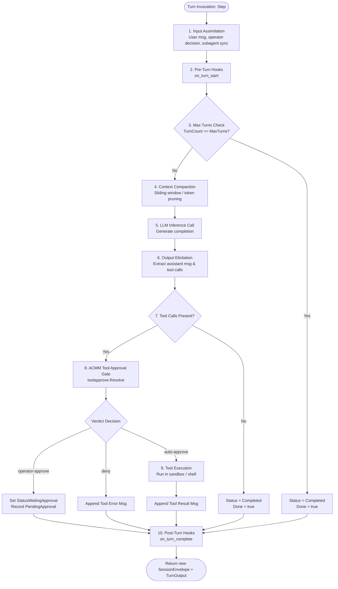

# RFC: Re-entrant Conversation-as-State Agent Turn Model (#4002)

**Status**: Proposed (RFC / Spike Phase)  
**Author**: Douglas Baggett (`@Danathar`)  
**Related Issues**: [#4002](https://github.com/kubestellar/hive/issues/4002) (RFC), [#4000](https://github.com/kubestellar/hive/issues/4000) (Tool Approval Operation), [#4001](https://github.com/kubestellar/hive/issues/4001) (State-Triggered Hooks)

---

## 1. Executive Summary & Problem Statement

Hive manages autonomous AI coding agents running 24/7 in Kubernetes cluster spokes. Currently, agent execution relies on persistent CLI processes hosted inside local `tmux` sessions. An agent's runtime state (conversation history, current reasoning step, pending tool execution, retry backoff, and local memory) is suspended directly within the running process and ephemeral tmux memory buffers.

While this model enabled fast prototyping with interactive CLI backends (Claude Code, GitHub Copilot CLI, Goose), it imposes significant operational challenges at scale:

1. **Vulnerability to Spoke Rolls & Pod Restarts**: When a spoke pod restarts or rolls during deployment, all suspended in-flight agent state is destroyed. The governor must rely on complex stall watchdogs and heuristic restart recovery mechanisms.
2. **Barrier to Horizontal Scaling & Agent Migration**: Agents cannot be migrated between spokes or distributed across worker nodes without bespoke coordination machinery, because their state is pinned to local process memory.
3. **Ad-Hoc Turn Gating**: Guardrails, ACMM authorization checks, tool approvals, and security scans are scattered across loop call sites rather than forming a deterministic pipeline.
4. **Testing Complexity**: Verifying multi-turn behavior requires spawning real tmux sessions and mocking terminal I/O rather than executing pure function calls over structured state.

### The Proposed Solution: Conversation as Durable State

We propose migrating to a **re-entrant, conversation-as-state agent turn model**. In this model:
- The **Conversation Transcript / Session Envelope** is the single source of truth and the complete, durable state of the agent.
- Each agent turn is an **explicit, re-entrant function call**:
  $$\text{Step}(\text{SessionEnvelope}, \text{TurnInput}) \longrightarrow (\text{SessionEnvelope}', \text{TurnOutput}, \text{error})$$
- Because **zero state is suspended in-process between turns**, a session can be paused, persisted to disk/database, serialized across network boundaries, or handed off between different spoke pods with zero context loss.

---

## 2. Current Architecture vs. Re-entrant Architecture

### Current In-Process Suspended State Model

```
┌─────────────────────────────────────────────────────────────┐
│ Spoke Pod (Ephemeral Lifecycle)                             │
│                                                             │
│   ┌─────────────────────────────────────────────────────┐   │
│   │ tmux session (hive-agent-<name>)                    │   │
│   │                                                     │   │
│   │   ┌───────────────┐     ┌───────────────────────┐   │   │
│   │   │ CLI Process   │ ──► │ In-Memory State       │   │   │
│   │   │ (Claude/Cop)  │     │ - Call stack          │   │   │
│   │   └───────────────┘     │ - Unflushed history   │   │   │
│   │                         │ - Pending tool future │   │   │
│   │                         └───────────────────────┘   │   │
│   └─────────────────────────────────────────────────────┘   │
└─────────────────────────────────────────────────────────────┘
                             ▼ (Pod Restart / Crash)
                       [STATE LOST]
```

### Proposed Re-entrant Conversation-as-State Model

```
┌───────────────────────────────────────────────────────────────┐
│ Durable Store / Hub / Beads Ledger                            │
│                                                               │
│   ┌───────────────────────────────────────────────────────┐   │
│   │ SessionEnvelope JSON                                  │   │
│   │  - SessionID, AgentIdentity, ACMMLevel, TurnCount     │   │
│   │  - Messages: [System, User, Assistant, Tool, Subagent]│   │
│   │  - Status: Active | WaitingApproval | Completed       │   │
│   │  - Variables, Subagents, PendingApprovals             │   │
│   └───────────────────────────────────────────────────────┘   │
└───────────────────────────────┬───────────────────────────────┘
                                │ Re-entrant Handoff
           ┌────────────────────┴────────────────────┐
           ▼                                         ▼
┌───────────────────────────────┐   ┌───────────────────────────────┐
│ Spoke Worker A (Turn N)       │   │ Spoke Worker B (Turn N+1)     │
│                               │   │                               │
│ Step(Env_N, Input)            │   │ Step(Env_N+1, Input)          │
│   ► Ordered Turn Operations   │   │   ► Ordered Turn Operations   │
│   ► Returns Env_N+1           │   │   ► Returns Env_N+2           │
└───────────────────────────────┘   └───────────────────────────────┘
```

### Comparison Matrix

| Dimension | Current Model (`pkg/agent` + tmux) | Re-entrant Turn Model (`pkg/turn`) |
| :--- | :--- | :--- |
| **State Storage** | Ephemeral process memory + tmux buffer | Externalized `SessionEnvelope` (JSON/Database) |
| **Pod Restart Recovery** | Stall detection + full agent restart from scratch | Instant resumption from latest turn checkpoint |
| **Cross-Spoke Handoff** | Impossible without shared filesystem & terminal attach | Native: Pass `SessionEnvelope` payload |
| **Tool Approval Gate** | Ad-hoc checks scattered in proxy & scripts | First-class `toolapprove.Resolve` operation (#4000) |
| **Subagent Sync** | Polling files / background cron tracking | Explicit `subagent_sync` state transition |
| **Deterministic Unit Tests** | Difficult (requires tmux daemon & fake PTYS) | Pure function test: `runner.Step(env, in)` |

---

## 3. Ordered Turn Operations

Each execution of `runner.Step(env, in)` executes a sequence of 10 discrete, deterministic operations:



### Operation Breakdown

1. **Input Assimilation**:
   - Resumes paused sessions when an operator approval/rejection decision is supplied in `TurnInput.OperatorDecision`.
   - Appends incoming `UserMessage` to the conversation history.
   - Synchronizes completed background tasks from `SubagentResults`.
2. **Pre-Turn Hooks**:
   - Triggers declarative hooks (`on_turn_start`) for observability, metrics, and tracing span initialization.
3. **Max Turns & Termination Check**:
   - Prevents runaway loops by checking `TurnCount >= MaxTurns`.
4. **Context Compaction**:
   - Prunes older conversation turns using configurable sliding-window or summarization strategies (`Compactor`), while always preserving critical system instructions.
5. **LLM Inference Call**:
   - Dispatches the compacted message array to the active backend via `LLMClient.Generate`.
6. **Elicitation & Parsing**:
   - Extracts structured tool calls and reasoning outputs from model response.
7. **Explicit Tool-Approval Gate (#4000)**:
   - Every tool call is routed through `toolapprove.Resolve(ctx, req, acmmLevel, agent, scanner)`:
     - `auto-approve`: Tool proceeds to execution.
     - `security-scan`: Pre-execution security check runs via `ioscan` / command validator.
     - `operator-approve`: Session transitions to `StatusWaitingApproval` and yields.
     - `deny`: Prohibits execution, returning structured policy rationale to the model.
8. **Tool Execution**:
   - Approved tools execute via `ToolExecutor.Execute`, capturing standard output and exit codes.
9. **Subagent Synchronization**:
   - Subagent invocation tools register child session references in `env.Subagents`.
10. **Post-Turn Hooks & Audit Log**:
    - Emits structured audit records and triggers post-turn notifications.

---

## 4. Minimal State Envelope & Handoff Mechanics

### The `SessionEnvelope` Schema

```go
type SessionEnvelope struct {
    SessionID        string                     `json:"session_id"`
    Agent            toolapprove.AgentIdentity  `json:"agent"`
    ACMMLevel        int                        `json:"acmm_level"`
    TurnCount        int                        `json:"turn_count"`
    MaxTurns         int                        `json:"max_turns"`
    Status           SessionStatus              `json:"status"`
    Messages         []Message                  `json:"messages"`
    WorkingRepo      string                     `json:"working_repo,omitempty"`
    WorkingBranch    string                     `json:"working_branch,omitempty"`
    BeadID           string                     `json:"bead_id,omitempty"`
    Variables        map[string]string          `json:"variables,omitempty"`
    Subagents        map[string]string          `json:"subagents,omitempty"`
    PendingApprovals []PendingApproval          `json:"pending_approvals,omitempty"`
    CreatedAt        time.Time                  `json:"created_at"`
    UpdatedAt        time.Time                  `json:"updated_at"`
}
```

### Handoff Mechanics: Queue-Based vs. Stateless API Dispatch

We evaluated two architectural patterns for multi-node execution:

| Architecture | Mechanism | Pros | Cons |
| :--- | :--- | :--- | :--- |
| **Pattern A: Queue-Based Handoff** (Recommended) | Spokes publish `SessionEnvelope` checkpoints to a persistent queue (Hub WebSocket / Redis / Beads Store). Any available spoke worker dequeues the envelope to run turn $N+1$. | Complete decoupling; resilient to spoke crashes; natural work distribution. | Requires message queue storage backend. |
| **Pattern B: Direct HTTP RPC Dispatch** | Central Hub dispatches `POST /api/v1/agent/step` to an available spoke pod with the envelope. | Simple point-to-point transport. | Synchronous failure if receiving spoke pod dies mid-request. |

**Recommendation**: Adopt **Pattern A (Queue-Backed Handoff via Hub WebSocket)**. Hive's Hub already maintains WebSocket connections to all spokes (`/contribute` relay). Extending this protocol with structured session handoffs allows seamless horizontal scale-out.

---

## 5. Prototype Implementation & Validation

A complete prototype has been implemented in [`pkg/turn`](file:///home/dbaggett/bluefin/hive/kubestellar/hive/src/pkg/turn) and validated through tests in [`turn_test.go`](file:///home/dbaggett/bluefin/hive/kubestellar/hive/src/pkg/turn/turn_test.go):

- **Process Restart Handoff**: Tested serializing `SessionEnvelope` to JSON after Turn 1, instantiating a fresh runtime, deserializing the JSON, and successfully executing Turn 2 with zero context loss ([`TestDurableStateHandoffAcrossProcessRestarts`](file:///home/dbaggett/bluefin/hive/kubestellar/hive/src/pkg/turn/turn_test.go#L114)).
- **ACMM Gated Operator Pauses**: Verified that side-effectful write tools at ACMM L4 enter `StatusWaitingApproval`, pause execution, and seamlessly resume upon receiving operator approval ([`TestOperatorApprovalPauseAndResume`](file:///home/dbaggett/bluefin/hive/kubestellar/hive/src/pkg/turn/turn_test.go#L173)).
- **Subagent Synchronization**: Verified that background subagent task completions delivered in `TurnInput` update state and conversation transcript cleanly ([`TestSubagentSynchronization`](file:///home/dbaggett/bluefin/hive/kubestellar/hive/src/pkg/turn/turn_test.go#L295)).

---

## 6. Feasibility, Migration Costs & Staged Rollout Plan

### Migration Phases

1. **Phase 1: RFC & Prototype (Current Phase)**:
   - Merge this RFC and the baseline `pkg/turn` and `pkg/toolapprove` packages.
   - Solicit community feedback from maintainers.
2. **Phase 2: Self-Hosted Inference & Sandbox Agent Runner**:
   - Introduce an in-process re-entrant runner for agents using self-hosted backends (`vllm`, `llm-d`, `litellm`) and sandbox executors where direct API access exists.
   - Dual-run alongside legacy tmux agents for validation.
3. **Phase 3: Hub-Coordinated Spoke Session Migration**:
   - Wire `SessionEnvelope` checkpoints into the Hub contribution relay and Beads store.
   - Enable spoke rebalancing and rolling updates without interrupting multi-step autonomous tasks.
4. **Phase 4: Full Unification & Deprecation of Suspended State**:
   - Provide standard bridge adapters for external CLI backends so all agent executions flow through the re-entrant turn pipeline.

---

## 7. Relationship to Sibling Issues

- **#4000 (Tool Approval Operation)**: Implemented in `pkg/toolapprove`. Integrated directly as Operation 7 in the turn pipeline.
- **#4001 (State-Triggered Hooks)**: Integrated via `HookHandler` callbacks (`OnTurnStart`, `OnTurnComplete`, `OnStatusChange`) to allow declarative operator actions upon state transitions.

---

## Conclusion & Next Steps

The re-entrant conversation-as-state model elevates agent execution in Hive from fragile in-process coroutines to a resilient, distributed, and testable system. We recommend approving this RFC for Phase 2 implementation.
