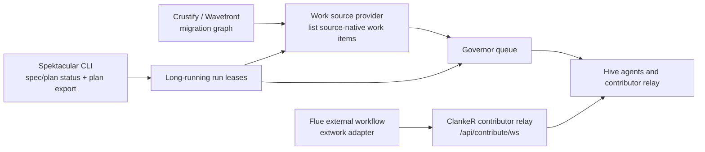

# Integration guide

Audience: platform teams and tool authors who want Hive to read a non-GitHub backlog, lend external execution capacity, or connect planning/specification tools without over-claiming what v5 can do today.

The canonical Hive documentation source for the published Hive docs is this repository's `src/docs/` tree. The separate `hivecommons/docs` site repository is the Next.js/Nextra shell for docs.hivecommons.dev; its README says the site syncs Hive content from `hivecommons/hive` `src/docs/` on branch `v5`. Put Hive guide changes here first, then let that mirror pick them up.

Two external projects shaped these surfaces and remain the reference integrations: [Flue](https://github.com/withastro/flue), the report-only external-execution pilot behind the `pkg/extwork` contract, and [Crustify](https://github.com/crustify-rs/crustify), the C/C++-to-Rust migration harness whose Wavefront migration graph is consumed as an additive work source (see [work sources](work-sources.md) and the `wavefront-smoke.yml` canary).

## Extension surfaces in v5

| Surface | What you can do today | Start here |
| --- | --- | --- |
| Work sources | Add or configure an adapter that turns source-native items into `worksource.Issue` values. The only primary adapters linked today are GitHub Issues, GitHub Projects, Linear, and Jira; run stages and the [Crustify](https://github.com/crustify-rs/crustify) Wavefront migration graph are additive sources. | [Work source providers](integrations/work-source-providers.md) |
| ClankeR + Flue-style external execution | Use the contributor relay as the transport and the `pkg/extwork` contract as the engine-neutral admission/observation seam. Flue is the reference HTTP adapter. | [ClankeR and Flue-style external execution](integrations/clanker-flue.md) |
| Spektacular | Let Hive poll a Spektacular-compatible CLI for `spec`/`plan` status and import final plan tasks into Hive's run flow. | [Spektacular and Project Inception](integrations/spektacular.md) |
| vibe-kanban | Mirror one repository's admitted hive queue onto a local [vibe-kanban](https://github.com/BloopAI/vibe-kanban) board through its MCP server, optionally record board pick-ups as shadow executions, or opt in to the `pkg/extwork/vibekanban` host adapter for report-only workspace dispatch. Default off. | [vibe-kanban mirror and dispatch](vibe-kanban.md) |

Related surfaces that are not redefined here: [agent configuration](agent-configuration.md), [CLI/backend setup](../../docs/backend-setup.md), [MCP write policy](security-model.md), [hub API](api-reference.md), [contributor relay](contributor-relay.md), [work sources](work-sources.md), [long-running runs](runs.md), and [Spektacular runner](spektacular.md).

## Terminology

Use source-neutral words in generic integration docs: **work source**, **project**, **item**, and **change request**. Keep product names only when talking about a specific adapter, such as GitHub Projects or Jira. The glossary and guard-test intent live in [Work-source terminology](work-source-terminology.md).

## Gaps tracked from this guide

- Work source adapters are compile-time Go integrations, not external plugins: [#10174](https://github.com/hivecommons/hive/issues/10174).
- Project Inception only wires a Spektacular-compatible CLI boundary; there is no generic named planning-engine registry: [#10175](https://github.com/hivecommons/hive/issues/10175).
