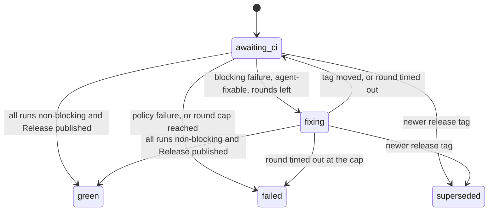

# Release sentinel

An opt-in, bounded repair loop for a release whose CI fails after it is
tagged. **Off by default.** Tracking issue:
[#9585](https://github.com/hivecommons/hive/issues/9585).

A failed release used to sit red until a person noticed:
[#5875](https://github.com/hivecommons/hive/issues/5875) (Actions lost the
setting that lets it open the release PR, v4.9.0 blocked),
[#6804](https://github.com/hivecommons/hive/issues/6804) (v4.29.2 stuck on a
release-gate push the App token was not allowed to make) and
[#7123](https://github.com/hivecommons/hive/issues/7123) (release-gate
workflows bulk-failed without running a job). The sentinel watches exactly
one thing, the CI of the current release tag, and either hands a failure to an
agent with the evidence attached or tells a human, with hard limits on both.

## Turning it on

```yaml
release_sentinel:
  enabled: true              # default false
  repo: acme/widgets         # default: project.primary_repo
  agent: ci-maintainer       # default: ci-maintainer
  max_rounds: 5              # default: 5
  round_timeout: 2h          # default: 2h
  poll_interval: 5m          # default: 5m
  ignore_workflows:          # runs of these workflows never block
    - Greetings
```

`HIVE_RELEASE_SENTINEL_ENABLED=true|false` overrides `enabled` for one
process, in either direction. The sentinel needs read access to Actions,
tags and Releases on the watched repo; the hive's GitHub App already has it
wherever the ci-maintainer lane works.

## What it watches

Each pass (at most once per `poll_interval`, riding the governor eval tick):

1. Find the **current release tag**: the highest `v<MAJOR>.<MINOR>.<PATCH>`
   tag (numeric order, so `v1.10.0` beats `v1.9.9`; pre-release tags are
   ignored), and the commit it points at **right now**.
2. List the latest workflow run per workflow for that commit. A run whose head
   SHA is not the tag's current commit is **stale** (the tag moved after the
   run started) and is never acted on.
3. Classify each run:

| Run | Effect |
|---|---|
| still queued / in progress | wait |
| `failure`, `timed_out`, `startup_failure` | **blocking** |
| `success`, `cancelled`, `skipped`, `neutral`, `action_required`, `stale` | non-blocking |
| a workflow named in `ignore_workflows` | ignored |

## The state machine

One durable record per release, persisted to `/data/release-sentinel.json`
on the PVC, so a restart resumes a release mid-repair with its round count
intact.



- **green** needs both halves: every run on the tag's commit non-blocking
  (and none still running) **and** a published, non-draft GitHub Release for
  the tag. Green CI with no Release yet keeps waiting.
- **fixing** a failure on the same commit the round was dispatched for is the
  failure the agent is already working on; it is not re-dispatched.
- A round **times out** after `round_timeout`. The round is spent; if the
  failure is still there, the next round starts, up to `max_rounds`. Then the
  release is **failed** and a human is notified. Nothing is dispatched after
  that.
- A newer release tag marks every still-open older record **superseded**.
  green, failed and superseded are terminal.
- A round the agent never received (agent paused, kick refused) is **not**
  counted; the sentinel retries it next pass.

## Failures an agent cannot fix

Before a round is dispatched, the failure evidence (failed job and step names
and the `::error` annotations GitHub recorded) is checked for causes no commit
can fix. Any match escalates to a human on the **first** round, with no
dispatch and no push:

| Signature | Example |
|---|---|
| a failed run that ran no job at all | approval gate, billing or org policy ([#7123](https://github.com/hivecommons/hive/issues/7123)) |
| `not permitted to create or approve pull requests` | org/repo Actions setting ([#5875](https://github.com/hivecommons/hive/issues/5875)) |
| `refusing to allow a GitHub App to create or update workflow ... without workflows permission` | App permission ([#6804](https://github.com/hivecommons/hive/issues/6804)) |
| `Resource not accessible by integration`, a 403 with permission/forbidden | token scope |
| `secret ... is not set` | missing repository or org secret |
| spending limit / failed payments | account billing |
| `must have admin rights` | admin-only operation |

One such run makes the whole round a human's problem: a code fix pushed next
to an unfixable setting cannot turn the release green and would only burn a
round.

## How a round reaches an agent

The sentinel has no agent runtime of its own. A round is a targeted kick to
the configured lane (default `ci-maintainer`) through the same kick path the
stuck-PR reaper uses. The kick names the tag, the commit, every blocking run
with its failed step and evidence, the round number and the deadline. The
evidence passes through the mention sanitizer before it reaches the agent.

In this phase the agent fixes through the **normal PR path**: a branch, a
signed commit, a PR through `hive-open-pr`. The kick tells it not to move,
delete or re-create the tag and not to push to the release branch. The merged
fix ships as the next patch release, which supersedes the red one.

Escalations go to the hive's notification channels (ntfy, Slack, Discord) at
high priority, and always to the log.

## Deliberately not in this phase

- **Pushing the fix and moving the tag together.** The issue's full loop has
  the sentinel push the fix in a dedicated release worktree and re-point the
  tag at it, so the re-run happens on the same version. That is a separate,
  later step. Until it lands the sentinel never pushes, never moves a tag and
  never writes to a protected branch, even when enabled.
- **Webhook triggering.** The sentinel polls completed runs for the tag's
  commit rather than receiving `workflow_run` events; the decision is the same
  and a spoke needs no inbound webhook.
- **Failures before a tag exists.** A release that fails before it is tagged
  (as in #5875 and #6804) has no `v<version>` tag to scope a record to; those
  still surface through the ci-maintainer lane's normal CI-failure path.
