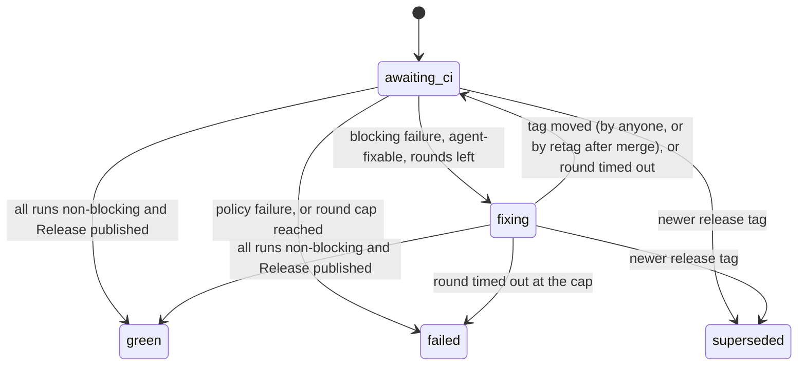

# Release sentinel

An opt-in, bounded repair loop for a release whose CI fails after it is
tagged. **Off by default.** Tracking issue:
[#9585](https://github.com/hivecommons/hive/issues/9585).

A failed release used to sit red until a person noticed:
[#5875](https://github.com/hivecommons/hive/issues/5875) (Actions lost the
setting that lets it open the release PR, v4.9.0 blocked),
[#6804](https://github.com/hivecommons/hive/issues/6804) (v4.29.2 stuck on a
release-gate push the App token was not allowed to make) and
[#7123](https://github.com/hivecommons/hive/issues/7123) (release-gate
workflows bulk-failed without running a job). The sentinel watches exactly
one thing, the CI of the current release tag, and either hands a failure to an
agent with the evidence attached or tells a human, with hard limits on both.

## Turning it on

```yaml
release_sentinel:
  enabled: true              # default false
  repo: acme/widgets         # default: project.primary_repo
  agent: ci-maintainer       # default: ci-maintainer
  max_rounds: 5              # default: 5
  round_timeout: 2h          # default: 2h
  poll_interval: 5m          # default: 5m
  ignore_workflows:          # runs of these workflows never block
    - Greetings
  # Phase 2, each separately opt-in:
  retag_enabled: false       # default false; see "Retag after merge"
  release_branch: ""         # default: the repo's default branch
  retag_allow_intervening_commits: false
  release_workflows:         # default empty = pre-tag detection off
    - Tagged Release
```

`HIVE_RELEASE_SENTINEL_ENABLED=true|false` overrides `enabled` for one
process, in either direction. `HIVE_RELEASE_SENTINEL_RETAG_ENABLED=true|false`
does the same for `retag_enabled`; it never turns retagging on while the
sentinel itself is off. The sentinel needs read access to Actions,
tags and Releases on the watched repo; the hive's GitHub App already has it
wherever the ci-maintainer lane works.

## What it watches

Each pass (at most once per `poll_interval`, riding the governor eval tick):

1. Find the **current release tag**: the highest `v<MAJOR>.<MINOR>.<PATCH>`
   tag (numeric order, so `v1.10.0` beats `v1.9.9`; pre-release tags are
   ignored), and the commit it points at **right now**.
2. List the latest workflow run per workflow for that commit. A run whose head
   SHA is not the tag's current commit is **stale** (the tag moved after the
   run started) and is never acted on.
3. Classify each run:

| Run | Effect |
|---|---|
| still queued / in progress | wait |
| `failure`, `timed_out`, `startup_failure` | **blocking** |
| `success`, `cancelled`, `skipped`, `neutral`, `action_required`, `stale` | non-blocking |
| a workflow named in `ignore_workflows` | ignored |

## The state machine

One durable record per release, persisted to `/data/release-sentinel.json`
on the PVC, so a restart resumes a release mid-repair with its round count
intact.



- **green** needs both halves: every run on the tag's commit non-blocking
  (and none still running) **and** a published, non-draft GitHub Release for
  the tag. Green CI with no Release yet keeps waiting.
- **fixing** a failure on the same commit the round was dispatched for is the
  failure the agent is already working on; it is not re-dispatched.
- A round **times out** after `round_timeout`. The round is spent; if the
  failure is still there, the next round starts, up to `max_rounds`. Then the
  release is **failed** and a human is notified. Nothing is dispatched after
  that.
- A newer release tag marks every still-open older record **superseded**.
  green, failed and superseded are terminal.
- A round the agent never received (agent paused, kick refused) is **not**
  counted; the sentinel retries it next pass.

## Failures an agent cannot fix

Before a round is dispatched, the failure evidence (failed job and step names
and the `::error` annotations GitHub recorded) is checked for causes no commit
can fix. Any match escalates to a human on the **first** round, with no
dispatch and no push:

| Signature | Example |
|---|---|
| a failed run that ran no job at all | approval gate, billing or org policy ([#7123](https://github.com/hivecommons/hive/issues/7123)) |
| `not permitted to create or approve pull requests` | org/repo Actions setting ([#5875](https://github.com/hivecommons/hive/issues/5875)) |
| `refusing to allow a GitHub App to create or update workflow ... without workflows permission` | App permission ([#6804](https://github.com/hivecommons/hive/issues/6804)) |
| `Resource not accessible by integration`, a 403 with permission/forbidden | token scope |
| `secret ... is not set` | missing repository or org secret |
| spending limit / failed payments | account billing |
| `must have admin rights` | admin-only operation |

One such run makes the whole round a human's problem: a code fix pushed next
to an unfixable setting cannot turn the release green and would only burn a
round.

## How a round reaches an agent

The sentinel has no agent runtime of its own. A round is a targeted kick to
the configured lane (default `ci-maintainer`) through the same kick path the
stuck-PR reaper uses. The kick names the tag, the commit, every blocking run
with its failed step and evidence, the round number and the deadline. The
evidence passes through the mention sanitizer before it reaches the agent.

The agent always fixes through the **normal PR path**: a branch, a signed
commit, a PR through `hive-open-pr`. The kick tells it not to move, delete or
re-create the tag and not to push to the release branch. With
`retag_enabled` off (the default), the merged fix ships as the next patch
release, which supersedes the red one. With it on, see below.

Escalations go to the hive's notification channels (ntfy, Slack, Discord) at
high priority, and always to the log.

## Retag after merge

`release_sentinel.retag_enabled: true` (default `false`, and separate from
`enabled`) lets a repair round finish on the **same version**: once the fix is
merged, the hive moves `v<version>` to it and the sentinel re-checks CI there.

The design keeps the blast radius as small as it can be:

- **The hive never pushes a branch.** The fix reaches the release branch only
  through the normal PR path, so branch protection, required checks and review
  apply exactly as they do to any other change. Nothing bypasses them.
- **The handoff is a marker line.** The kick asks the agent to put
  `Release-Sentinel: v<version>` on its own line in the PR body. A PR counts as
  the round's fix only when it carries that line, was merged into the release
  branch (`release_branch`, default the repo's default branch), and merged
  after the round started.
- **The tag move is one leased, atomic push** from a scratch bare repository
  on the PVC (`/data/release-sentinel-git`, commits only):
  `git push --atomic --force-with-lease=refs/tags/v<version>:<old> <fix>:refs/tags/v<version>`.
  The tag is the only ref in the push, and the lease means a tag someone else
  moved in the meantime is never overwritten.
- **Before pushing, the retagger refuses** when:
  - the tag no longer points at the commit the round was for;
  - the tag is annotated (only lightweight tags are moved);
  - the fix commit is not a fast-forward of the tagged commit;
  - the fix commit is not contained in the release branch;
  - any commit between the old tag and the fix is not part of the fix PR.
    `retag_allow_intervening_commits: true` relaxes this for busy release
    branches where other merges land between the tag and the fix. Leave it
    off unless you accept that those merges ship under the old version
    number.
- **A refusal is final for that PR** and is recorded on the release record
  (`retag_refused_pr`, `retag_note`) and in the log. The release then falls
  back to the default behavior: the merged fix ships as the next patch
  release. A different marked PR is a new candidate.
- **After a move** the record goes back to `awaiting_ci` on the new commit.
  The next pass evaluates that commit's runs with the same stale-SHA and
  classification rules as any tag move, so a still-red fix starts the next
  round (still bounded by `max_rounds`) and a green one with a published
  Release goes `green`.

Requirements and caveats:

- The push token is minted from the hive's GitHub App installation (the
  trusted tier: `contents: write`, plus `workflows: write` when the
  installation grants it, which GitHub requires when the moved range touches
  `.github/workflows/`). A hive that authenticates with a static token logs
  a warning and does not retag.
- Tag rulesets or immutable releases that forbid moving the tag make the push
  fail; the sentinel reports the error and retries on the next pass until the
  round times out.
- Moving the tag triggers workflows on the tag push. Whether that republishes
  the GitHub Release is the release workflow's business: `green` still needs a
  published, non-draft Release for the tag.

## Failures before a tag exists

A release can fail before any `v<version>` tag exists: in
[#5875](https://github.com/hivecommons/hive/issues/5875) and
[#6804](https://github.com/hivecommons/hive/issues/6804) the release workflow
itself failed, so there was no tag to scope a record to. List the workflows
that cut releases in `release_sentinel.release_workflows` (by name, such as
`Tagged Release`, or file name, such as `tagged-release.yml`). Each pass
checks the latest completed run of each one, on any branch or event (the
release PR, `release-gate/*` scratch branches, the release branch), and
classifies a blocking one with the same classifier as a tagged release:

| Classification | Effect |
|---|---|
| policy (a setting, permission or secret) | escalated to a human through the notification channels, **no dispatch**. Paged once: repeats of the same block (an hourly release run failing the same way) do not page again until a run of that workflow succeeds. |
| fixable | left to the ci-maintainer lane's normal CI-failure path. The sentinel never dispatches from here, so it cannot double-dispatch a failure another lane owns. |

A run on the commit the current tag points at belongs to the tag's own
record, not to this path. Pre-tag records live in the same state file under a
`pre-tag:<workflow>` key with `"kind": "pre_tag"` and are never pruned or
superseded.

## Trigger: polling, not webhooks

The sentinel polls on the governor eval tick (`poll_interval`) rather than
reacting to `workflow_run` events. Spokes do not receive GitHub webhooks: the
only GitHub App webhook endpoint is on the hub, and it handles installation
events. The decision logic is the same either way; the poll interval bounds
the delay.

## Not yet covered

- A dashboard surface for the state file.
