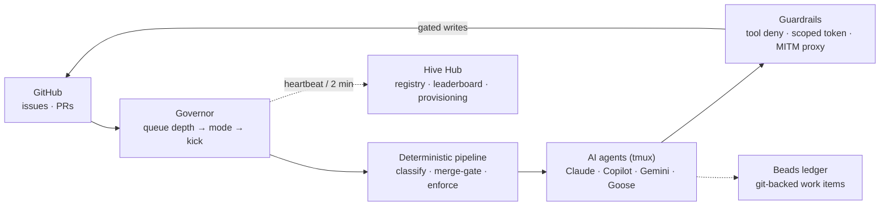

## Relevant CNCF projects


  
  
  - **Using since:** 2024
  - **Current version:** 1.24+

  A hive is a single-replica Kubernetes Deployment with a PVC, Service, and Ingress. The hub provisions new spoke hives onto member clusters as native Kubernetes objects.
  

  
  
  - **Using since:** 2024
  - **Current version:** v1.x

  Issues and renews the TLS certificates that terminate every hive dashboard and the hosted hub, via a `ClusterIssuer` (Let's Encrypt in production).
  

  
  
  - **Using since:** 2024 (CNCF Sandbox)
  - **Current version:** 0.2x

  KubeStellar provides an optional multi-cluster substrate: the hub can reason about a fleet of clusters (cloud and edge) and place spoke hives onto them. Hive's own hub-and-spoke model is directly inspired by KubeStellar's placement design.
  



  
  
  - **Using since:** 2024
  - **Current version:** (cluster default)

  The container runtime that runs the single hive image on every node. Each hive is one OCI image bundling the Go orchestrator, agent CLIs, and the dashboard.
  

  
  
  - **Using since:** 2025
  - **Current version:** exposition format

  Each hive exposes `/metrics` in Prometheus format (governor mode, queue depth, per-agent token spend, fleet health) for scraping, alongside a live SSE stream to the dashboard.
  

  
  
  - **Using since:** 2024
  - **Current version:** v3.x / kubectl-native

  Hive ships a Kustomize base (namespace, Deployment, Service, PVC, ConfigMap, Secret) so an operator applies one overlay per environment.
  


## Describe your organisation

**Hive** is an open-source, self-hostable platform that keeps software
repositories maintained by running a fleet of AI coding agents — triaging issues,
writing fixes, opening pull requests, and merging on green CI — under a
human-controlled autonomy dial and permissions enforced in depth. It is built as
a cloud-native workload: each hive is a Kubernetes deployment, and a hosted hub
coordinates a fleet of self-hosted spoke hives.

Hive is used in production today by more than one open-source community:

- The **KubeStellar Console** team ([`kubestellar/console`](https://github.com/kubestellar/console)) runs a hive against the console's repositories — the flagship end user, where Hive is dogfooded daily.
- **Project Bluefin** ([`projectbluefin`](https://github.com/ublue-os)) runs its own hive (`projectbluefin/knuckle` and related repos) at a measured ACMM level.

This is the point of the hub-and-spoke design: independent teams each self-host a
spoke hive against their own repositories, while a shared hub gives them a
registry, a cross-hive leaderboard, and — where reachable — provisioning.

## Describe your entity and/or team

Hive is built and operated by an open-source community as a standalone project.
There is no separate commercial entity: the maintainers run production hives
against their own repositories (the project dogfoods its own tool) and operate a
hosted hub ([hive.kubestellar.io](https://hive.kubestellar.io)) so other
open-source projects and individual contributors can register a spoke hive or
donate compute to an existing one.

## Brief overview of your architecture and any potential goals you are trying to achieve with it?

**The goal:** let a fleet of AI coding agents maintain a repository
autonomously — triage issues, write fixes, open PRs, merge on green CI — while
keeping a human firmly in control of *how much* autonomy is granted, and enforcing
those limits with technical controls rather than trust.

A hive runs as a **single container** on Kubernetes with three long-lived
processes:

- a **Go orchestrator** (the brain) — runs the governor eval loop, the agent
  manager, the dashboard API, an in-process man-in-the-middle GitHub proxy, and
  the hub heartbeat;
- a **Node.js proxy** — the public front door (auth, path-rewrite, SSE/WebSocket);
- **ttyd** — a web terminal onto the agents' `tmux` sessions.

Two ideas define the architecture:

1. **Deterministic before judgment.** A pipeline of Go and shell steps
   enumerates GitHub work, classifies it, gates which PRs are mergeable, and
   enforces permissions *before* any model sees a task. Agents only make the
   judgment calls (read code, reason about a fix, write a PR).

2. **Autonomy is a dial, enforced in depth.** An **AI-native Capability Maturity
   Model (ACMM)** with six levels (advisory → fully autonomous) is the single
   control a human turns. Each level maps deterministically to a per-agent
   permission mode, and that mode is enforced at three independent layers: CLI
   tool denial, least-privilege scoped GitHub App tokens, and a network-level
   MITM proxy that gates every GitHub write by `(method, path) → minimum mode`
   plus a repo allowlist. A bug in one layer is caught by the next.

The **hub** is where the cloud-native, multi-cluster story shows: it holds a
registry of all spoke hives, a cross-hive leaderboard, and — for clusters it can
reach — provisions new spokes onto them with `kubectl`. Firewalled spokes it
cannot reach directly are still fully managed over the 2-minute heartbeat, whose
response carries callbacks (self-upgrade to a pinned image SHA, GitHub App
credential delivery, visibility changes). It is this heartbeat-driven control
plane that lets independent teams — the KubeStellar Console team and Project
Bluefin among them — each run a spoke against their own repositories while a
single hub keeps the fleet coherent.

A fuller technical walkthrough (process model, the governor loop, the guardrail
layers, the beads ledger, and an end-to-end "issue → merged PR" trace) lives in
the project's [reference architecture](architecture.md).

## Can you expand on why you are using those projects/services?

- **Kubernetes** is the deployment substrate because a hive needs to be
  self-hostable anywhere, survive restarts, and be provisioned programmatically.
  Modeling each hive as a Deployment + PVC + Service + Ingress means the hub can
  create, upgrade, and delete a spoke with plain Kubernetes API calls.
- **KubeStellar** (optional) gives the hub a coherent way to reason about *many*
  clusters — cloud and edge — as placement targets for spokes when a hive is run
  across a multi-cluster fleet.
- **cert-manager** removes TLS toil: every dashboard and the hub get automatic,
  renewing certificates, which matters because agent dashboards stream over
  long-lived SSE connections that must be secured.
- **containerd** runs the single, self-contained hive image — the Go binary, the
  agent CLIs, and the dashboard travel together so a hive is one artifact.
- **Prometheus exposition / OpenTelemetry** make the fleet observable: the
  governor's mode, queue depth, and per-agent token cost are all scrapeable, so a
  runaway agent or a stalled eval loop is visible before it does harm.
- **Kustomize/Helm** keep per-environment deployment declarative.

## What has worked well?

- **The three-layer guardrail model.** Because the MITM proxy enforces
  permissions at the network boundary — independent of what the agent's CLI or
  prompt does — we can grant real write access with confidence. An agent that
  tries to merge a PR while in `ISSUES_ONLY` mode simply gets a `403` from its own
  egress proxy. This is the feature that made higher ACMM levels safe to run.
- **A durable, git-backed work ledger ("beads").** Giving each agent a typed,
  dependency-aware work ledger on disk (rather than an in-memory queue) means
  agents coordinate without stepping on each other, and state survives restarts,
  crashes, and upgrades.
- **Queue-depth governance.** Driving agent cadence from the actionable-issue
  count (idle → quiet → busy → surge) keeps a quiet repository nearly free and
  gives a flooded one the full fleet — without a human tuning schedules.
- **Hub-and-spoke over heartbeat.** Managing spokes we can't reach directly
  (firewalled clusters) purely through the heartbeat response has been robust —
  and it is what lets separate end users (KubeStellar Console, Project Bluefin)
  each self-host a spoke under one shared hub.

## What has not worked well?

- **Cost attribution across model backends.** Agents run against several
  inference backends (Anthropic, GitHub Copilot, and OpenAI-compatible gateways
  like vLLM/llm-d/LiteLLM). Reconciling token spend across their differing session
  formats — especially "auto" model selection and one-time cost restores — took
  several iterations to get accurate on the dashboard.
- **Non-reentrant locks on the startup path.** Early versions risked a startup
  deadlock when a mutex was re-taken from the launch path; CI's race detector did
  not catch it, and it manifested as spokes crash-looping before readiness. We
  moved hot startup state to lock-free atomics.
- **Config precedence.** The authoritative runtime config lives on the PVC, while
  a ConfigMap seeds only the first boot. It took clear conventions (and
  documentation) before this stopped being a source of "why didn't my change take
  effect" confusion.

## What sort of "glue" have you had to develop to enable usage of your architecture?

Quite a bit, and it is most of the interesting engineering:

- A **deterministic shell/Go pipeline** (`run-pipeline.sh` + `pkg/classify`) that
  enumerates, classifies, clusters, and merge-gates GitHub work before agents run.
- A **`gh` wrapper** installed at `/usr/local/bin/gh` that injects scoped tokens
  and blocks writes exceeding an agent's tier — the shell-level twin of the MITM
  proxy.
- An **in-process MITM proxy** (with `iptables` redirection of agent egress and a
  self-signed CA installed into the container trust store) that inspects
  `api.github.com` traffic and gates it by agent mode and repo allowlist. Agent
  identity is resolved from the connection's owning UID via `/proc/net/tcp`.
- An **inference translator** that reroutes Anthropic-shaped calls to
  OpenAI-shaped gateway endpoints so the same agent CLI works across backends.
- A **trajectory reviewer** — a periodic second-model check that reads an agent's
  recent transcript against its assigned intent and pauses it on drift (a defense
  against prompt-injection-style goal hijacking that per-action gating can't see).
- Agents run inside **`tmux`** sessions under per-agent OS users for UID
  isolation; a "kick" is literally a work order typed into the agent's CLI prompt.

## Has your architecture evolved? What lessons did you learn from previous iterations?

Yes — the central lesson was **enforce, don't trust**. Early designs relied on
prompting and CLI tool-deny lists to keep agents in bounds; that is necessary but
not sufficient, because a capable agent can find paths the prompt did not
anticipate. Moving enforcement to the *network boundary* (the MITM proxy) and to
*credential scope* (least-privilege, per-agent, short-lived GitHub App tokens)
changed the trust model: we no longer have to believe the agent will behave, we
constrain what it *can do* regardless.

A second lesson was **make autonomy a graded, human-owned dial**. Rather than
"agents on / agents off", the ACMM ladder lets an operator start advisory-only and
climb one rung at a time as trust is earned — and every rung is a concrete,
enforced permission change, not a vibe.

A third: **durable state beats clever runtime state**. The git-backed beads
ledger and PVC-authoritative config both came from painful episodes where
in-memory coordination lost work across restarts.

## What's next for your architecture? What are you looking to do next?

- **Planning intelligence** (already incubating on a development branch):
  automatic decomposition of a high-level goal into a tree of child work items,
  with a human "approve the plan" gate before agents execute, and stall-triggered
  re-planning when progress stops.
- **Richer fleet observability** — first-class OpenTelemetry traces across the
  governor → pipeline → agent → PR lifecycle so an operator can see exactly why a
  given change was (or wasn't) made.
- **Broadening the guardrail model** with an optional content/prompt-injection
  classifier and a proxy-level request-rate limiter for defense in depth.
